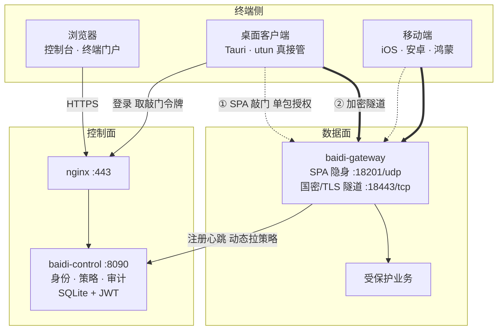
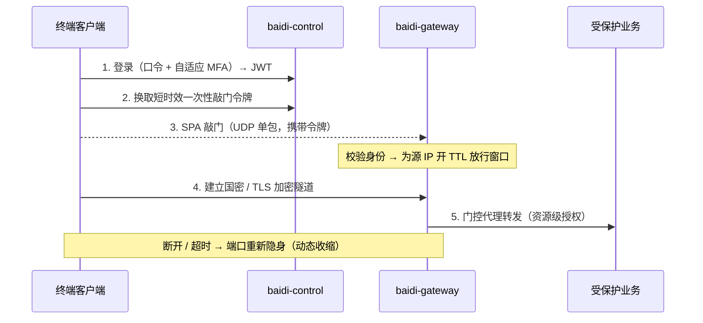

<div align="center">

# 白帝 · 零信任访问控制系统

**以身份重塑边界 —— 默认不信任、持续验证、最小授权、动态收缩。**

零信任访问控制（ZTNA / SDP）全栈实现：SPA 服务隐身 · 国密加密隧道 · utun 真流量接管 · 身份/策略/审计闭环。
对标深信服 aTrust / Zscaler / Cloudflare ZTNA，定位为 SSL VPN（EasyConnect 一代）的下一代演进。


</div>

---

## ✨ 核心能力

| | 能力 | 说明 |
|---|---|---|
| 🕵️ | **SPA 服务隐身** | 受保护端口默认对外不可达（防火墙 DROP，扫描器见 `filtered`）；**先认证、后连接** |
| 🎫 | **短时效一次性敲门令牌** | 控制面签发 90s + `jti` 去重令牌，根治重放攻击 |
| 🔐 | **国密 TLCP 隧道** | SM2 双证书 + `ECC_SM4_GCM_SM3`；通用 TLS 1.3 亦可切换 |
| 🚇 | **utun 真流量接管** | 桌面客户端以 utun 虚拟网卡真正接管受保护网段流量（gVisor 用户态栈 + 逐流敲门），非"演示动画" |
| 🧭 | **零信任闭环** | 身份 / 认证（自适应 MFA）/ 资源 / 策略（继承树）/ 网关 / 审计 / 系统，**全自有实现** |
| 📺 | **态势大屏** | 全屏 NOC：实时威胁雷达 + 三道防线仪表 + 实时安全事件 + 接入来源 TOP 地域（连真实接口，15s 轮询） |
| 🩺 | **运维诊断** | 控制面 / 存储 / 数据面 / 隐身 / 集群 / 身份 / 密钥 八维**真实**自检 + 健康分 |
| 📇 | **真实审计** | 每个管理写操作落库留痕，审计中心实时呈现 |
| 🩹 | **终端 posture + 风险引擎** | 桌面客户端真实采集（FileVault/SIP/防火墙/EDR）60s 上报，控制面按**可编辑安全基线**集中评估；不合规 → 拒发敲门令牌 + 自动撤窗断隧道（持续验证闭环） |

## 🏗 架构



## 🔐 零信任接入链路



## 📂 目录结构

```
baidi/
├── console/         # 控制台（Vue3 + Arco，dev :5193）— 管理台 + 态势大屏 + 运维诊断 + 终端门户
├── control/         # 控制面 baidi-control（Go，:8090，SQLite + JWT）
│   └── internal/{api,store,auth}
├── gateway/         # 数据面 baidi-gateway（Go：SPA 敲门 / 隧道 / 防火墙隐身 / utun 引流）
│   ├── cmd/{baidi-gateway,baidi-knock,baidi-tun,baidi-gmca,...}
│   └── internal/{spa,proxy,gmcert,darkfw,dataplane,resource}  +  mobile/  firewall/
├── clients/
│   ├── desktop/     # 桌面客户端（Vue + Arco + Tauri，utun 真数据面，dev :5294）
│   └── mobile/      # 移动端（iOS / 安卓 / 鸿蒙，移动优先 UI + 原生 VPN 壳，dev :5295）
├── deploy/          # systemd + nginx + build / install / wipe 脚本
├── design-system/   # 设计 token
└── docs/            # SCOPE.md 范围边界 · design/ 交互规范
```

## 🚀 快速开始

### 控制面 + 控制台

```bash
# 控制面（Go，:8090，SQLite 首启自动建表 + 播种）
cd control && go run ./cmd/baidi-control

# 控制台（Vue，:5193，vite /api → 127.0.0.1:8090）
cd console && npm install && npm run dev     # → http://localhost:5193
```

- **登录**：管理台 `admin / baidi@123`；终端门户 `/portal/login` 任意用户名 + 口令 `baidi@123`（如 `li.fang`），`ext.*` / 含「外包」账号（如 `ext.zhou`）触发自适应 MFA，验证码 `123456`。
- 未起后端时各页降级为内置演示数据，UI 完整可点。

### 数据面网关

```bash
cd gateway
./demo.sh                        # 暗 → SPA 敲门 → 隧道 → 后端 → TTL 自动重暗 的最小闭环演示
go run ./cmd/baidi-gateway -gm   # 国密 TLCP 隧道
```

### 桌面客户端（真 utun 接入）

```bash
cd clients/desktop
./src-tauri/build-sidecars.sh    # 构建 baidi-knock / baidi-tun sidecar
npm install && npm run tauri:build   # 产出 .app / .dmg（macOS，需 Rust 工具链）
```

登录后点「接入」→ 授权管理员 → 客户端以 **utun 虚拟网卡**接管配置的受保护网段：逐流 SPA 敲门 + 加密隧道送达网关。**不接入时该网段路由不存在**（先认证后连接的直接证据）。

## 🖥 控制台三模式（顶栏切换）

| 模式 | 路由 | 说明 |
|---|---|---|
| **控制台** | `/` | 监控中心 / 业务管理 / 安全防护 / 系统 四组侧栏 IA |
| **态势大屏** | `/screen` | 全屏暗色 NOC 实时态势感知 |
| **运维诊断** | `/diag` | 八维系统自检 + 健康分 |

## ☁️ 部署与在线演示

`deploy/` 提供 systemd + nginx（80→443 + SPA 回退 + `/api` 反代）+ 交叉编译/安装脚本；`WITH_GATEWAY=1` 一并装启国密网关。

> **在线演示**：`https://101.43.125.131/`（控制台 `admin/baidi@123`）。当前为自签证书（浏览器会提示，可继续访问），控制面 + 数据面公网全栈跑通，含国密 TLCP 真实接入。生产需换正式证书。

## 🧭 与「烛龙」的关系

白帝基于深信服 aTrust 逆向 PRD、从统一安全接入平台**烛龙**分叉立项，**独立仓库 + 自有全栈**（前端、控制面、数据面、客户端均自实现，不复用烛龙运行时）。相比烛龙主体**有意做减法**：移出 UEM 终端数据安全与安全中心管理模块，聚焦零信任访问控制主线。逐章取舍见 [`docs/SCOPE.md`](docs/SCOPE.md)。

## 📄 许可证与声明

本项目以 [MIT License](LICENSE) 开源。此外请知悉：

- **研究 / 演示用途**：白帝是零信任架构的自研学习与演示实现，演示口令、自签证书、内置种子数据仅供试用，**未经安全审计，请勿直接用于生产**。
- **国密说明**：TLCP / SM2·SM4·SM3 为工程演示实现（基于 gotlcp / gmsm），**非商用密码合规认证**；正式合规需走国密测评与认证。
- **需求来源**：PRD 由深信服 aTrust 公开资料逆向整理，**仅用于学习与产品设计研究**，不含其源码/专有资产；白帝为全自有实现。
- **posture 信任边界**：终端环境检查由客户端自报（控制面按基线集中判定），**无远程证明（attestation）**——被控终端可伪造自报数据；真实产品需 TPM/公证链等度量根，此处为架构演示。

---

<div align="center"><sub>零信任 · 国密 · 自主可控 —— 默认不信任，持续验证。</sub></div>
