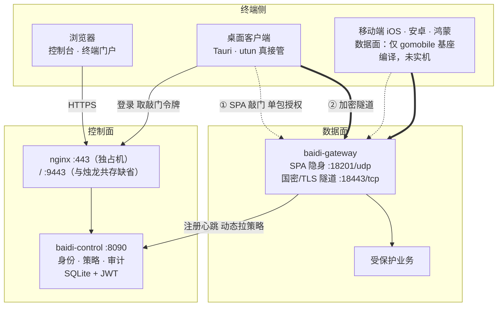
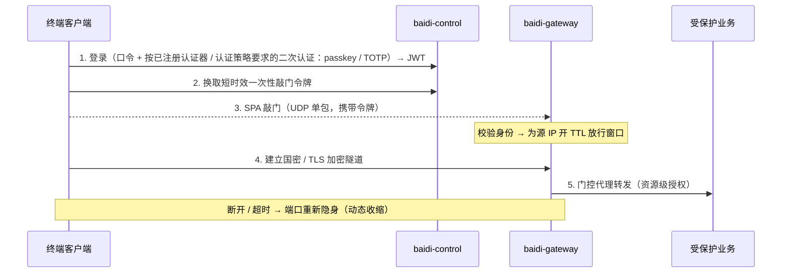

<div align="center">

# 白帝 · 零信任访问控制系统

**以身份重塑边界 —— 默认不信任、持续验证、最小授权、动态收缩。**

零信任访问控制（ZTNA / SDP）全栈实现：SPA 服务隐身 · 国密加密隧道 · utun 真流量接管 · 身份/策略/审计闭环。
对标深信服 aTrust / Zscaler / Cloudflare ZTNA，定位为 SSL VPN（EasyConnect 一代）的下一代演进。


</div>

---

## ✨ 核心能力

| | 能力 | 说明 |
|---|---|---|
| 🕵️ | **SPA 单包授权** | **先认证、后连接**：未敲门的连接一律拒。加 `-pf` 可落到 nftables/pf 内核态 DROP；**参考部署默认不开 `-pf`**，此时未敲门的 TCP 连接完成三次握手后被断开、扫描器判 `open`。隐身是否生效以网关页的实测回执（八态）为准，不以配置为准 |
| 🎫 | **短时效一次性敲门令牌** | 控制面签发 90s + `jti` 去重令牌，根治重放攻击 |
| 🔐 | **国密 TLCP 隧道** | SM2 双证书 + `ECC_SM4_GCM_SM3`；通用 TLS 1.3 亦可切换 |
| 🚇 | **utun 真流量接管** | 桌面客户端以 utun 虚拟网卡真正接管受保护网段流量（gVisor 用户态栈；敲门是 15s 保活对全部网关落点各敲一次，不逐流），非"演示动画"。macOS 端到端实测；Windows ARM64 阶段 A/B 过、阶段 C 未完，x64 与 Linux 未实机 |
| 🧭 | **零信任闭环** | 身份 / 认证（认证策略驱动的二次认证：passkey / TOTP）/ 资源 / 接入策略（在线设备上限 / 无流量超时注销）/ 网关 / 审计 / 系统。业务层自研，密码学与协议库见各 `go.mod`（gotlcp / gmsm / gVisor / go-ldap / go-webauthn 等） |
| 🌐 | **七层 Web 代理（B/S 免客户端）** | 门户取一次性票据 → 网关换本机会话 Cookie → **逐请求重新鉴权** → 反代到真后端；`gateway/web-e2e.sh` 九条断言。**L7 端口不受 SPA 隐身保护**、HTML 绝对链接不改写、应用间隔离靠不住（见 ARCHITECTURE 第七节） |
| 🔗 | **IPSec 站点组网** | 纯 Go 自研 IKEv2 + ESP（独立进程 `baidi-ipsec`），两台白帝网关之间真隧道承载真流量，`ipsec-e2e.sh` 无 root 可验。**仅 PSK 认证、ESP 只走 UDP-4500 封装、未与 strongSwan 实机互通**；`suite=gm` 是私有码点，**不是国密 IPSec** |
| 🛡 | **控制面温备** | `baidi-standby` 周期拉加密备份（`VACUUM INTO` 一致性快照）→ 校验 → 落盘 → 回报新鲜度；切换是脚本 `deploy/promote-standby.sh`，**需人工触发、不做自动选主、不是双活**（RPO = 同步间隔） |
| 📡 | **审计外送 Syslog / SIEM** | RFC 5424 + RFC 6587 帧（只走 TCP，可选 TLS 且不给跳过校验的开关）与通用 HTTP JSON 出口，每条带审计链 `seq`/`mac` 供 SIEM 侧独立验真；有界队列、丢新保旧并留痕。**未与商用 SIEM 实机对接** |
| 📺 | **态势大屏** | 全屏 NOC：实时威胁雷达 + 三道防线仪表 + 实时安全事件 + 接入网关分布（无 GeoIP，不做「地域」；连真实接口，15s 轮询） |
| 🩺 | **运维诊断** | `/diag` 15 项**真实**自检（控制面 / 存储与审计链 / 数据面 / 内核态隐身回执 / 自动备份与温备 / 认证源 / 终端合规 / 密钥…）+ 健康分；不可判定与确定失败分开计 |
| 📇 | **真实审计** | 每个管理写操作落库留痕（HMAC 链），放行与拒绝都留痕，审计中心实时呈现 |
| 🩹 | **终端 posture + 风险引擎** | 桌面客户端真实采集（FileVault/SIP/防火墙/EDR）60s 上报，控制面按**可编辑安全基线**集中评估；不合规 → 拒发敲门令牌 + 自动撤窗断隧道（持续验证闭环）。采集三态（探不到报 unknown，不塌缩） |
| 🖥 | **多端客户端** | 桌面 Tauri（macOS 端到端已验；Windows ARM64 部分实机、x64 未实机；Linux 未实机）· 鸿蒙桌面壳（ArkWeb 复用桌面 UI，真机跑通，**数据面未实现**）· 安卓 APK（CI 出包未装机）· iOS 仅参考源码（`PacketTunnelProvider.swift` / `RouteSpec.swift`）+ swiftc 自检脚本 `test-routespec.sh`、无工程 |

## 🏗 架构


```mermaid
flowchart TB
  subgraph 终端侧
    direction LR
    B["浏览器<br/>控制台 · 终端门户"]
    D["桌面客户端<br/>Tauri · utun 真接管"]
    M["移动端 iOS · 安卓 · 鸿蒙<br/>数据面：仅 gomobile 基座编译，未实机"]
  end

  subgraph 控制面
    N["nginx :443（独占机）<br/>/ :9443（与烛龙共存缺省）"] --> C["baidi-control :8090<br/>身份 · 策略 · 审计<br/>SQLite + JWT"]
  end

  subgraph 数据面
    G["baidi-gateway<br/>SPA 隐身 :18201/udp<br/>国密/TLS 隧道 :18443/tcp"] --> R["受保护业务"]
  end

  B -->|HTTPS| N
  D -->|登录 取敲门令牌| N
  D -.->|① SPA 敲门 单包授权| G
  D ==>|② 加密隧道| G
  M -.-> G
  M ==> G
  G -->|注册心跳 动态拉策略| C
```

## 🔐 零信任接入链路


```mermaid
sequenceDiagram
  participant U as 终端客户端
  participant C as baidi-control
  participant G as baidi-gateway
  participant R as 受保护业务
  U->>C: 1. 登录（口令 + 按已注册认证器 / 认证策略要求的二次认证：passkey / TOTP）→ JWT
  U->>C: 2. 换取短时效一次性敲门令牌
  U-->>G: 3. SPA 敲门（UDP 单包，携带令牌）
  Note over G: 校验身份 → 为源 IP 开 TTL 放行窗口
  U->>G: 4. 建立国密 / TLS 加密隧道
  G->>R: 5. 门控代理转发（资源级授权）
  Note over U,G: 断开 / 超时 → 端口重新隐身（动态收缩）
```

## 📂 目录结构

```
baidi/
├── console/         # 控制台（Vue3 + Arco，dev :5193）— 管理台 + 态势大屏 + 运维诊断 + 终端门户
├── control/         # 控制面 baidi-control + 温备 baidi-standby + 离线 CLI（Go，:8090，SQLite + JWT）
│   └── internal/    # 包清单见 docs/ARCHITECTURE.md 第六节「控制面」
├── gateway/         # 数据面（Go：SPA 敲门 / L4 隧道 / L7 Web 代理 / 内核态隐身 / utun 引流 / IPSec 站点组网）
│   ├── cmd/         # 9 个二进制：baidi-gateway / baidi-knock / baidi-tun / baidi-ipsec / baidi-gmca / e2e 自检…
│   └── internal/    # 包清单见 docs/ARCHITECTURE.md 第六节「数据面」；mobile/ gomobile 绑定；firewall/ pf·nft 脚本
├── clients/
│   ├── desktop/     # 桌面客户端（Vue + Arco + Tauri，utun 真数据面，dev :5294）
│   ├── harmony/     # 鸿蒙桌面壳（ArkWeb 复用 desktop 的 Vue 源码，真机跑通；数据面未实现）
│   └── mobile/      # 移动端 UI（移动优先，dev :5295）+ 原生 VPN 壳参考源码（安卓可出 APK，均未实机）
├── deploy/          # systemd + nginx + build / install / wipe / promote-standby 脚本
├── design-system/   # 烛龙黏土橙遗留目录（fork 残留），白帝不消费——主题只动 console/src/styles/tokens.css
└── docs/            # ARCHITECTURE.md 架构与技术方案（第七节是真伪清单）· SCOPE.md 范围边界 · design/ 交互规范
```

## 🚀 快速开始

### 控制面 + 控制台

```bash
# 控制面（Go，:8090，SQLite 首启自动建表 + 播种）
cd control && go run ./cmd/baidi-control

# 控制台（Vue，:5193，vite /api → 127.0.0.1:8090）
cd console && npm install && npm run dev     # → http://localhost:5193
```

- **登录**：管理台 `admin / baidi@123`；终端门户 `/portal/login` 用**种子账号**（如 `li.fang`）+ 口令 `baidi@123`——登录查的是目录账号 + bcrypt 哈希，**不是任意用户名都能登**。按脚本部署（`deploy/deploy.sh`）时 `BAIDI_SEED_MUST_CHANGE` 默认 1，种子账号**首次登录强制改密**；演示机在 `config.env` 里显式关闭。
- **二次认证（passkey + TOTP）**：passkey 由 `BAIDI_WEBAUTHN_RPID` + `BAIDI_WEBAUTHN_ORIGIN` 驱动，门户与管理台均覆盖——已注册 passkey 的账号登录需 Touch ID / Windows Hello / 安全密钥断言，`/portal/security` 管理凭据。注意 **RP ID 必须是可注册域名或 `localhost`，浏览器不允许裸 IP**，故上述 IP 演示站启用不了 passkey；**裸 IP 站用 TOTP**（`/portal/security` 绑定，自研 RFC 6238，不依赖域名，也是桌面/移动 C/S 客户端唯一能走的二因子）。演示验证码 `123456` 仅在「WebAuthn RP 未配置 **且** 未注册 TOTP **且** 认证策略未列二次方式」时残留（裸 IP 演示站即前一条恒成立的形态）；注册 TOTP 后对该账号从密码学上不可达。
- 未起后端时各页降级为内置演示数据，UI 完整可点。**「设备状态」与「业务告警」两页例外**：连不上就如实显示为空，不画假曲线、不编假告警。

### 数据面网关

```bash
cd gateway
./demo.sh                        # 暗 → SPA 敲门 → 隧道 → 后端 → TTL 自动重暗 的最小闭环演示
go run ./cmd/baidi-gateway -gm   # 国密 TLCP 隧道
```

### 桌面客户端（真 utun 接入）

```bash
cd clients/desktop
./src-tauri/build-sidecars.sh    # 构建 baidi-knock / baidi-tun sidecar
npm install && npm run tauri:build   # 产出 .app / .dmg（macOS，需 Rust 工具链）
```

登录后点「接入」→ 授权管理员 → 客户端以 **utun 虚拟网卡**接管控制面剖面下发的受保护网段：SPA 敲门开窗（15s 保活续窗、对全部网关落点各敲一次）+ 加密隧道送达网关。**不接入时该网段路由不存在**（先认证后连接的直接证据）。

## 🖥 控制台三模式（顶栏切换）

| 模式 | 路由 | 说明 |
|---|---|---|
| **控制台** | `/` | 监控中心 / 业务管理 / 安全防护 / 系统 四组侧栏 IA |
| **态势大屏** | `/screen` | 全屏暗色 NOC 实时态势感知 |
| **运维诊断** | `/diag` | 15 项系统自检 + 健康分（不可判定不计入通过） |

## ☁️ 部署与在线演示

`deploy/` 提供 systemd + nginx（HTTPS 443 独占机 / **与烛龙共存时缺省 9443**，绝不占 default_server；SPA 回退 + `/api` 反代 + 产品自带限流片段）+ 交叉编译/安装脚本；`WITH_GATEWAY=1` 一并装启国密网关，`WITH_IPSEC=1` 装站点组网守护进程。

> **在线演示**：`https://101.43.125.131/`（控制台 `admin/baidi@123`）。当前为自签证书（浏览器会提示，可继续访问），控制面 + 数据面公网全栈跑通，含国密 TLCP 真实接入。生产需换正式证书。

## 🧭 与「烛龙」的关系

白帝基于深信服 aTrust 逆向 PRD、从统一安全接入平台**烛龙**分叉立项，**独立仓库 + 自有全栈**（前端、控制面、数据面、客户端均自实现，不复用烛龙运行时）。相比烛龙主体**有意做减法**：移出 UEM 终端数据安全与安全中心管理模块，聚焦零信任访问控制主线。逐章取舍见 [`docs/SCOPE.md`](docs/SCOPE.md)。

## 📄 许可证与声明

本项目以 [MIT License](LICENSE) 开源。此外请知悉：

- **研究 / 演示用途**：白帝是零信任架构的自研学习与演示实现，演示口令、自签证书、内置种子数据仅供试用，**未经安全审计，请勿直接用于生产**。
- **国密说明**：TLCP / SM2·SM4·SM3 为工程演示实现（基于 gotlcp / gmsm），**非商用密码合规认证**；正式合规需走国密测评与认证。
- **需求来源**：PRD 由深信服 aTrust 公开资料逆向整理，**仅用于学习与产品设计研究**，不含其源码/专有资产；白帝业务层自研，密码学 / 协议 / 网络栈依赖开源库（见各 `go.mod`）。
- **真伪边界**：哪些能力是端到端验过的、哪些只有源码或只在本机验过，逐条见 [`docs/ARCHITECTURE.md` 第七节](docs/ARCHITECTURE.md)；本 README 的措辞以那份清单为准。
- **posture 信任边界**：终端环境检查由客户端自报（控制面按基线集中判定），**无远程证明（attestation）**——被控终端可伪造自报数据；真实产品需 TPM/公证链等度量根，此处为架构演示。

---

<div align="center"><sub>零信任 · 国密 · 自主可控 —— 默认不信任，持续验证。</sub></div>
