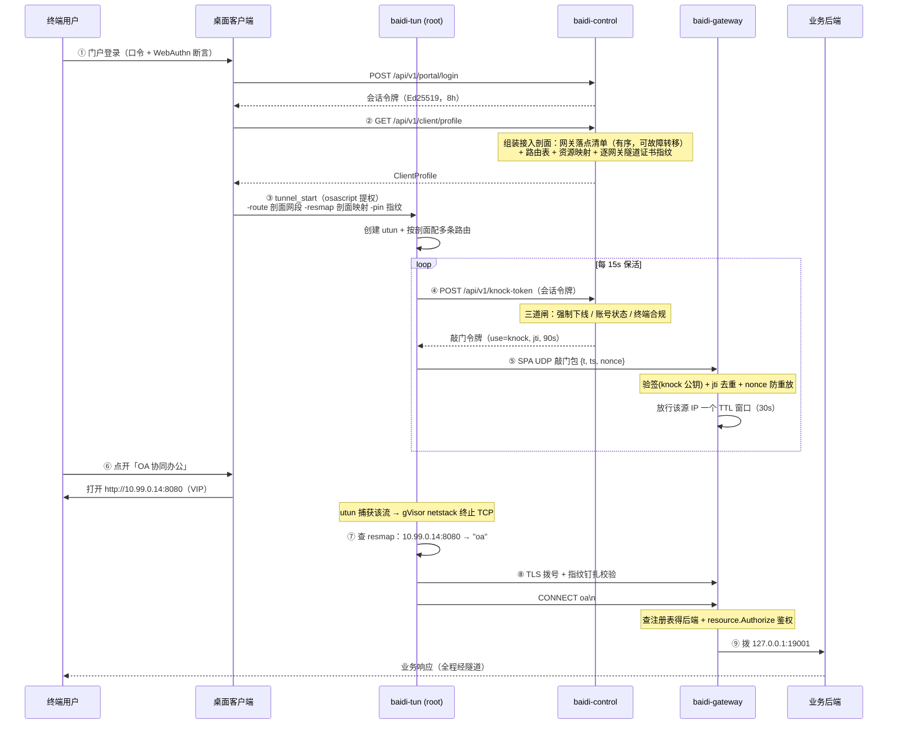
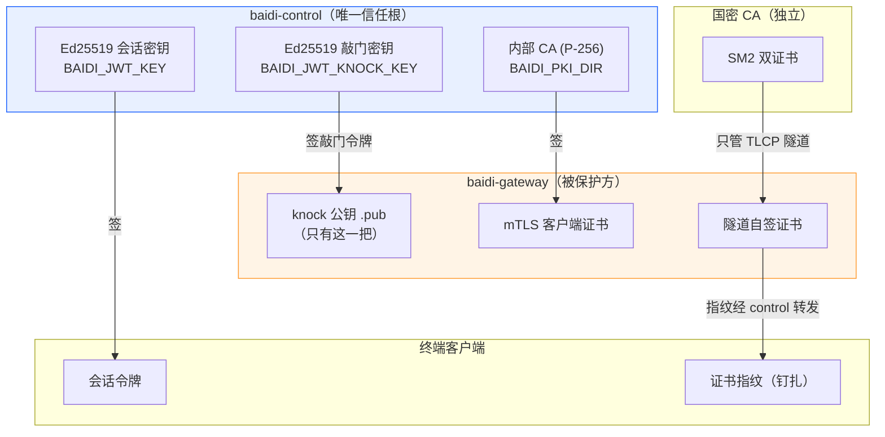
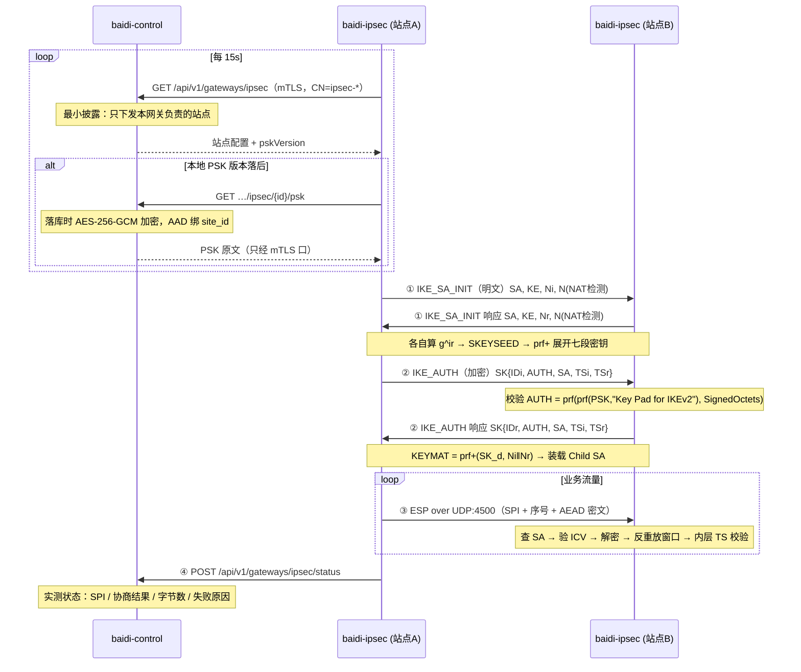

# 白帝 · 架构与技术方案解析

> 面向代码审查：每节都给出可点击的源码位置。读完这篇应当能回答「一个包从终端出发，经过哪些判定，最终怎么到达业务」，以及「哪一段是真链路，哪一段是演示数据」。
>
> 配套自检（各一条命令、自带起栈、无需 root/Docker）：
> - `cd gateway && ./e2e.sh` —— 南北向：登录 → 剖面 → 敲门 → 钉扎 → 多资源路由 → 越权拒绝
> - `cd gateway && ./ipsec-e2e.sh` —— 东西向：真 IKEv2 协商 → 真 ESP 加密 → 跨隧道业务流量 → 反例
> - `cd gateway && ./web-e2e.sh` —— 浏览器路径：取票 → 换 Cookie → 反代真后端 → 跨应用拒绝 → 撤权即断 → XFF 剥离

---

## 一、一句话架构

**控制面判定，数据面执行，两者之间只有单向的信任流。**

控制面（`control/`）持有全部判定权：谁是谁、能访问什么、此刻是否合规。数据面（`gateway/`）不做任何策略推导，只执行控制面下发的结论。终端（`clients/`）连策略都不推导，连"哪些地址该进隧道"都由控制面告诉它。

这条原则决定了后面所有的设计取舍——凡是让数据面或终端获得判定权/签发能力的方案，都被刻意排除了。

---

## 二、进程全景

| 进程 | 位置 | 职责 | 端口 |
|---|---|---|---|
| `baidi-control` | [control/cmd/baidi-control](../control/cmd/baidi-control/main.go) | 控制面：身份、策略、审计、令牌签发、接入剖面下发 | 8090（管理）/ 8092（网关 mTLS） |
| `baidi-gateway` | [gateway/cmd/baidi-gateway](../gateway/cmd/baidi-gateway/main.go) | 数据面：SPA 门控 + 隧道代理 + 资源路由 | 18201/udp（敲门）、18443/tcp（隧道） |
| `baidi-tun` | [gateway/cmd/baidi-tun](../gateway/cmd/baidi-tun/main.go) | 终端数据面：utun 接管流量 → 逐流入隧道（需 root） | — |
| `baidi-knock` | [gateway/cmd/baidi-knock](../gateway/cmd/baidi-knock/main.go) | 轻量敲门器（桌面端 sidecar） | — |
| `baidi-knock-agent` | [gateway/cmd/baidi-knock-agent](../gateway/cmd/baidi-knock-agent/main.go) | 浏览器 dev 联调用的敲门代理 | 8091 |
| `baidi-gmca` | [gateway/cmd/baidi-gmca](../gateway/cmd/baidi-gmca/main.go) | 国密 SM2 双证书签发（只服务 TLCP 隧道） | — |
| `baidi-tlcp-probe` | [gateway/cmd/baidi-tlcp-probe](../gateway/cmd/baidi-tlcp-probe/main.go) | 国密隧道探针（curl 不支持 TLCP） | — |
| `baidi-e2e` | [gateway/cmd/baidi-e2e](../gateway/cmd/baidi-e2e/main.go) | **全链路自检**：8 步真实断言 | — |
| `baidi-ipsec` | [gateway/cmd/baidi-ipsec](../gateway/cmd/baidi-ipsec/) | **站点组网**：自研 IKEv2 + ESP（需 CAP_NET_ADMIN） | 500/udp（IKE）、4500/udp（NAT-T + ESP 封装） |
| `baidi-ipsec-e2e` | [gateway/cmd/baidi-ipsec-e2e](../gateway/cmd/baidi-ipsec-e2e/) | IPSec 全链路自检（无 root） | — |
| console | [console/](../console/) | 管理台 SPA + 门户 + 大屏 + 诊断 | 5193（dev） |
| desktop | [clients/desktop/](../clients/desktop/) | Tauri 2 + Vue3 桌面客户端 | 5294（dev） |

---

## 三、核心链路：一次接入的完整时序

这是理解整个系统的主干。**注意 ②③ 两步是本轮补上的关键环节** —— 在此之前客户端不知道该接管哪些网段，隧道建起来了也没有流量进去。



### 为什么第 ②③ 步是关键

修复前，客户端的接管网段是**设置页里手填的** `10.99.0.0/24`，而业务真实地址是 `10.20.1.10:8080`。两者毫无关系，于是：

- 隧道成功建立、UI 显示"已接入"、日志一切正常；
- 但用户点开应用，流量走系统默认路由直连内网，**根本不进隧道**；
- 而 `-resmap` 从来没有被任何人填过，即使流量进了隧道也只会落到网关的单一默认后端。

这就是"最基础的客户端连接没跑通"的真实成因——不是某处报错，而是**整条映射链缺了控制面这一环**。修复方式是让控制面下发接入剖面（[clientprofile.go](../control/internal/api/clientprofile.go)），因为只有它同时知道：网关在哪、业务在哪、当前用户有权访问哪些资源。

---

## 四、信任模型：三套互不污染的密钥体系

这是全系统最需要小心的部分。三套 PKI 各管一段，**刻意不复用**：



### 关键不变量

| 不变量 | 实现位置 | 为什么 |
|---|---|---|
| **网关只装 knock 公钥** | [main.go `-jwt-pubkey`](../gateway/cmd/baidi-gateway/main.go) | 会话令牌用另一把密钥签，其 kid 在网关侧查不到 → **从密码学上就敲不开门**。`spa.checkKnock` 的 `use` 语义闸退化为纵深，而非唯一防线 |
| **敲门与 Web 票据各一把密钥** | [keys.go](../control/internal/auth/keys.go)、[splitkeys_test.go](../control/internal/auth/splitkeys_test.go) | 数据面有两条入场路径（UDP 敲门 / L7 票据），各只装一把公钥：拿错路径的票据在对面**连签名都验不过**，`use` 语义闸退化为纵深而非唯一防线 |
| **数据面没有 Sign 函数** | [gateway/internal/auth](../gateway/internal/auth/) | 阶段 4 主动删除。要加签发就是给被保护方发钥匙——不加 |
| **公钥走部署期文件分发，不做 JWKS 端点** | 部署脚本 | 在线端点若自身即信任根，会构成循环论证 |
| **配了 `-control` 就必须配 mTLS 证书** | [main.go](../gateway/cmd/baidi-gateway/main.go) | 机器身份只有一条路，没有回退 |
| **证书指纹白名单是即刻吊销的执行点** | [mtls.go `VerifyPeerCertificate`](../control/internal/api/mtls.go) | mTLS 只证明证书由我们签过，不代表此刻仍被信任 |
| **国密 CA 只管 TLCP 隧道** | [gmcert](../gateway/internal/gmcert/gmcert.go) | 与身份体系完全隔离，两套 PKI 互不污染 |

### 隧道证书钉扎（本轮新增）

网关的隧道证书是**启动期自签**的，没有公共 CA 可校验。修复前客户端写死 `InsecureSkipVerify: true` —— 隧道加密但**不认证**，任何抢到 TCP 连接的中间人都能冒充网关，把明文业务流量原样读走。

修复思路不是"去搞一个公共证书"，而是**把信任根落到控制面**：

1. 网关启动时算出自己隧道证书的 SHA-256 指纹，随 mTLS 注册心跳上报（[main.go `certFingerprint`](../gateway/cmd/baidi-gateway/main.go)）；
2. 控制面存下并经接入剖面转发给客户端（[clientprofile.go `ProfileGateway.TunnelPin`](../control/internal/api/clientprofile.go)）；
3. 客户端在 `VerifyPeerCertificate` 里比对指纹（[dataplane.go `tlsClientConfig`](../gateway/internal/dataplane/dataplane.go)）。

> 代码里仍然有 `InsecureSkipVerify: true`，但含义完全不同：它关掉的是**链**校验（自签证书必然过不了），安全性改由指纹钉扎承担。钉扎比链校验**更严**——只认那一张证书，连同一个 CA 签的其他证书都不认。回归覆盖见 [pin_test.go](../gateway/internal/dataplane/pin_test.go)。

---

## 五、五道门：一个访问请求会被拦几次

理解白帝的核心在于：**同一个访问会被独立地拦截五次，任何一次拒绝都终止访问**。

| # | 门 | 位置 | 拦什么 |
|---|---|---|---|
| 1 | **敲门令牌签发闸** | [api.go `handleKnockToken`](../control/internal/api/api.go) | 强制下线名单 / 账号禁用锁定 / 终端合规（posture）三项任一不过就不发令牌 |
| 2 | **SPA 单包授权** | [spa.go `checkKnock`](../gateway/internal/spa/spa.go) | 令牌签名、`use=knock`、jti 去重、TTL 上界、nonce 防重放；未通过 → 网关对该 IP 保持隐身 |
| 3 | **放行窗口** | [spa.go `Allowlist`](../gateway/internal/spa/spa.go) | 源 IP 不在 30s 放行窗口内 → 隧道端口直接断连 |
| 4 | **隧道证书钉扎** | [dataplane.go](../gateway/internal/dataplane/dataplane.go) | 对端不是那台网关 → 握手失败（防中间人） |
| 5 | **资源鉴权** | [registry.go `Authorize`](../gateway/internal/resource/registry.go) | 资源 id 的 AllowRoles/AllowUsers 不命中 → 断连 |

关键：**接入剖面不是授权凭据**。它只是"路由提示"，告诉客户端哪些地址该进隧道。即使剖面被完整泄露，攻击者也拿不到任何访问权 —— 第 5 道门在网关侧独立重新鉴权（自检第 ⑧ 步专门验证这一点）。

### 浏览器走的是另一条入场路径（同样五道，但第 2~4 道换了）

上面五道门描述的是 **C/S 隧道**。浏览器做不了 SPA 敲门（那是带签名令牌的 UDP 包），
所以 B/S 免客户端接入另有一条链，只有第 1 道与第 5 道是同一段代码：

| # | 门 | 位置 | 拦什么 |
|---|---|---|---|
| 1 | **票据签发闸** | [api/webproxy.go `handleWebTicket`](../control/internal/api/webproxy.go) | 与敲门**共用** `entryGates`：强制下线 / 账号禁用锁定 / 终端合规；再加一次资源鉴权（`accessibleFor`，与剖面同一入口） |
| 2 | **票据校验** | [webproxy.VerifyTicket](../gateway/internal/webproxy/ticket.go) | 签名（只装 web 公钥）、`use=web`、jti、绑定资源、TTL 上界、角色白名单 |
| 3 | **会话 Cookie 绑定** | [webproxy/session.go](../gateway/internal/webproxy/session.go) | HttpOnly+Secure+SameSite=Lax + Path 限定到 `/app/<资源id>/`，服务端再复核 Cookie 里的资源与路径一致 |
| 4 | **强制下线名单** | `spa.Allowlist.UserDenied` | 控制面下发的封禁名单对两条路径同时生效 |
| 5 | **逐请求资源鉴权** | [registry.go `Authorize`](../gateway/internal/resource/registry.go) | **每个 HTTP 请求**都重查一次（含 DenyUsers 否决）——不是只在建会话时判一次 |

第 5 道是这条链的关键：它让强制下线 / 风险降权 / JIT 到期在**一个策略轮询周期内**自然生效，
不必等票据或 Cookie 过期。`./web-e2e.sh` 的第 ⑤ 条断言专门验证「撤权后同一个 Cookie 的下一个请求就被拒」。

### fail-closed 的代价与补偿

严格敲门（默认开）意味着**所有敲门客户端必须能访问控制面**。副作用是：控制面不可达超过网关 TTL（30s）时，窗口自然关闭、访问中断。

这是刻意的选择——零信任下失去策略源就该收窗，而不是拿长效令牌硬撑。补偿手段是 reknock 频度（15s）显著小于 TTL（30s），单次抖动不至于关窗（[dataplane.go `knock`](../gateway/internal/dataplane/dataplane.go)）。

---

## 六、代码地图

### 控制面 `control/`

```
cmd/baidi-control/       启动、密钥自举、双监听（明文 8090 + mTLS 8092）
internal/api/
  api.go                 主路由表 + 门户/管理端点（1000+ 行，从这里开始读）
  clientprofile.go       ★接入剖面：网关落点 + 路由表 + 资源映射 + 证书指纹
  mtls.go                网关 mTLS 服务端配置 + 证书指纹白名单校验
  jit.go                 JIT 申请 → 审批 → 时限授予
  webauthn.go            passkey 注册/断言两回合
  posture.go             终端环境上报
  diag.go                自诊断
internal/auth/           Ed25519 双密钥、JWT 自实现、中间件
internal/pki/            内部 CA（签网关 mTLS 客户端证书）
internal/risk/           按安全基线评估 posture → allow/observe/block
internal/store/          领域文件 + 同名 _sqlite.go 成对；Memory 是种子/降级
internal/webauthnx/      WebAuthn 依赖方实现
```

### 数据面 `gateway/`

```
internal/spa/            ★SPA 单包授权：放行表、封禁、敲门校验
internal/proxy/          受 SPA 门控的隧道代理；CONNECT 前导多资源路由
internal/resource/       资源注册表（防 SSRF：后端地址只来自注册表）
internal/dataplane/      ★客户端数据面引擎（桌面/移动共享）
                         TUN → gVisor netstack → 逐流隧道 + 证书钉扎
internal/knock/          敲门包封装、nonce 缓存、向控制面换令牌
internal/cplane/         网关侧控制面客户端（mTLS）
internal/darkfw/         内核态隐身（pf / nft）
internal/auth/           令牌验证（★刻意没有 Sign）
internal/gmcert/         国密 SM2 双证书
internal/ipsec/          ★站点组网：自研 IKEv2 + ESP（约 2 万行含测试）
                         依赖是一条单向链，任何一环都不许反向 import：
                         ipsec（契约） ← ike ← esp ← site ← cmd/baidi-ipsec
  types.go               契约层：SiteConfig / SiteState / Protector / Datapath / Transport
  config.go              装载期拒绝规则的**唯一集中地**（不支持的配置一律显式拒绝，绝不静默降级）
  transport_udp.go       500/4500 双监听 + non-ESP marker + IKE/ESP/keepalive 三分流
  transport_mem.go       进程内假 UDP 网 —— 让「真协商」能被无 root 的 go test 验证
  datapath_{tun,pair,netstack}.go  生产 TUN / 内存对拨 / gVisor netstack 三种数据面
  ike/                   IKEv2：wire 报文层、payload_* 载荷、crypto+dh 算法、keys 派生、
                         auth PSK 认证、suite 套件映射、initiator/responder/engine 状态机、
                         rekey / nat / cookie / retransmit
  esp/                   ESP：packet 线格式、sa SPI 与生存期、replay 反重放窗口、spd 选路
  site/                  编排：site 生命周期、backend 声明式对账、pump 双向泵、status 状态聚合
mobile/baidimobile/      gomobile 绑定（iOS/Android）
```

### 客户端 `clients/desktop/`

```
src-tauri/src/main.rs    Tauri 壳：osascript 提权拉起 root baidi-tun、
                         终端环境采集、托盘常驻、open_app_url 白名单
src/lib/api.ts           HTTP 封装 + 接入剖面类型
src/lib/store.ts         会话 / 配置 / ★接入剖面（profile）
src/lib/tunnel.ts        ★resolveTunOpts：剖面优先、config 兜底；
                         ★parseTunStatus：接入态判据 = 数据面「健康行」（ready = knock ∧ err 空；tunnel 位只展示，
                         空闲健康态它恒 false），健康行缺席才回落两行启动日志；
                         ★nextDataplaneNotice：运行中失败的提示条去留（隧道类失败被保活敲门擦掉不算恢复）；
                         单测 tunnel.test.ts（npm test）
src/lib/knock.ts         敲门抽象（Tauri sidecar / dev 代理两条路径）
src/views/Connect.vue    接入状态机（吃 parseTunStatus 的结论；运行中的失败原因也上屏）
src/views/Apps.vue       ★应用中心：真实打开 VIP 地址
```

### 客户端 `clients/mobile/`（移动端 UI + 原生 VPN 壳参考源码，数据面均未实机）

```
src/                     移动优先 Vue UI（登录 / 接入 / 应用 / 我的），浏览器视口实测
src/lib/vpn.ts           原生桥 window.__BAIDI_NATIVE__（无桥时退化为经 knock-agent 真敲门）
native/android/          VpnService 壳：可在 CI 出 debug APK（clients-mobile.yml），未装机
native/ios/              参考源码（PacketTunnelProvider.swift / RouteSpec.swift）+ swiftc 自检脚本
                         test-routespec.sh，无 Xcode 工程
native/harmony/          仅 VpnExtAbility.ets 骨架，NAPI 桥未实现
```

### 客户端 `clients/harmony/`（鸿蒙桌面壳：真机跑通 UI，数据面未实现）

```
entry/                   ArkWeb 壳 + 原生桥注入（platform / startTunnel / stopTunnel）
build.sh                 命令行构建 / 装机 / 拉起（签名那一步要 DevEco 一次）
inline-webui.py          把 clients/desktop 的 Vue 源码内联成单文件进 rawfile
                         （desktop 侧 vite.harmony.config.ts 用 alias 把三个 Tauri 模块换成 webui/shim/）
```

★两个目录的共同边界：**没有一条移动/鸿蒙数据面在任何真机上跑过**。`startTunnel` 在鸿蒙上如实返回失败，
不会画出「已接入」。

---

## 六·五、站点组网：自研 IKEv2 + ESP

远程接入（南北向：用户 → 业务）与站点组网（东西向：站点 ↔ 站点）是**两条完全独立的链路**，只共享 mTLS 客户端证书与控制面地址。理解这一点很重要——它解释了为什么 IPSec 是独立进程而不是并进网关。

### 为什么是独立进程

| 理由 | 说明 |
|---|---|
| **权限边界（决定性）** | `baidi-gateway` 是**非 root、`NoNewPrivileges=true`** 的进程——这不是偶然：SPA 敲门 + 隧道代理只需两个高位端口。IPSec 需要 `CAP_NET_BIND_SERVICE`（绑 500）+ `CAP_NET_ADMIN`（建 TUN、配路由）。并进去等于给**直接暴露在公网、逐包解析未认证 UDP 敲门包**的进程授予建网络接口的能力，账算不过来 |
| **失效域隔离** | 网关挂 = 远程接入中断；IPSec 挂 = 站点组网中断。合进一个进程意味着 IKE 解析器的一个 panic 会顺带打掉所有远程接入 |
| **部署可选性** | `WITH_IPSEC=0` 默认关。很多部署只要远程接入不要站点组网，不该被迫背上一个需要特权的组件 |

### 一条隧道的建立时序



### 三个关键设计决定

**① ESP 只走 UDP 4500 封装，不做裸 ESP。** 裸 ESP（IP 协议号 50）需要 raw socket + root，本机无法验证——做了就等于再造一个不可验证的声明。UDP 封装还顺带让 IKE 与 ESP 共用一条 socket（NAT 映射按五元组建立，ESP 另开端口在 NAT 后必然收不到）。

**② 期望态与观测态彻底分家。** `ipsec_sites.enabled` 是管理意图（toggle 只改这个），`ipsec_sa_state` 是网关实测回报。旧实现里 `status` 一列同时承担两者，于是「点了启用」和「真的连上了」在界面上长得一模一样——真做 IKE 后必然出现「点了启用但协商失败」，混在一起就是又一个静默失效。

**③ 算法参数化从第一行做起。** IKEv2 的报文编解码、状态机、SPI 管理、rekey、NAT-T、ESP 封装占了 90% 的工作量，而这些**全部与具体算法无关**。把算法藏在 `EncrAlg`/`PRF`/`IntegAlg`/`DHGroup` 接口后面，增加国密套件的成本就退化为「注册表加一行 + 几十行 gmsm 胶水」。反过来先硬编码 AES 再回头抽象，代价是重写整条链路。

> 国密套件能以极低成本存在，但**能实现不等于能声称合规**——它走 IANA 私有码点，只白帝↔白帝互通，与 GM/T 0022 无关。边界见第七节。

---

## 七、真实性清单（诚实版）

这是本文档最该被认真读的一节。

### ✅ 真链路（可用 `./e2e.sh` 复现验证）

| 能力 | 证据 |
|---|---|
| SPA 单包授权 + 服务隐身 | 自检 ③：敲门前直连必被拒 |
| 短时效一次性敲门令牌（三道闸） | 自检 ④；[api.go `handleKnockToken`](../control/internal/api/api.go) |
| 敲门重放防护（ts + nonce + jti） | [knock.go](../gateway/internal/knock/knock.go)、[spa_test.go](../gateway/internal/spa/spa_test.go) |
| TLS / 国密 TLCP 隧道 | 自检 ⑤；国密路径用 `baidi-tlcp-probe` 验证 |
| **隧道证书钉扎（防中间人）** | 自检 ⑤⑥；[pin_test.go](../gateway/internal/dataplane/pin_test.go) |
| **多资源路由到不同后端** | 自检 ⑦：两个资源落到两个可区分的后端 |
| **资源级鉴权（越权拒绝）** | 自检 ⑧ |
| utun 真流量接管 + gVisor netstack | [dataplane.go](../gateway/internal/dataplane/dataplane.go)（需 root，自检不覆盖建卡） |
| **网关多活 + 客户端故障转移（有序落点清单 · 逐网关指纹 · 切换可见）** | 自检 ②（单数 `gateway` 与清单首项一致）；[clientprofile.go `profileGateways`](../control/internal/api/clientprofile.go)、[api/failover_test.go](../control/internal/api/failover_test.go)、[dataplane/failover.go](../gateway/internal/dataplane/failover.go)、[dataplane/failover_test.go](../gateway/internal/dataplane/failover_test.go)（两张不同自签证书跑真 TLS 握手：首选死掉切备用、指纹取错必须被拒） |
| 网关 mTLS 机器身份 + 即刻吊销 | [mtls.go](../control/internal/api/mtls.go)、[gwidentity_test.go](../control/internal/api/gwidentity_test.go) |
| 强制下线（撤窗 + 断隧道 + 封禁敲门） | [linkage_test.go](../control/internal/api/linkage_test.go) |
| 终端合规（posture）→ 拒发令牌 | [posture_test.go](../control/internal/api/posture_test.go)、[risk_test.go](../control/internal/risk/risk_test.go) |
| **风险分档四档都有执行方（gray 观察 / degrade 降权 / block 全断）** | [degrade_test.go](../control/internal/api/degrade_test.go)、[registry_test.go](../gateway/internal/resource/registry_test.go) |
| JIT 申请 → 审批 → 时限授予 → 网关放行 | [jit_sqlite_test.go](../control/internal/store/jit_sqlite_test.go)、`TestBuildProfile_ActiveGrantUnlocksRouting` |
| WebAuthn / passkey 二次认证 | [ceremony_test.go](../control/internal/webauthnx/ceremony_test.go)（需可注册域名，裸 IP 不可用） |
| 真实在线用户 / 网关活性 | 网关 mTLS 注册上报，[monitor_objects.go](../control/internal/api/monitor_objects.go) |
| 审计落库 | [audit_sqlite.go](../control/internal/store/audit_sqlite.go) |
| **审计外送 Syslog/SIEM（RFC 5424 over TCP/TLS + HTTP JSON，持久化队列 + 退避重试 + 上界与丢弃计数）** | [internal/forward/](../control/internal/forward/)、[syslog_test.go](../control/internal/forward/syslog_test.go)（进程内 TCP 接收端跑真报文往返 + TLS 反例）、[auditfwd_sqlite_test.go](../control/internal/store/auditfwd_sqlite_test.go)、[api/auditforward_test.go](../control/internal/api/auditforward_test.go)（真审计 → 真投递 → 与 /audit 列表比对 seq/mac） |
| **网关设备状态采集（CPU/内存/磁盘/负载/吞吐，随心跳上报 + 时序落库 + 降采样）** | [internal/sysstat/](../gateway/internal/sysstat/)、[sysstat_test.go](../gateway/internal/sysstat/sysstat_test.go)（本机真采一次断言值域）、[metrics_sqlite_test.go](../control/internal/store/metrics_sqlite_test.go)、[api/metrics_test.go](../control/internal/api/metrics_test.go) |
| **应用分类字典（可自建可修改，此前是编译进二进制的两个常量）** | [appcats.go](../control/internal/store/appcats.go)、[appcats_sqlite.go](../control/internal/store/appcats_sqlite.go)、[appcats_sqlite_test.go](../control/internal/store/appcats_sqlite_test.go)（回填 + 重启不复活已删分类 + 收养历史自由文本值 + **发布应用与删分类并发互斥**：`CreateApp` 的分类校验与 INSERT 同事务，否则两个管理员并发能落库一个字典外的孤儿应用）、[api/appcats_test.go](../control/internal/api/appcats_test.go)（三权矩阵 + 删除守卫 409 带数量 + 内置拒删 + 改名后应用页跟随） |
| 组织树 / 用户组落库（含环形父子拒绝、删除守卫、种子部门回填） | [orgs_sqlite.go](../control/internal/store/orgs_sqlite.go)、[orgs_sqlite_test.go](../control/internal/store/orgs_sqlite_test.go)、[orgs_test.go](../control/internal/api/orgs_test.go) |
| **按组织 / 用户组授权（含子树继承、移出即失效、两处判定同构）** | [subjects.go](../control/internal/store/subjects.go)、[subjects_sqlite_test.go](../control/internal/store/subjects_sqlite_test.go)、[subjects_test.go](../control/internal/api/subjects_test.go) |
| **认证策略驱动二次认证（自适应认证真接进登录链路）** | [authpolicy.go](../control/internal/authpolicy/authpolicy.go)、[authpolicy_test.go](../control/internal/authpolicy/authpolicy_test.go)、[api/authpolicy_test.go](../control/internal/api/authpolicy_test.go) |
| **管理员分级分权 / 三权分立（有真执行方 + 防自锁）** | [admins_sqlite.go](../control/internal/store/admins_sqlite.go)、[api/admins.go](../control/internal/api/admins.go)、[adminrbac_test.go](../control/internal/api/adminrbac_test.go)、[admins_sqlite_test.go](../control/internal/store/admins_sqlite_test.go) |
| **消息通道 SMTP / Webhook（真发；STARTTLS 不降级；安全事件真通知）** | [internal/notify/](../control/internal/notify/)、[smtp_test.go](../control/internal/notify/smtp_test.go)（进程内 SMTP 服务端跑真协议）、[api/notify_test.go](../control/internal/api/notify_test.go)。★`kind=sms` 就是 webhook，不是短信网关实现 |
| **七层 Web 代理（B/S 免客户端：票据换会话 + 逐请求重新鉴权 + 反代）** | `./web-e2e.sh` 九条断言；[gateway/internal/webproxy/](../gateway/internal/webproxy/)、[api/webproxy.go](../control/internal/api/webproxy.go)、[api/webproxy_test.go](../control/internal/api/webproxy_test.go) |
| **业务告警实体与规则（八类触发源全部读真实信号 + 冷却去重 + 处置状态机）** | [internal/alerting/](../control/internal/alerting/)、[alerting_test.go](../control/internal/alerting/alerting_test.go)、[api/alerts_test.go](../control/internal/api/alerts_test.go)（真把心跳调旧 / 真连错口令锁账号 / 真篡改一行审计） |

**按组织 / 用户组授权（真，判定权全在控制面）**：资源授权从「角色 + 账号」两维扩到四维，新增 `resources.allow_groups / allow_orgs`（补列 + 回填 `[]`，既有行语义不变）。组织**含子树**——授权给某组织即涵盖其全部后代组织的用户。

- **子树展开只有一处实现**：`store.SubjectIndex`（[subjects.go](../control/internal/store/subjects.go) 纯逻辑 + [subjects_sqlite.go](../control/internal/store/subjects_sqlite.go) 取数）。它靠 `org_units.path` 这条冗余物化路径一次性展平祖先链，不递归查库。
- **数据面一字未改**：网关的 `resource.Resource` 仍只有角色/账号两维，`registry.Authorize` 原样不动。组织与组在控制面 `expandForGateway` 里展开成账号并进 `AllowUsers` 后才下发——与「数据面不做策略推导」的既有原则一致，也避免网关按 30s 周期缓存一棵可能已经过时的组织树。
- **控制面四个判定点同构**：`handleGatewayPolicy → expandForGateway`（权威闸）、`buildProfile → appAccessState`（剖面路由提示）、`handlePortalApps → appAccessState`（门户磁贴）、`handleWebTicket → accessibleFor`（七层入口票据）都只调 `SubjectIndex` 的方法。同构测试见 [subjects_test.go](../control/internal/api/subjects_test.go)（网关 × 剖面）与 [portal_apps_test.go](../control/internal/api/portal_apps_test.go)（门户 × 剖面，两个端点都走真实 HTTP）。
- **门户磁贴曾经是第四个判定点，而且方向相反**（wave8 行动 1 修复）：`handlePortalApps` 自己写了一份只看 `sensitivity` 的判据——普通资源恒可访问、高敏资源恒需申请，静态 ACL / 组织 / 用户组一概不看。三种失败形态全部无报错：①普通资源未授权的人看到亮着的「访问」按钮，点下去才 403；②**已被静态授权**的高敏资源显示「需申请」，逼人为自己已有的权限走一遍审批，而同一个人经桌面客户端或 Web 票据立刻能进（审批退化成纸面闸）；③高敏 + 未设 ACL 的资源磁贴锁着，点「申请权限」被 JIT 闸以「目标资源未设访问限制，无需申请」400 顶回来——UI 说需申请、后端说无需申请，浏览器侧是条死路，而该资源经隧道对全体登录用户开放。第③种由 `backfillResourceSensitivity` 自动造得出来（`apps.category='finance'` 关联的资源一律抬成 high，不问它有没有 ACL）。现在 ②③ 两处收敛成同一个 `api.appAccessState`，死路的消失靠**两步**：控制面侧「不可访问 ∧ 非降权 ∧ 非不可用 ⟹ `Restricted()==true` ⟹ JIT 闸必收单」（有用例真的把申请打出去、断言不是 400），前端侧把 degraded / unavailable 两个分支**排在**「申请权限」之前。少了后一步，降权态下的高敏不限资源会立刻画出「申请权限」而后端仍回「无需申请」——原缺陷原样复活，所以改前端时不许把这两个分支合并掉。
- **「结构性不可用」是配置缺口，不是授权结论**：磁贴另有一格 `unavailable` + 一句服务端下发的 `unavailableReason`。它有**两种成因**——未关联受控资源、后端不是 `host:port`——恰好对应剖面的两条丢弃路径，合并成一个状态是因为对用户它们是同一件事（点了打不开、申请也没用、只能找管理员）。剖面对这类应用的处置是「丢弃 + 给管理员一条 warning」，门户没有 warnings 通道，故如实标在磁贴上并把按钮置灰——它既不能画成「访问」（点了必然打不开），也不能画成「需申请」（JIT 闸会以「该应用不支持自助申请」拒掉，同样是死路）。同构测试钉的是**双向**不变式「剖面里没有它 ⟺ 门户说它不可用」：只覆盖其中一种成因的话，另一条丢弃路径上门户会继续把按钮亮着。测试还遍历两侧 key 的并集并断言「门户磁贴覆盖库里全部 running 应用」——只从门户一侧遍历时，「把不可用的磁贴干脆藏起来」这类改动会全包绿灯通过（对抗式复核用真变异实测出过这个盲区），而那对用户是应用凭空消失且无任何解释，比显示成不可用更糟。
- **`handleSaveResource` 至今不校验 `backend` 的 host:port 形态**，缺端口的资源能经控制台真的落库（`Resources.vue` 只选地址对象、不选服务对象时就会写出裸地址）。上面那道读侧兜底覆盖了展示与路由，但入口校验是根因，另立项（见 [wave8 charter](charter/wave8.md) 边界建议）。
- **展开每次现算、不缓存**：撤权与生效之间不留窗口，把人移出组织下一轮网关轮询即失效。
- **空展开下发哨兵**（`store.DenyAllSubject`）：只按组织授权、而该组织成员为零时，展开结果为空；若原样下发，网关会因「AllowUsers 与 AllowRoles 皆空 = 不限」退化成**对所有人开放**，而控制面判定的是「对所有人关闭」——方向相反且两侧日志都正常。哨兵是一个含 NUL 字节、任何真实账号都不可能等于的值。
- 用户组成员按 **account** 存（而非 user id），正是为了在这一步能与令牌主体对齐。

控制台「资源策略」页的编辑器直接吃组织树与用户组真实数据，并显示**展开后的生效账号数**——那份数字与下发网关的展开出自同一次计算，管理员看得见子树语义的实际影响。

**业务告警（真，PRD ch5 FR-MON-21~25）**：此前白帝**没有告警实体**——审计中心的 `audit_log` 是只追加的流水，没有类别、没有 `pending/ignored/handled` 状态机、没有处置人，「谁值班时把这条异常处理掉了」这件事表达不了。现在 `alert_rules` + `alerts` 两张表落库，控制台「监控中心 → 业务告警」页可过滤与处置。

- **八类触发源，每一条都读一份真实存在的信号**（出处写在 `store.alertKindSpecs` 的 `Signal` 字段里，页面上原样展示）：网关心跳超时（与在线判据 `gatewayOnlineWindow` 同源）、网关 CPU/内存/磁盘超阈值（`gateway_metrics`）、JIT 授予即将到期、JIT 授予已过期未回收（库里仍标 active 的行，**刻意不吃展示层的到期纠正**——那会把"该回收没回收"抹平）、应用未关联受控资源（与客户端剖面 `warnings` 同一条信号）、账号/IP 爆破锁定（取 `lockout.Guard` 正在执行的那份）、终端 posture 判 block、**审计防篡改链周期性自检失败**。
- **审计链自检是这组里最该存在的一条**：防篡改链没人定期查，就等于没有——篡改发生到被发现之间的窗口，此前完全取决于有没有人手动点那个「校验」按钮。现在后台循环按 `BAIDI_ALERT_CHAIN_INTERVAL`（默认 15min）全链重算，失败即出 critical 告警。链断裂与"自检没跑成"是**两条不同措辞**的告警（运维的下一步动作不同）。
- **判定是纯函数**（`alerting.Evaluate`，吃一份信号快照吐候选），因此每条规则都能用构造出来的快照两向断言。告警最容易犯的错不是存不下来，而是条件写反——而条件写反在集成环境里与"一切正常"无法区分。「空快照不产生任何候选」有单独用例钉住（空集合语义反转是本项目栽过的坑）。
- **冷却期去重按 (规则, 对象)**：网关离线这类条件会持续成立，不冷却的话每轮评估刷一条，告警页当场不可用；对象键那一半同样必要——只按规则去重的话，三台网关同时离线只会留下一条。去重用单条 `INSERT … WHERE NOT EXISTS` 完成（先查后插在两轮评估重叠时会双双判"没有"）。冷却**只看时间不看状态**：按状态放宽会让人一点「已处理」就立刻冒出同一条。
- **未处置即压制 + 留存轮转（告警表的上界）**：有一类规则的条件是**永久成立**的——最典型的是 `grant_stale`：过期的 JIT 授予行在库里永远标着 active（全系统没有回收动作，那正是这条规则要报的事实），`app_unlinked` 同理是个能挂几个月的配置状态。只有时间冷却的话，每个这样的对象每 30 分钟产出一行新告警 + 一次同步通知 + 一两条审计，48 行/天/对象、只增不减，而 `alerts` 表此前**没有任何清理**。现在两道闸：① 同一 (规则, 对象) 上还挂着 `pending` 时不再产生新行（待办量收敛成"每个真实对象至多一条"，处置之后条件仍成立会在冷却期后如常再报，不是永久静默）；② `PurgeExpiredAlerts` 按 `BAIDI_ALERT_RETENTION_DAYS`（默认 90 天，下限 7 天，无"关闭"档）轮转**已处置**的行——`pending` 一律留着，按时间删待办等于让没人管的问题自己消失，而列表与角标会同时变干净。
- **单轮通知有预算（`alertNotifyBudget`=20）**：通知是同步发的（理由见上一条的反面），而单轮新增条数没有天然上界——升级后首轮评估、一次性接入几十台网关都可能一次产出上百条，× 每通道 SMTP 默认 15s 超时，`POST /alerts/evaluate` 会挂住几十分钟。超预算的告警**照常落库**（页面一条不少），只是不逐条外发，差额落一条审计说明。
- **数据源未就绪要说得出原因**：`gateway_metrics` 表不存在 / 列对不上 / 表里还没有数据，三种情况分别如实回报，页面显示「等待数据面上报」+ 具体原因，而不是让一条永远不触发的规则看起来跟正常规则一模一样。指标三态（NULL = 采不到 ≠ 0）在评估侧原样保留：采不到的项不参与阈值比较。
- **通知复用消息通道**：规则的 `channels` 留空 = 发给全部启用通道，点名则只发这几条（点名不存在的通道**保存时即拒**）。发送失败、通道已停用、通道已被删除**三种情况都落审计**——「配了通知却没人收到」必须有痕迹。
- **权限**：读（列表/规则）= 任意管理员且角色现算（网关离线、链断裂对三权都是待办）；写（处置 / 规则 / 立即检测）= `PermSecurity`。审计链那条告警只呈现「链在第 N 条断裂」这一个事实，不含任何审计正文。
- **控制台不给演示告警**：其余页面未连后端时降级为内置演示数据，这一页刻意不降级——编造的「未处理告警」会让人以为系统正在监控。侧栏三个角标（业务告警 / 在线用户 / 用户状态）同批改成真实计数，取不到就不显示；在线用户角标只在 `source=live` 时给数字，避免把种子演示会话画成"10 人在线"（那正是改造前写死的角标值）；后端那份种子此后已整体删除，这道判断留作旧后端兼容闸。

### ⚠️ 内存种子（结构真实、数据是演示值，无落库/无真实采集）

`SQLiteStore` **内嵌** `*Memory`（[sqlite.go](../control/internal/store/sqlite.go)），漏写一个方法不是编译错误而是**静默落回种子**——这是「页面看起来是真的」的机制性原因。**当前 0 个 Store 方法走种子**：[coverage_guard_test.go](../control/internal/store/coverage_guard_test.go) 的豁免清单已清空并双向钉住（新增接口方法要吃种子必须在那里登记并说明理由）。

**方法级之下还有字段级**：方法写了 SQLite 实现，但方法体以 `b, _ := s.Memory.X(ctx)` 打底、只覆盖一部分字段，剩下的字段照样带着种子返回——**接口层面完全合规，页面上真假字段混排**。上面那道守卫抓不到它。这一形态已全部清掉，并由 [memory_fallback_guard_test.go](../control/internal/store/memory_fallback_guard_test.go) 用 AST 双向钉住（登记清单当前为空；要留必须写清"哪些字段来自种子、为什么"）。

守卫的口径是「**任何** `*SQLiteStore` 方法体内出现种子引用都要登记」，且三种形状都算：调用式 `s.Memory.X(...)`、取值式（`m := s.Memory` 别名 / `f := s.Memory.X` 方法值）、以及包级种子构造函数调用（`seedApps()` / `builtinAppCategories()`——种子抽成包级函数之后，打底连 `s.Memory` 这个形状都不再出现）。早先按形状筛（只看 Store 接口方法与同名方法）留下的三个零成本绕过口子已封掉，`TestSeedRefDetectorCatchesEvasions` 拿这三种写法的源码喂给检测器逐一断言——守卫失效不会有任何症状，它照常 PASS，只是从此什么都拦不住。建库播种与一次性回填（`seed` / `backfill*`）走 `memorySeeders` 显式豁免名单，名单被四条断言拴住：必须是真方法、必须仍在碰种子、理由不许空、**不许豁免 Store 接口方法**（读取路径没有任何理由拿种子打底）。

| 方法 / 页面 | 悄悄躺着的种子字段 | 现在 |
|---|---|---|
| `Users` / 访问者目录顶部 | `Directories`：「本地目录 124 / 总部 AD 域 1160（在线 1096，上次同步 5 分钟前）」——库里只有 8 个用户，且这台部署从没配过认证源 | 由 `auth_sources` 真实行投影（`userDirectories`，与认证源页同源）。`online` / `lastSync` 两个字段**删除**：`users.online` 只在建号那一刻写过，白帝也不做目录周期同步（外部账号是首次登录按 subject 绑定建号的） |
| `Overview` / 监控中心 + 大屏 | `Devices`（186/240）、`Sessions`（186）、三道防线的风险分与 TOP 实体（`203.0.113.7`、`svc-bot-04`、`WIN-诊室-12`）——与同屏真实的用户统计、审计聚合并排 | 设备改 `trusted_devices` **台账口径**（登记 / 已授信 / 待审批 / 已吊销 + 纳管率；"设备此刻在线"控制面无从得知，会话按账号计、没有设备维度）；`Sessions` 在 store 层恒 0、由 api 按网关上报注入；三道防线分别取自台账、`users`+posture、posture。`DefenseLine.Trend` 字段**删除**（趋势要历史快照，白帝一张历史态势表都没有） |
| `Security` / 安全中心 | `Spa`：G3 / 已隐身 / 敲门正常 / 三个受保护端口 | 整段连同页面上那个「SPA 服务隐身」页签**删除**。控制面不实测端口可见性、也不代数据面宣布敲门是否正常；真实版本在「网关与隐身」页，每一项都来自网关注册心跳 |
| `PolicyBundle` / 用户策略 | `List`：5 条编造的策略清单（含人数与更新时间） | **删除**。控制台从来没渲染过它，但它照样出现在 `GET /api/v1/policies` 的响应里等着被人画出来——没有消费方的假数据仍是假数据 |

更早那一批**方法级**脱壳的方式（"做成真实现"与"诚实降级"各占一半）：

| 页面 | 原种子 | 现在 |
|---|---|---|
| 认证源接入 · 顶部卡片 | `Memory.AuthSrc`（6 条硬编码源 + 「总部 AD 域 1160 用户」） | `(*SQLiteStore).AuthSrc` 由 `auth_sources` 真实行构建。`status`/`primary` 两列**删除**（恒 online 是替一台可能已宕的目录打包票；可达性只有 probe 那一刻知道）；`users` 改为 `boundAccounts` —— 外部源 = `auth_source_bindings` 真实绑定条数，本地目录 = 无外部绑定的账号数，**不是目录纳管用户数**。同页「自适应认证规则」tab 仍是**交互沙盘**（改动不落库、不参与登录判定，页面已如实标注），真正在登录链路生效的是「认证策略」tab |
| 网关与隐身 · 区域拓扑 | `Memory.Gateway`（"华东/华南出口" + 主备节点 + 负载条） | `Store.Gateway` **整个方法移除**，`GET /api/v1/gateway` 改在 api 层按 mTLS 注册心跳构建（`api/gatewaypage.go`，与 `GET /api/v1/gateways`、诊断页同源）。**区域 / 主备角色 / 负载百分比三个维度整体去掉**：白帝没有区域概念（`apps.node` 那列区域名无消费方）、没有选主、不采集网关负载，做成自报字段既不可验证也不参与任何判定，那就是又一个 config-only。无网关注册时整页空态，不画任何拓扑。该端点同时补上 `requireAdmin`（网关落点属敏感拓扑，与 `/gateways` 同档） |
| 在线用户 · 无网关回退 | `Memory.OnlineSessions`（10 条演示会话，`source=demo`） | `Store.OnlineSessions` **整个方法移除**，会话只有网关上报一个来源，`source` 恒 `live`，无网关即空态。"强制下线"对种子 id 的回退分支一并删除（它会给一个虚构账号落处置审计、并把这个名字写进封禁表挡住同名真人） |
| 大屏 `/screen` | 前端 `MOCK_*` 常量 | 纯展示，未脱壳 |

**管理员分级分权 / 三权分立（真，PRD ch15.1）**：此前系统管理页整页是 `Memory.System` 种子——五张编造的管理组卡片、八个不存在的管理员账号、三个假集群节点，而权限模型实际只有 `admin|user` 两级：任何管理员都能改用户、改策略、读全量审计。这是全项目最容易被误读成「已实现」的一页。

- **角色落库**：`admin_roles("key", name, power, builtin, scope_json)` + `users.admin_role`（补列 + 回填，见下）。内置四角色 root / system / security / audit 每次启动按 `PowerPerms` 重算 `scope_json` 覆盖，新增权限键时内置角色自动跟上。
- **执行方是 `api.requirePerm`**，不是页面文案：`scope_json` 里的权限键（`system` / `security` / `audit` / `admins` / `*`）逐端点比对。审计管理员读得到 `/api/v1/audit`（含链校验与导出）却改不了用户与策略；安全管理员管认证源 / 认证策略 / 资源应用 / 用户组织 / 审批，但**读不到全量审计**；系统管理员管网关证书 / 组网 / 对象库 / 锁定阈值 / `/diag`。权限矩阵有双向用例（能做的 2xx、不能做的 403）。
- **角色现算不进令牌**：写进 8h 会话令牌的话一次降权要等到令牌过期才生效。读不出角色（库抖动 / 角色悬空 / 从未分派）一律 **fail-closed 403**，越权尝试落审计（category=security、verdict=deny）。
- **读端点同样过角色闸；全部路由的负向鉴权由 `TestEveryRouteRejectsNonAdminUnlessListed`（`api/routeguard_test.go`）全量守卫**：管理台的 `GET /apps`、`/overview`、`/security`、`/authpolicy` 此前一道闸都没有——任何 role=user 甚至 role=gateway 令牌都读得到应用后端地址、攻击源 IP、全部基线与认证策略里的可信网段 CIDR（消费方核对：四条只有管理台在读，门户磁贴走 `/portal/apps`，/screen 大屏对 role=user 在 router 层就被重定向）。现在四条都是 `requireAdmin`（现算，撤销管理员后旧令牌立刻 403，`readgates_test.go`）。守卫用 go/ast 解析 `Routes` 里每一条 `mux.HandleFunc` 注册（全部注册，含 compat 分支；条数以用例 t.Logf 输出为准，少于 100 条守卫自身 Fatal），用 user 与 gateway 令牌各打一次：不在例外清单里的**必 403**，清单里的**必不是 403** 且必须是真实路由——例外只有三类（免认证登录/票据/公开分发、`requireUser` 自助端点、compat 明文口的两条网关接口），逐条写理由。新加一条路由漏了闸，CI 当场红；变异检查的实测范围：撤掉 `handleSaveResource` 的 `requirePerm`、或四条读端点任一条 `requireAdmin`，守卫都红；恢复后绿。守卫另有两条自检守住自己的视野：`Routes` 里出现 `mux.Handle` 之类非 `HandleFunc` 的注册、或把 `mux` 当实参传给别的函数，都当场红——那两种形态都会让注册从守卫眼里消失而用例照旧全绿。
- **补列回填是「不被自己锁在门外」的唯一保证**：既有 `role='admin'` 的账号一次性回填成 root（`admin.role.backfill.v1` 标记）。不回填的话升级后所有管理员立即什么都干不了，而"给自己分配角色"本身也要管理员权限——死锁。做成**一次性**则是另一面：每次启动都补的话，任何造出「是管理员但没角色」的路径都变成「重启即提权到超管」。
- **防自锁三条路都堵上**：最后一名可登录的超管不可降权（`SetAdminRole`）、不可撤销（`RemoveAdmin`）、不可禁用/锁定（`SetUserStatus`），三处判定在同一个事务内做计数，回 409 + 原因。**已被禁用的 root 不计入剩余超管**——留着一个登不进来的 root 当"还有人管"，等于闸没生效。
- **自定义角色只能在三权内收缩**：`*` 与 `admins` 保存时拒绝。拿得到它们的自定义角色等价于一个不叫 root 的超管，而防自锁的计数只认 `power=root`。
- **`POST /api/v1/users` 收口成只建普通用户**：`DirUser.Role` 是能从请求体解出来的字段，放任它带 `admin` 就意味着持 security 权的人一次请求给自己造个管理员。建管理员的唯一入口是 `POST /api/v1/admins`（需 `admins` 权限）。
- **集群区块如实回真实形态**：`api.clusterView` 是唯一答案，System 页与 `/diag checkCluster` 同口径。此前那三个 healthy 节点是在给不存在的能力背书，改成如实回「未部署」；**再之后温备落地**（见下文「控制面温备」一节），于是它现在有三种真实答案：未配置备机 = skip 单机形态、配了但从未同步 = warn、已同步 = pass/warn 按新鲜度。白帝依然**没有节点发现 / 选主 / 双活**，温备的边界写在那一节里。

### ✅ 七层 Web 代理（真，但边界很硬：它是新增的入站攻击面）

PRD 8.3.3 / FR-INTRO-09/12。改造前网关只有 L4 CONNECT 隧道，全库没有一处 `httputil.ReverseProxy`，
而门户 `PortalApps.vue` 的 `openApp()` **整个函数体就是一句 `Message.success`**——
浏览器用户能登录门户、能看到应用磁贴，却无法通过浏览器访问任何被保护业务。
这是"页面存在≠功能存在"全项目最典型的一例，也是产品对外宣称的两大接入形态之一。

**浏览器怎么证明身份**（这条链的设计比实现重要，设计错了比不做更糟）：

```
门户登录（控制面）→ 点开 Web 应用 → 控制面按资源鉴权后签一张短时效一次性票据
（use=web + jti + res + 60s，用**第三把**密钥签）→ 浏览器跳到网关 /__baidi/enter
→ 网关用 control 的 web 公钥验票 → 换成网关本地会话 Cookie → 逐请求重新鉴权 → 反代
```

- **网关没有、也不会有签发能力**。Cookie 用网关启动期随机生成的**本地** HMAC 密钥签，
  那是本机会话状态（"这个浏览器刚才出示过一张有效票"），不是身份签发：它出不了这台网关、
  换不到任何控制面凭据、控制面从不验它，网关重启即全部失效。`gateway/internal/auth` 至今没有 Sign。
- **`use` 语义闸三向且成对**：敲门路径拒 `use=web`（`spa.checkKnock`），L7 路径拒 `use=knock`
  （`webproxy.VerifyTicket`），**控制面入站两种都拒**（`auth.Middleware` 的用途白名单：
  只有会话令牌能调 API）。前两道此前就有，第三道是补上的那一半，也是爆炸半径最大的一道——
  `Keys.Verify` 按 kid 同时认三把公钥，缺了它，一张资源级票据等价于该账号 60s 的全量 API 会话
  （admin 的票就是 60s 全权管理台），还能拿它再调一次 `/portal/web-ticket` 自我续签。
  再加上三条路径各装一把独立密钥，拿错票据在对面**连签名都验不过**——语义闸是纵深，不是唯一防线。
- **票据真是一次性的**：执行方是网关侧的 jti 去重缓存（`webproxy.Server.ticketUsed`，
  与 `spa.checkKnock` 的 `cache.Seen("j:"+jti)` 同构），去重窗按票据剩余寿命取。
  去重缓存是**每台网关自己的内存**，所以票据还带 `gw`（= 目标网关 mTLS 证书 CN），
  网关只收给自己的票——否则同一张票在每台装了 web 公钥的网关上都能各换一次会话，
  去重被机器台数整除掉。票据整串会进浏览器地址栏、历史与前置 nginx 的 access.log，
  这三处泄露是它必须一次性的直接理由。
- **Cookie 不是万能通行证**：HttpOnly + Secure + SameSite=Lax + `Path=/app/<资源id>/` + 15 分钟 TTL
  + 服务端复核绑定 + 不转发给后端（`SanitizeOutboundCookies`：Cookie 头不在 Go 的 hop-by-hop
  剔除表里，不摘的话每个被保护应用都白拿一张网关会话凭据）。浏览器的 Path 规则挡的是正常浏览器，
  服务端那道挡的是手工构造的请求，两道缺一不可。**但同源下的应用间隔离靠不住，见下方边界**。
- **每个请求都重新鉴权**（本设计的核心）：拿的是与 L4 隧道**同一份** `resource.Registry`
  （含控制面算好的 `DenyUsers`）。只在建会话时判一次的话，一张 15 分钟的 Cookie 就是一段谁也撤不掉的访问权。
  **101 升级（WebSocket）之后不再有"下一个请求"**，所以那类连接单独登记进可切断台账
  （`webproxy` 的 `upgradeTracker`）：周期复查用同一套判据，强制下线经 `Server.KillUser` 逐条切断
  （与 L4 的 `proxy.KillUser` 成对，回执里分别计数），寿命不超过签发它的那张 Cookie。
- **绝不信任进站的 XFF**：`X-Forwarded-For` / `X-Real-IP` / `Forwarded` / `X-Forwarded-*` 以及
  白帝自己的 `X-Baidi-*` 一律先剥干净，再按**真实来源**重写。PRD 8.3 要求 XFF 透传，
  但**信任进站的 XFF 等于让任何人伪造来源 IP**，且骗过之后后端日志看起来完全正常。
  "真实来源"由 `-web-trusted-proxies`（显式配置的可信代理网段，与控制面 `BAIDI_TRUSTED_PROXIES`
  同构）决定：对端在白名单内才采信它转发的 XFF / X-Forwarded-Proto / X-Forwarded-Host，
  否则一律取 `net.Conn` 对端。**没有这一半的话，推荐部署（回环监听 + 前置 nginx）下后端看到的
  客户端 IP 恒为 127.0.0.1、X-Forwarded-Proto 恒为 http**——前者让按 IP 的风控与限速全失效
  （还可能命中"本机来源免认证"），后者会让开了 HTTPS 强制跳转的后端与 Location 改写咬成死循环。
  `X-Forwarded-Host` 尤其严格：不可信来源时**一个字节都不发**（Host 头是客户端可控的，
  当真实值转发即 Host header injection），要固定对外主机名请显式配 `-web-external-host`。
- **`__Host-` 前缀的后端 Cookie 会被改名**（`bdhostpfx-`，出站请求再改回去）。
  RFC 6265bis 要求该前缀必须 `Path=/`，而我们必须把 Path 收进应用前缀，两者不可兼得：
  不改名浏览器会**静默丢弃**整条 Cookie（症状是"登录成功后立刻又跳回登录页"），
  不改 Path 则该 Cookie 会被送给同源下的每一个应用。
- **入口主机名读管理员登记的网关接入地址，推导出回环即不就绪**（`api.webEntryBase`）。取数优先级：
  资源级 `webEntry` → `BAIDI_WEB_ENTRY_BASE` → **网关页登记的对外接入地址**（与客户端剖面**同一个**
  `gatewayAccessMap`、同一张 `gateway_access` 表；**只登记了一栏时**才用它，见下）→ 网关自报的七层监听
  host（通配时退 SPA 监听 host，再退 `BAIDI_CLIENT_GW_HOST`）。此前直接从第 2 档跳到第 4 档，而参考部署
  `install-remote.sh` 的网关是 `-spa :18201` + `BAIDI_GW_WEB=127.0.0.1:18444`：票据 URL 算成
  `http://127.0.0.1:18444/__baidi/enter`，把浏览器指向用户自己的机器，而 `webProxyStatus` 照报就绪、
  门户按钮亮着、控制台零报错。现在后两档推导出回环 / 通配 / 空 / `localhost`（`webHostUnroutable`）一律
  **不签票**：门户磁贴置灰的 note 与取票 503 的正文是**同一句话**（「七层入口地址无法确定：请在网关页登记
  对外接入地址，或配置 BAIDI_WEB_ENTRY_BASE」+ 此刻推导出的值与来源），因为两处经的是同一个函数。
  前两档是管理员的显式配置，不受回环判据约束——`gateway/web-e2e.sh` 正是靠
  `BAIDI_WEB_ENTRY_BASE=http://127.0.0.1:<port>` 在本机跑起来的（登记接口拒收回环，本机自检没有第二条路）。
- **两栏都登记且值不同 = 判不出来，不就绪、不签票**。网关页那两栏（局域网 / 互联网访问地址）是
  PRD FR-SCEN-17 要求分开填的，剖面把两个**都**下发给终端、由数据面逐落点试拨；而浏览器只会收到
  **一个** 302，控制面无从知道此刻这位用户在内网还是外网。第一版写死"内网栏优先"，于是
  「网关通配监听 + 两栏都登记 + 未配 `BAIDI_WEB_ENTRY_BASE`」这套完全合法的配置下，外网用户在门户
  看到「访问」按钮亮着、点下去跳到内网主机名、浏览器一直转圈，而控制面审计记着「签发 Web 访问票据」、
  网关侧一个请求都没收到——与上面那条「指向 127.0.0.1 的票」同形，只是错得更隐蔽（对内网那一半用户是通的）。
  三条出路都写在拒绝文案里：配 `BAIDI_WEB_ENTRY_BASE` / 配资源级 `webEntry` / 内外网用同一个域名
  （FR-SCEN-09 分区 DNS，两栏填成同一个值即无歧义、照常签票）。
  **只登记一栏时不受此限**：那是管理员给出的唯一地址，用它不构成"挑"——它对另一侧的浏览器可能不通，
  但控制面确实无从判断，这条残余边界就是下面那句「只判必然不通、不判可能不通」。
  ★**被否决的另一方案**（复核时提过，记在这里以免下次重来）：保持「内网栏优先」不变，只在门户 note 与
  网关页登记抽屉里当面告知「B/S 入口用的是内网栏，外网用户请配统一入口」。它的好处是纯内网组织不受影响；
  代价是**外网那一半用户仍然只能拿到一个超时**——他们看不到那条 note（note 在门户里，而他们连门户之后
  点开的新标签页才是打不开的那个），"当面告知"只对管理员成立、对受害者不成立。取舍的判据是本节开头
  那条：**两栏填了不同的值，本身就意味着这个部署确实存在外网访问者**；对他们静默失败，正是本轮要消灭的形态。
  代价也如实记着：一个两栏填了不同值、而 B/S 用户其实全在内网的部署，升级后要动一次配置（三条出路任选）
  才能恢复 B/S——这条在发布说明里要写。
- **门户的就绪判定是逐磁贴的**（`PortalTile.web`）。入口的第 1 档是**资源级** `webEntry`，只有拿着那个
  资源才判得出来；`webProxyStatus` 用的是空资源，第 1 档在它那里**永远不可达**。此前门户只下发那一份
  全局结论，于是参考部署下管理员照着 503 文案「（或资源级 webEntry）」给某个资源配好之后，取票接口
  签得出票、门户却仍把该磁贴置灰并显示同一句拒绝——**照着提示做了也点不动**。现在每个 `mode=web` 磁贴
  各带一份 `{ready,note}`（判据仍是同一个 `webEntryBase`，没有资源级覆盖的磁贴与全局逐字相同，
  不额外查库）；顶层 `webProxy` 字段保留给旧控制台。
- **主机地址的可达性判据只有一处**：`store.ClassifyHost`（登记接口 `NormalizeAccessHost` / 剖面落点
  告警 `endpointWarnings` / 七层入口 `webHostUnroutable`+`webListenLoopback` 共用）。它认得出
  `net.ParseIP` 认不出、却真能监听或解析到回环的几种写法：`localhost`、`localhost.`（根点）、
  `::1%lo0`（带 zone）；`127.1` / `2130706433` / `0x7f.1` 这类 inet_aton 短写归**不可判定**
  （`HostMalformed`），控制面刻意不实现 inet_aton 的十进制/八进制/十六进制混合规则，判不出来就不就绪。
  改造前这三处各判各的：`localhost` 在登记接口能存进去、剖面一条回环告警都不报，而七层那一处判它不可达——
  同一份配置两条接入路给出相反结论。**判据的限定**：它只看**字面量**。一个 A 记录指向 127.0.0.1 的
  正常域名（`lo.corp.example`）判不出来，也判不出内网 IP 对外网浏览器是否可达——**只拦必然不通的形态，
  不拦可能不通的**。

**不能声称 / 刻意不做**：

- **L7 端口不受 SPA 服务隐身保护**。浏览器敲不了门，这个端口就必须对浏览器可达——
  它是一个真实的入站攻击面，与「命中 NAT 的流量绕过隐身」是同性质的取舍。
  默认关闭（`-web` 为空），开启时网关打一条响亮的启动告警，控制台发布向导里当面告警。
- **HTML 正文里的绝对链接不改写**。改写 `Location` 响应头与后端 `Set-Cookie` 的 Path/Domain 是做了的
  （前者不改会把用户甩到内网地址，后者不改是跨应用 Cookie 泄露），但**正文**改写要解析并重写
  HTML/CSS/JS 里的每一个链接，是个无底洞。补偿是「根相对静态资源按 Referer 兜底 302 进正确前缀」，
  它只产生一个同源重定向、不放行任何数据。仍然不能覆盖 JS 里拼出来的绝对 URL——
  这类应用需要后端支持子路径部署，或给它配一个专属域名（`webEntry`）+ 前置 nginx。
- **到内网 HTTPS 后端不校验后端证书**。这是 L7 相对 L4 隧道的一处**安全性下降**：
  L4 隧道里 TLS 是浏览器与业务端到端的（网关看不到明文），L7 把 TLS 终结在网关，
  而内网应用普遍自签、白帝也没有内网 CA 可依赖。不做"假装校验"（那会让所有内网 HTTPS 应用直接不可用），
  也不留一个迟早被永久打开的开关；要收紧应当给内网应用签发内部 CA 证书后再做这件事。
- **设备准入（授信终端）这道闸对浏览器不生效**。它需要客户端自报的终端指纹，浏览器没有。
  三道账号闸（强制下线 / 账号状态 / 终端合规）两条路共用同一段代码（`api.entryGates`），第四道不共用。
- **`BAIDI_POSTURE_ENFORCE=strict` 与 B/S 接入互斥**：浏览器上报不了 posture，strict 下会被
  「缺报即拒」一并拦住。这是刻意的 fail-closed（判不了 ≠ 合规），不是遗漏。
- **会话 Cookie 不做滑动续期**，15 分钟到期回门户重新点开应用。续期会让活跃会话无限延长，
  而账号禁用/锁定并不经数据面撤销通道下发（那条通道只表达"强制下线"），Cookie 越长这段空窗越长。
- **必须置于 HTTPS 之后**。Cookie 恒带 `Secure`，没有关掉的开关；纯 HTTP 暴露时浏览器不会保存它，
  网关会回一个写明这件事的说明页（而不是让人陷进"点进去又被弹回门户"的循环）。
  网关自身可用 `-web-cert/-web-key` 直接跑 HTTPS，也可由前置 nginx 终结。
- **DLP / 水印 / 禁复制禁打印禁下载不做**（SCOPE.md ch11 整章不做）。这些需要浏览器侧代理注入
  或客户端管控，做不到就不在 UI 上留开关。
- **同一个浏览器源下的应用间隔离靠不住**。所有 Web 应用共用 `https://<网关>:18444` 这一个源，
  隔离只有 Cookie 的 `Path` + 服务端绑定复核两道。它们挡得住"拿 A 的 Cookie 开 B"，
  但挡不住"在 A 的页面里用 B 自己的 Cookie 发请求"——那是**同源**请求，浏览器按 Path 规则
  照样把 B 那张 Cookie 送出去，服务端每一道判定也都对 B 成立。所以一个低敏应用上的 XSS
  可以读到用户当前打开的高敏应用内容。现在按 `Referer` + `Sec-Fetch-Mode/Dest` 拦掉直白的那一种（`CrossAppOrigin`：脚本发起的跨应用带凭据请求拒、用户点链接的顶层导航放行——后两个头是浏览器加的、页面脚本改不了），但那**是纵深不是隔离**：发起方可以用 `referrerPolicy` 抑制 Referer。
  **真正的隔离只有一条路：给每个应用配独立域名**（资源的 `webEntry` 覆盖 + 前置 nginx），
  高敏应用与可由业务方自助发布的应用不要共用一个源。
- **票据的一次性只在"控制面知道票会落到哪台网关"时是全的**。用了 `webEntry` /
  `BAIDI_WEB_ENTRY_BASE` 统一入口时票据不带 `gw`（控制面确实不知道前置 nginx 会转给谁），
  此时同一张票在 N 台网关上最多能各换一次会话（每台各自去重）。要收紧就给每台网关配
  独立入口域名，或让统一入口只指向一台。**刻意不做集中式去重**：那要给数据面一条
  回控制面的实时校验通路，控制面一抖动全部 B/S 访问就断——比这个残余面更糟。
- **登记地址 + 自报端口只对「网关 L7 口通配监听、直接对外」成立**。走第 3 档时 scheme 取自网关自报的 `webTls`、
  端口取自它的 `-web` 监听（与剖面「端口的权威来源是自报监听地址」同一条纪律）。两种打不开的拓扑分开处置：
  ①网关**显式绑回环**（参考部署 `BAIDI_GW_WEB=127.0.0.1:18444`）——控制面手里就有自报的监听地址，`127.0.0.1:18444`
  与 `:18444` 在报文里分得开，**判得出来**：`webListenLoopback` 命中即不与登记地址组合、不就绪、不签票，拒绝文案
  点名回环监听与登记地址并只给「配前置入口」这一条补救（第一版只看登记地址存在与否，管理员为了让 C/S 客户端连得上
  一登记，七层立刻报就绪并签出一张必然连不上的票）；②网关通配监听 18444、前置 nginx 在 443 终结 HTTPS——对外是 443
  而登记地址算出的是 `http://gw:18444`，这一种控制面**无从区分**（自报地址与登记地址都合法），只能把规则写在这里：
  那种拓扑要配 `BAIDI_WEB_ENTRY_BASE`（或资源级 `webEntry`）指向 nginx。
- **多台网关共用同一个对外入口主机名（DNS 轮询 / L4 负载均衡）不受支持**，B/S 这条路是单落点的。
  登记接口不拦重复 host（C/S 那边两台网关共用一个 VIP 是合法拓扑，剖面已有「多落点同址」告警），
  但七层从第 3/4 档算出的入口会把票据钉到 `freshestWebGateway` 选中的那一台：浏览器若被解析到另一台，
  票据的 `gw` 对不上即被拒。**刻意不把票据的 `gw` 留空来"修"它**——那要拿一次性去重被机器台数整除
  换一个仍然不成立的拓扑：会话 Cookie 用的是**每台网关启动期随机生成的本机密钥**（`webproxy.NewSessionKey`），
  换票之后的每一个请求若落到另一台，Cookie 一律 401「会话已失效」。要多网关分担 B/S 流量，
  只有给每台网关配独立入口域名，或让统一入口（`BAIDI_WEB_ENTRY_BASE` / 资源级 `webEntry`）
  指向一台带**粘性会话**的前置代理。
- **没有做 SSO 免登**：网关只把验过的账号放进 `X-Baidi-User` 头，后端要不要认由后端自己决定。
- **未与任何真实企业 Web 业务系统做过适配验证**：验证来自进程内 httptest 后端与 `web-e2e.sh`。

### ✅ IPSec 站点组网（真，但边界很硬）

纯 Go 自实现 **IKEv2（RFC 7296 子集）+ ESP（RFC 4303）**，用户态数据面，独立进程 `baidi-ipsec`（`gateway/internal/ipsec/`，约 2 万行含测试）。真实完成 IKE_SA_INIT / IKE_AUTH（PSK）/ CREATE_CHILD_SA（含 PFS）/ INFORMATIONAL（DPD、Delete），真实做 DH 密钥交换、prf+ 派生、AES-GCM 与 AES-CBC+HMAC 的 ESP 加解密、64 位滑窗反重放。站点状态、SPI、协商结果、流量字节数**全部来自 IKE 状态机与 ESP 计数器的实测值**，经 mTLS 回报控制面。

**能声称**：两台白帝网关之间能建立真实 IPSec 隧道并承载真实业务流量。协商与加解密可在**无 root、无 Docker** 的本机由 `gateway/ipsec-e2e.sh` 端到端验证。关键证据（都是「只有真协商才可能成立」的性质）：

- 两端**独立导出**的 KEYMAT 逐字节相等，且这些密钥字节**从未出现在任何一条抓到的报文里**；
- SPI **交叉相等**（`InSPI(A) == OutSPI(B)`）—— 单端伪造不出来；
- IKE_AUTH 报文的明文里**看不到身份**（被 SK 加密），而 IKE_SA_INIT **能被明文解析出 SA/KE/Nonce** —— 正面证明这是 RFC 7296 的报文，不是自造协议；
- ESP 载荷与 `crypto/cipher` **独立**按 RFC 4106 算出的结果逐字节相同（KAT，排除「自己 Seal 自己 Open 所以通过」）；
- 反例断言同样常驻：PSK 不一致 → `AUTHENTICATION_FAILED`、套件不相交 → `NO_PROPOSAL_CHOSEN`、TS 不匹配 → `TS_UNACCEPTABLE`、密文翻转任一 bit → 丢弃、重放 → 丢弃并计数、越权目的地址 → 不进隧道。

**不能声称**：

- **未与 strongSwan / libreswan 做过实机互通验证**。设计按 RFC 7296/4303 逐字段对齐并刻意避开私有行为，但**「按标准写」与「实测互通」是两回事**。`interop_test.go` 默认 skip，不作为互通依据。已知风险点：AEAD 提案我们显式发 `INTEG=NONE(0)`，strongSwan 是省略该变换（收侧已双向宽容，发侧未验证）。
- **ESP 只走 UDP 4500 封装（RFC 3948），不实现裸 ESP（IP 协议号 50）**。裸 ESP 需要 raw socket + root，本机无法验证 —— 不做，而不是做了不验证。与 strongSwan 对接需对端 `forceencap=yes`。
- **两端的 UDP 封装端口必须一致（生产恒为 4500）**，否则须在站点上显式配 `peerNatPort`。IKEv2 **没有**通告对端封装端口的机制，RFC 3948 直接把它定死为 4500，实现只能按对称假设推算。配错的症状极具迷惑性：**IKE 协商全绿、隧道显示 up、协商结果正常，但字节数恒为 0 且没有任何报错**。
- **认证方式只有 PSK**。证书认证（RFC 7427 数字签名 AUTH、CERT/CERTREQ）本轮不实现；控制台的 `cert`/`sm2cert` 在装载期被**显式拒绝并回报原因**，不会静默降级成 PSK。
- **国密套件（`suite=gm`：SM4-GCM/SM4-CBC、HMAC-SM3、sm2p256v1）走 IANA 私有使用段码点（1024+），只承诺白帝↔白帝互通，与 GM/T 0022 无关**。GM/T 0022 是 IKEv1 血统 + 数字信封的另一套协议栈，与 RFC 7296 结构性不兼容；且 IANA 从未为 SM 系列分配 IKEv2 码点。**因此绝不可对外称「国密 IPSec」或宣称 GM/T 合规。** 纯软件实现也不具备商用密码产品认证的资格（GM/T 0028 要求密码运算在硬件密码模块内完成）。
- **不实现**：EAP、IKEv1、MOBIKE、IKE 分片、配置载荷 CP/虚拟 IP 下发、ESN、传输模式、AH、IPComp、TFC padding、多 TS 对与 narrowing、窗口 >1、后量子混合（`pqHybrid` 字段保留但无效，装载期告警）。
- **不做 PMTUD**：内层包超过隧道 MTU 直接丢弃并计数（可见），不静默截断。
- **自实现的密码学协议，未经安全审计**。与项目整体定位一致（README 已声明研究/演示用途）。

### ✅ 审计日志外送 Syslog / SIEM（真，PRD ch16 + ch21.6）

此前白帝的审计**只落库、没有任何外发出口**：全部证据留在被审计方自己的机器上。这在合规语境下是结构性问题——持库文件写权限的人同时是被审计对象时，「事后不可抵赖」只剩 HMAC 链一道，而链本身也在同一个文件里，整库替换（连同 `audit-hmac.key`）之后 `/audit/verify` 依然全绿。

- **外送把链搬到另一台机器上**，这才是本功能的价值：每条记录都带链的 `seq` 与 `mac`，SIEM 侧能独立发现「控制面那边的第 N 条与我收到的第 N 条不是同一条」。因此 seq/mac 不是可选字段——缺了它外送就退化成"日志复制"。
- **口径同源**：外送的记录、`GET /api/v1/audit` 列表、CSV 导出三者是**同一个结构体**（`store.AuditEntry`，`forward.Record` 是它的类型别名），CSV 也补了「链序号 / 链MAC」两列。各出口自建 DTO 的话，下一次加字段一定只改其中一两处。
- **两种出口**：`syslog` 走 **RFC 5424 报文 + RFC 6587 帧（octet-counting / LF 两种）**，TCP，可选 TLS；`http` 是通用 JSON 批量出口。**刻意不做 UDP**——审计日志用 UDP 会在抖动/对端忙时静默丢包，而"丢了"两端都看不见。TLS 路径**没有**跳过证书校验的开关（证书对不上请填 `serverName` 或 `caCert`）：外送内容是全量审计，那种开关一旦存在就会被永久打开；`syslog_test.go` 里有一条"换一把无关 CA 必须连不上"的反例守着它。SD-PARAM 的转义按**输出**长度逐字符累加（转义序列要么整体写入、要么整体不写）：先转义后截断会在截断点落进 `\"` 中间时留下悬空反斜杠，把随后的闭合引号吃掉，整个 SD 元素不再闭合——而这条路径**免认证可触发**（门户登录失败的 `actor` 就是请求体里那个用户名），等于让攻击者能使针对自己的那条审计在 SIEM 侧丢掉 seq/mac。
- **可靠性**：审计落库的**同一个事务**里给每个启用中的出口入队一行（`audit_forward_queue`）；后台 pump 批量取、**发送成功才出队**，失败整批留队 + 退避（5s/15s/1min/5min/15min 封顶）。外送失败既不丢审计、也不阻塞主流程——入队失败只记 `slog.Error` 不回滚，因为"少一条外送"远好过"少一条审计"。
- **为什么是独立队列表而不是在 `audit_log` 上加 `forwarded` 列**：加列必须配一次性回填把既有行标成已处理，漏了回填就会在**开启外送的那一刻**把 180 天历史整段重发。独立队列让"不重发历史"结构性成立——历史行从来不进队列，不需要任何回填，也不会被下一个改代码的人破坏。出口上记的 `start_audit_id` 只用于把"历史不补发"这件事显式说给管理员看。
- **队列有上界（默认 20000/出口）**：没有上界的话，一个连不上的出口会把库涨到磁盘写满，而磁盘写满会让**审计本身**落不了库——为了不丢外送反而丢了审计，方向完全反了。溢出**丢新保旧**（留下的是连续的最早一段，SIEM 侧 seq 仍连续），丢弃累计落库、控制台红条显示，并按出口节流转成一条 `security` 审计。
- **权限**：出口的**增 / 删要 `PermSystem` ∩ `PermAudit` 两权同时持有**，其余（读清单 / 设凭据 / 连通性自检 / 立即投递）只要 `PermSystem`。理由是不变量：`GET /api/v1/audit` 挂 `PermAudit`，而**新增一个启用中的出口就是开一条全量审计的实时读通道**——只挂 system 的话，读不到 `/audit` 的系统管理员填一个自己的 URL 就整体绕开了「只有审计权能读全量日志」。反过来只挂 audit 也不行（`PermAudit` 按设计是只读权，不该持有写端点），两权取交集才同时成立；删除同理（单方面掐掉外送是同一不变量的镜像面）。内置角色里只有 root 同时持有，三权分立下的正解是建一个显式含 `system+audit` 的自定义角色。双向用例见 `TestAuditForwardWritesRequireSystemAndAudit`。
- **改目的地即清凭据**：`SaveAuditForwardTarget` 刻意不动凭据表（改个显示名不该让外送认证失败），于是"记录还在原地、URL 被换掉"这条路上，AAD 绑 target id 挡不住任何东西——改完点一次「测试」，`Authorization` 头就原样出现在新地址收到的请求里。现在保存时比对**凭据暴露面**（URL / host / port / TLS 材料），变了就清掉凭据并要求重填，审计与响应都说清楚。消息通道（SMTP 主机 / webhook URL）同构处理，那条路上泄的是企业邮箱口令。
- **控制台**：系统管理 →「日志外送」。审计中心那个「日志配置」弹窗（四个类别留痕开关 + 保留天数 + Syslog 转发）**整体删除**——它全是显示层假配置，其中 Syslog 那一格正是本轮做成真的这件事。

**不能声称**：未与商用 SIEM（Splunk / QRadar / 奇安信 / 天融信…）做过实机对接验证；报文按 RFC 5424/6587 逐字段对齐并有进程内接收端的往返用例，但**「按标准写」与「实测互通」是两回事**（同 IPSec 那条边界）。也不做 syslog 的客户端证书认证与本地缓冲文件。

### ✅ 控制面温备 warm standby（真，但**不是双活**，切换需人工触发）

PRD 15.5 / FR-ARCH-03。改造前「集群」整章是纯演示：两张 SVG 拓扑图背后是三个硬编码节点（"中心单元（华东）healthy"…），`/diag checkCluster` 与系统页各写死一段文案。上一轮把两处都改成如实回「未部署」——诚实，但也没有任何冗余能力。现在有了一条真的、边界清楚的路。

**形态先说死：温备不是双活。** SQLite 是单写者，白帝做不了多活控制面。硬做（两个实例同时写同一个库文件）会在写冲突时**静默丢配置**：管理员改完策略、页面回了 200，那条策略却在另一台的写入里消失了，两边都不报错——那比没有 HA 更糟。

**能声称**：

- **主机侧同步端点**：`GET /api/v1/standby/backup` 现做一份加密配置备份（**复用 `upgrade.CreateBackup`，不另造一套**——再造一套就是第二个"哪些材料算完整"的定义，而分叉的表现是切换那天才发现少了个文件）；`POST /api/v1/standby/status` 收备机回报。两个端点**只挂 mTLS 监听**，要求 CN 以 `standby-` 开头（照 `ipsec-` 前缀分权的既有做法），明文口对 `/api/v1/standby/` 一律 403。
- **温备同步端点不走 Bearer**：`/api/v1/standby/*` 只挂 mTLS 监听、要求 CN `standby-*`，网关/组网证书拉不走，反过来备机证书也调不到 `/api/v1/gateways/*`（备机若能注册成网关，剖面会把这台不转发流量的机器当可用落点下发给终端）。签发接口拒收 `standby-` 前缀，备机证书只能在主机上离线签（`baidi-control -issue-gateway-cert`）——否则 CN 前缀这道分权判据自己就能被一次 HTTP 调用绕过。
  **但不要把它说成「管理员令牌拉不走备份」**：`POST /api/v1/upgrade/backup` 一直存在，产出的是**逐字节同源**的同一份归档（同一个 `backupSources`），口令还由调用者自己指定。现在那个端点收成 `PermSystem ∩ PermAdmins`（实际只有 root）——一份备份 = CA 私钥 + 三把签名私钥 + 审计链密钥 + 认证源凭据 + IPSec PSK + 整个库，解开就能自签一张 Name=某 root 的会话令牌拿到全权（含 `PermAudit`），所以「能拿走全部信任材料」必须等价于「能造任意管理员」。真正的不变量是：**备份导出要超管，且它在审计里一定留痕**；mTLS + CN 前缀保护的是备机那条自动化通路，不是"备份拿不走"。
- **备份里的库是 `VACUUM INTO` 出来的一致性快照**，不是活库文件。库跑在 WAL 模式，直接整读主库文件（且不带 `-wal`）拿到的是「上一次 checkpoint 为止」的内容——备份照样解得开、照样含 `baidi.db`，备机校验通过、页面显示「同步新鲜 · RPO = 10 分钟」，而真实 RPO 是「距上次 checkpoint 多久」，**没有上界**；读文件时若正赶上 checkpoint 回写页，还可能拷出一份内部不一致的库。两种失败都只在切换那天暴露。也不做「先 `wal_checkpoint(TRUNCATE)` 再拷文件」：那两步之间仍有写入窗口，一致性靠时间差碰运气不算一致性。
- **备机侧 `baidi-standby`**：周期拉 → 校验（解密 + 必须含 `baidi.db`）→ **原子落盘** → 回报。**校验不过绝不覆盖本地已有的那份**（覆盖了的话，切换那天才会发现盘上这份解不开，而此前每天页面都显示"同步正常"）。它**不开任何监听**——"备机不是第二个控制面"由"进程里根本没有 http.Server"保证，而不是靠一个默认关闭的开关。
- **新鲜度只看「备机回报校验通过」那个时间，不看「它来拉过」**。两个时间在 `standby_nodes` 里分列两列：拉取只证明主机发出去了字节。拿拉取当判据，会把「每 10 分钟准时来拉、每次校验都失败」显示成一台健康备机。落库时间一律用**服务端时间**，客户端时钟不参与判定。
- **四态如实**：未配置备机 = `skip`（单机形态不该因为"没有备机"被扣健康分）；**已签发备机证书却零台账 = `warn`**（`standby_nodes` 的行只在备机真连上主机 mTLS 口时才建立，所以"证书签好了、备机在跑，但 mTLS 口只听回环 / 被防火墙挡住"此前与"根本没配"完全同形——而它恰恰就是切换那天手上没有备份的形态，主机侧的交叉核对材料就是已签发的 `standby-*` 证书）；同步新鲜 = `pass`；落后超阈值 / 从未成功同步 / 最近一轮失败 = `warn` 且说明落后多久。逐节点阈值 = `max(全局 15 分钟, 3×备机自报间隔)` 并**封顶 6 小时**——间隔是被判定方自报的，不封顶就等于让一台自报间隔 30 天的备机永远显示新鲜。「从未成功同步」的 `lagSeconds` 是 **-1（不可判定）而不是 0**，0 的意思是"刚刚同步过"，与事实恰好相反。
- **系统页与 `/diag checkCluster` 读同一个 `api.clusterView`**，只有一处实现。此前两处各写死一段文案——那种形态下"改一处漏一处"不会有任何报错，只会让两个页面对同一件事给出不同答案。
- **切换是一条真能跑的脚本**：`deploy/promote-standby.sh`（前置检查 → 校验完整性 → 解到暂存 → `--dry-run` 到此为止 → 停服务 → 快照现有材料 → 覆盖 → 起服务 → `/healthz` 自检）。它的**干跑逻辑由 Go 用例真的执行**（`standby.TestPromoteDryRunOnGoodBackup` / `TestPromoteRefusesBrokenBackup`）：一段没人跑过的恢复脚本，与"写了一句请手工恢复"没有本质区别。**备份坏掉时在碰现网文件之前就停住**——先停服务再发现备份解不开，等于亲手制造一次停机。
- **顺带补上的两个备份缺口**（都会让"恢复成功"的系统以没人看得出的方式坏掉）：审计链 HMAC 密钥原先按 `BAIDI_AUDIT_HMAC_KEY_FILE` 收集，而**该变量默认为空**（默认路径由 `OpenSQLite` 按库目录推导），于是标准部署的备份里根本没有它，恢复后全链校验永久失败；`BAIDI_JWT_WEB_KEY` 那把整个漏掉了，恢复后所有 B/S 应用点开都验不过票而隧道路径一切正常。现在库与审计密钥都问 store 要"真正在用的那份"，三把签名私钥逐一收集，有回归用例守着。

**不能声称 / 刻意不做**：

- **不是双活，不做读写分流**。备机不对外提供服务、不接管任何流量。
- **RPO = 同步间隔**（默认 10 分钟，下限 1 分钟），不是零丢失。最后一次成功同步之后的配置改动，切换后不存在。这句话在系统页、`/diag` 提示与脚本输出里都写着。
- **不做自动选主 / 不做自动故障转移**。两节点没有仲裁第三方，自动选主必然脑裂，而脑裂在这套系统里意味着两个控制面同时签发令牌、下发相反的策略，网关照着后到的那份执行，现场没有任何一处会显示这件事。脚本也无法替运维确认"老主机确已停机"，这句话直接印在成功输出里。
- **不做数据库层复制**（WAL 流式 / litestream 之类）。那能把 RPO 压到秒级，但也把"两台机器的库是否一致"变成一个需要持续验证的新命题；温备用的是与人工备份完全相同的一条材料通路，坏了就是备份坏了，判据只有一个。
- **正式提升那一半未实机验证**：停服务 / 覆盖 / 起服务 / 自检需要 systemd 与 root，本机与 CI 都不跑（干跑那一半跑）。这条边界与 IPSec 实机互通、系统解析器配置同性质。
- **网关侧的多活是另一件事**（下一节）。控制面短暂不可用时，网关按既有 fail-closed 语义在 `-ttl`(30s) 内自然关窗——不会因为控制面没了就把门一直开着。

### ✅ 网关多活与客户端故障转移（真，但**不做**就近选择与负载均衡）

PRD FR-ARCH-03/04、第 19 章多数据中心。改造前剖面结构上**只装得下一个落点**（`ProfileGateway` 单数），
`buildProfile` 把所有客户端导向「心跳最新鲜的那一台」：**一台网关挂掉 = 全部终端断，哪怕另有网关在线**。

**能声称**：控制面下发有序的落点清单（`gateways`），客户端按序尝试、失败切下一个，切换在接入页可见。

- **排序确定性**：健康度（在线/离线）优先，**同健康度按网关 id 字典序**。刻意不按「心跳谁更新鲜」排——两台都健康时那个顺序每 15s 就翻一次，客户端每次拉剖面都换首选落点，表现为**隧道莫名重连**（旧实现选"最新鲜那台"正是这个毛病，只是单落点时看不出来）。
- **离线网关排末尾但仍然下发**（`online=false`）。不下发的话，控制面自己抖一下（心跳窗口边缘、一次 GC 卡顿）就会让客户端丢掉一个其实可达的落点；而"控制面看不到它的心跳"与"终端连不上它"是两个独立事实，后者才是终端唯一关心的。
- **指纹逐网关**：每台网关的隧道证书都是自己启动期自签的，`TunnelPin` 因此挂在落点上而不是剖面上。共用一份的话故障转移必然卡在钉扎那一步，而症状是「切过去就连不上」——极易被误判成第二台网关也坏了，把一次成功的容灾排查成一次双机故障。反例用例用**两张不同的自签证书**跑真 TLS 握手守着。
- **向后兼容是硬要求**：单数 `gateway` 字段保留且恒等于 `gateways[0]`，两者由同一次计算产出。改成只发列表会让存量终端在升级控制面那一刻整体接不进来（读不到网关地址，且回滚前无法自愈）。自检 ② 与 `TestBuildProfile_LegacyClientReadsSingularGateway` 双向钉住。
- **在线判定同源**：落点清单的 `online` 与 `GET /api/v1/gateway`、诊断页共用 `api.gatewayFresh`（此前剖面自己写了一个 90s 的窗口，而网关页是 120s——两处会给出相反答案）。同构用例贴着窗口边缘取值。
- **数据面侧**：`-gateways` 清单（JSON，顺序即优先级）→ `dataplane.picker`。**每轮保活敲全部落点**——网关对未敲门者隐身，没被敲过的落点在切换那一刻只会给出一次拨号超时，"有备用落点"就退化成"多等 5 秒再失败"；**逐落点各取一张令牌**，因为 jti 去重是每台网关各自做的，同一个封包发两处等于让链路上截获它的人能拿去给自己的源 IP 开一扇窗。切换后**粘住**新落点（每条流都从头撞一遍死网关的话，5s 超时 × 每条流就是"接入后什么都打不开"）。
- **切换必须可见**：数据面打一行结构固定的日志（`endpoint=2/3 id=… addr=… reason=…`），桌面客户端接入页据此显示「第几落点 / 为什么切」。静默切换的后果是用户说"我明明连着但很慢"，而现场没有任何线索指向"你现在走的是异地那台备用网关"。

**不能声称 / 刻意不做**：

- **不做就近选择**。它需要地理或时延数据，白帝两样都没有：没有 IP 地理库（与 `geoAnomaly` 被冻结同一个原因），也不做终端到各网关的时延探测。按"看起来合理"的字段（比如网关自报的区域名）挑一个，就是又一个不可验证的维度。
- **不做负载均衡**。心跳里确实有 CPU/内存（`gateway_metrics`），但那是**观测**指标、不带调度语义：按"CPU 最低"选会让同一时刻拉剖面的所有客户端一起涌向同一台（羊群效应），下一轮再一起涌向另一台——比不均衡更糟，且这个抖动本身又会触发上面那条"顺序不稳定 = 隧道重连"。要做负载分担得有网关侧的连接配额反馈与会话粘性，那是另一件事。
- **不做自动切回**。首选落点恢复后，运行中的隧道仍留在备用落点上，需断开重连。切回会打断在途连接，而"首选恢复了"这个判断在客户端侧只有拨号成功一个依据（它可能刚起来还没准备好）。接入页把这件事写在提示里，不假装自动。
- **不做控制面自身的多活**（无节点发现、无选主）。控制面那一侧现在有的是**温备**（上一节：备机周期拉加密备份、不提供服务、切换人工触发，RPO = 同步间隔），与这里的网关多活是两件事：网关多活让"一台网关挂了终端还能连"，温备只让"控制面那台机器没了还能重建"。控制面不可达超过网关 TTL 时窗口自然关闭，这是既有的 fail-closed 姿态，不因两者中的任何一个而改变。
- **B/S 路径没有故障转移**：浏览器只会收到一个 302，`freshestGateway` 挑一台就定了。
- **移动端（gomobile 绑定）仍是单落点**：`baidimobile.Start` 走 `SpaAddr/ProxyAddr` 旧入口，不消费剖面的 `gateways`。
- **未做过多网关的实机验证**：本机与 CI 只跑到"两个进程内 TLS 监听 + 一个拨不通的地址"这一层，没有在真实多机/多数据中心拓扑上验证过。这条边界与 IPSec 互通那条同性质。

### ✅ 分离式 DNS（split-DNS，真，但系统解析器那一段未实机验证）

企业业务几乎都靠域名访问。此前客户端**只按 IP 路由**，域名形式的后端被静默跳过（流量直连内网、无任何提示）。现在：控制面剖面下发 `dns` 段（解析器 VIP + 分流域 + `FQDN→VIP` 记录表），客户端在 netstack 里跑一个隧道内解析器，并把这些域交给它解析。

**能声称**：DNS 报文的编解码与作答逻辑是真的，有单元测试 + fuzz + 一条端到端用例（手工拼校验和的 IPv4/UDP 包灌进真协议栈，断言回包源地址/端口/事务 ID/RDATA）。UDP 与 TCP 两条查询路径都实现并有回归覆盖。

几个刻意的取舍：

- **不做递归转发**：未知域名一律 `REFUSED`。转发会把内网查询泄露给外部解析器，也会让我们变成开放解析器；而系统已按域分流，不属于我们的域名根本不会来问。
- **AAAA 命中名字返回 `NOERROR + 0 应答`（NODATA）而非 `NXDOMAIN`**。NXDOMAIN 意为「这个名字不存在」，客户端收到后连 A 都不再查——症状是「明明配了 A 记录却解析失败」，且**只在开了 IPv6 的机器上出现**。
- **按域分流，不全局接管**：全局接管会让所有 DNS 走隧道，隧道一断整机解析全挂。
  **一个例外必须写明**：Linux 上若没有 `systemd-resolved`（`resolvectl` 不在 PATH——
  不少信创/最小化发行版与容器化终端都是这样），退路是改写 `/etc/resolv.conf`，
  而那个文件**没有按域分流的表达能力**：`domains` 参数被整体丢弃，接入即等于把整机
  首选 DNS 指向隧道内解析器 `10.99.0.53`（原有 nameserver 保留在后作兜底）。
  功能上"看起来能用"（未知域名回 REFUSED，glibc 自动换下一台），代价是每个外网域名
  多一次 RTT；真正的风险在清理失败时——后果从「某个域名不通」放大到
  「整机 DNS 指向一个已消失的 VIP」。数据面在走这条退路时会打一条 WARN 说明。
- **UDP 只服务 DNS**：隧道协议只承载 TCP 语义，其余 UDP 目的地不接管。不接管的包**交回协议栈回 ICMP 端口不可达**而非黑洞丢弃——黑洞会让 QUIC(UDP/443) 卡满重试超时才降级 TCP，表现为「接入后网页奇慢」，比直接失败难查。

**不能声称**：**系统解析器配置那一段未实机验证**（macOS `/etc/resolver`、Linux `resolvectl`/`resolv.conf`、Windows NRPT）——它需要 root 且会真改系统配置，本机与 CI 都不跑。三个平台实现的文件头都标了「未实机验证，请按未验证代码对待」。清理覆盖了 defer / 信号 / 数据面异常退出三条路径，但 SIGKILL 拦不住的残留只能靠下次启动扫描回收。

**运维约束**：业务后端应使用**专用内网域**。分流域是从域名后端推导的父域（`oa.corp.internal` → `corp.internal`），若有人配了 `shop.example.com`，`example.com` 会成为分流域，其兄弟名字在隧道期间会因「不转发」而解析不了。公共后缀（`com`/`co.uk` 这类）已被显式挡住，但可公开注册的二级域挡不住。

### ✅ 认证源接入 LDAP/AD + OIDC（真，但未与真实目录/IdP 实机互通）

此前「认证源接入」页是**一整页内存种子**：6 条硬编码认证源，连「总部 AD 域 1160 用户」这个数字都是凭空写的，「接入认证源 / 同步」按钮背后没有任何东西；登录只查本地 SQLite + bcrypt。

现在：认证源配置真落库、凭据加密存储（AES-256-GCM，AAD 绑认证源 id，**只写不读**）、「测试连接」真的去连、登录链路真的按「本地 → 外部源」问下去。

**能声称**：协议实现是真的，且**验证方式不是 mock 接口**——
- LDAP/AD 用 `gldap` 起**进程内 LDAP 服务端**做真实 BER 协议往返（含 LDAPS 与 StartTLS 握手），覆盖率 93.6%；
- OIDC 用 `httptest` 起 mock IdP（发现文档 + JWKS + 令牌端点，真 RSA-2048/P-256 私钥签 ID Token），30 个用例。

守住的**认证绕过**（每条都有对应测试）：LDAP 注入（RFC 4515 转义，带"未转义会被骗到"的漏洞对照组）、**空口令 bind**（LDAP 经典绕过：有 DN + 空口令会被许多目录当成匿名 bind 并返回成功）、空 DN 条目、命中多条即拒、StartTLS 失败不得降级明文、OIDC 的 `alg=none` 与 HS256（且算法由**我们的白名单**决定而非令牌自称）、iss/aud/azp/exp/nonce 全验、伪造 kid 不会打成 JWKS 拉取风暴。

账号映射的两条硬约束（`login_authsrc.go` 与 `authsrc_sqlite.go` 里都写了症状）：
- **绑定以 `Subject`（OIDC 的 `sub` / LDAP 的 `entryDN`）为键，不是用户名**。按用户名绑的话，谁能在 AD 里新建一个叫 `admin` 的账号谁就是本地管理员，而审计日志里是一次完全正常的「admin 登录成功」。撞名时给外部账号加来源后缀，绝不复用本地账号；外部账号 `role` 恒为 `user`。
- **外部账号的 `pass_hash` 恒为空**。不置空的话，认证源被停用/删除后那个账号会退回成「用某个本地口令也能登录」，而那个口令是谁设的没人说得清。

**认证源故障 ≠ 密码错误**：目录不可用时回「认证服务暂时不可用」而非「用户名或密码错误」，也不计入账号锁定——不区分的症状是「AD 挂了，所有人看到的都是密码错误」，运维被误导去查用户而不是查目录。

**不能声称**：
- **未与真实 Active Directory / OpenLDAP / Keycloak / Azure AD 实机互通验证过**。所有往返都是对自写的进程内服务端/mock IdP。协议编解码是真的，但 AD 的具体行为（`data 533` 诊断串格式、referral 回法）与真实 IdP 的实现差异（form 编码、字符串型 `exp`、单值 `groups`）是**按文档模拟**的，不是抓包抄的。这条边界和 IPSec 那条一样硬。
- **LDAP 不支持 referral 追踪**（AD 多域林会表现为「某些域的人登不上」）、**不支持 SASL/GSSAPI/Kerberos**（只做 simple bind）、**嵌套组不展开**（按组授权时嵌套组成员会被判成不在组里）。
- **`Subject = entryDN` 有代价**：用户改名或跨 OU 移动时 DN 会变，绑定需要重建。AD 的 `objectGUID` 才是真正不变的标识，但它是 AD 专有。
- **外部账号状态回验已补上 LDAP/AD 半边**（wave7 行动 3）：后台循环按 `entryDN` 直查目录（AD 读 `userAccountControl`/`accountExpires`，通用 LDAP 只有存在性——协议里没有更多语义），目录侧禁用/过期/删除即禁用本地账号并入撤销通道（撤窗断隧道+拒敲门），失效窗从 8h 压到回验周期（`BAIDI_EXTAUTH_RECHECK`，默认 5 分钟）。三条方向纪律：**源不可用绝不动手**（AD 抖一下禁光全员是比 8h 窗大得多的自伤）、只单向禁用不自动恢复（自动恢复会撤销本地管理员的显式禁用）、幂等不刷审计。**OIDC 那半仍是洞**：标准 OIDC 没有"按 sub 查状态"的通道（RP-initiated / back-channel logout 也没做），IdP 禁号后该源账号的 8h 会话照用到自然过期——协议边界如实标注，接了支持 back-channel logout 的 IdP 再补。
- **RADIUS / 短信网关 / 商密证书三种类型没有实现**，`Kind.Supported()` 会在保存时明确拒绝，控制台上置灰——不再是「能选但静默不生效」。

### ✅ 认证策略 → 二次认证（真接进登录链路，判不了的两条已冻结）

此前 `auth_policies` 是全项目最典型的 **config-only**：有表、有落库、安全中心可编辑，但全库对 `store.AuthPolicies()` 的唯一调用是"读出来给页面看"。真正决定要不要二次认证的，是 `webauthn.go` 里一行字符串启发式——`账号名以 ext 开头或含「外包」`。于是管理员关掉「弱密码增强」登录行为毫无变化，而一个叫 `external.zhang` 的正式员工被强制 MFA，谁也说不清是哪条规则干的。

现在判定在 [`internal/authpolicy`](../control/internal/authpolicy/authpolicy.go)（纯函数、无 IO，与 `internal/risk` 同套路），取数在 [`api/authpolicy.go`](../control/internal/api/authpolicy.go)，消费点是 `api.secondFactor`。

**能声称**（每条都有命中/未命中两向用例）：

| 规则 | 判据 | 数据从哪来 |
|---|---|---|
| 增强 · 范围内一律二次认证 | 策略适用范围（组织含子树 / 用户组）覆盖该账号 | `store.SubjectIndex`（与资源授权同一处子树展开） |
| 增强 · 弱密码 | `users.pw_strength = weak` | **改密/建号那一刻**按明文判定（`auth.PasswordStrength`）；登录时只有 bcrypt 哈希，判不了 |
| 增强 · 非工作时段 | 服务器时间不在策略的工作日 + 工作时段内（支持跨零点排班） | 策略配置 |
| 豁免 · 授信终端 | 登录请求带的设备指纹曾以本账号上报过 posture，且该设备最新判定为 allow | `posture_reports`；指纹由桌面客户端登录时上报 |
| 豁免 · 可信网络 | 真实源 IP 落在策略网段内 | `api.clientIP`（已过 `BAIDI_TRUSTED_PROXIES` 信任边界） |

- **策略只能加强，不能削弱**：「已注册 passkey → 强制断言」排在策略求值**之前**，任何豁免都碰不到它。反过来（先算策略、命中豁免就放行）会让 passkey 变成"有时候要、有时候不要"，且在日志里看不出来。这条顺序有专门用例钉住。
- **判定材料读不到 → fail-closed 拒登录**：把"查不到该不该要二次认证"当成"不需要"，等于库一抖动就静默降级成单因素。
- **决策一律写审计**（category=auth），包括「命中 X 但因 Y 豁免」——否则"这次为什么没要二次认证"无从回答。

**不能声称 / 刻意不做**：

- **异地登录（GeoAnomaly）判不了**：没有接入任何 IP 地理库。该开关被**冻结**——保存接口拒绝开启、控制台按后端下发的 `capabilities` 置灰并写明原因、迁移回填清掉存量为 true 的行。选择"置灰+注明"而不是从模型删掉，与 RADIUS/短信/证书三类认证源的处理一致：删掉会让人以为"白帝不支持"，置灰才说清是"本版本判不了"。
- **Windows 域环境（WinDomain）判不了**：posture 六个基线键里没有域信息，也不校验机器票据。同样冻结。
- **一键上线（OneClick）已从模型与 UI 删除**：它需要一整套设备绑定的长效免认证票据（签发/存储/吊销/与强制下线联动），本轮不做。`auth_policies.one_click` 列冻结（不读不写，旧库可直接启动）。
- **授信终端豁免建立在客户端自报的指纹上，指纹不是秘密**。因此它只用来降低二次认证要求，**绝不放宽任何授权**——授权闸始终在网关侧 `resource.Authorize`。
- **`users.pw_strength` 的存量行只能是 `unknown`**：库里只有 bcrypt 哈希，明文不可得。回填成 `strong` 会让「弱密码」规则对全部存量账号静默失效，回填成 `weak` 会把所有人无端抬进二次认证——两种错法都看不出来。`unknown` 不命中该规则，用户改一次口令即自动补齐。

### ✅ 风险分档 → 四档都有真实执行方（degrade / gray 不再只是显示）

此前 `internal/risk` 定义了 allow / degrade / gray / block 四档，但全库唯一的消费点是
`PostureBlockedUsers`（只 `SELECT verdict='block'`）——**degrade 与 gray 落库了、审计了、页面显示了，就是不生效**。
于是白帝只有"全断"和"放行"两态，与 PRD 1.5「风险动态收缩优先于全断，优先降权而非终止会话」正相反。

现在四档的可执行语义写在 [store/posture.go](../control/internal/store/posture.go) 的常量注释里，逐档如下：

| 档 | 执行内容 | 执行方 |
|---|---|---|
| `allow` | 不做任何收缩 | — |
| `gray` | **访问权一字不改**，控制面每轮策略下发为该账号记一条 `observing` 审计 | `api.auditGrayObserved` |
| `degrade` | **降权不断连**：高敏资源（`Resource.Sensitivity=high`）从网关允许集合与客户端剖面里**同时**摘除；普通/低敏资源与隧道本身照常 | `expandForGateway`（网关侧 `DenyUsers`）+ `accessibleFor`（剖面侧） |
| `block` | 全断：拒发敲门令牌 + 并入撤销名单撤放行窗 + 断隧道（**行为未改**，有回归用例） | `PostureBlockedUsers` → `handleGatewayPolicy` |

几个关键决定：

- **敏感度从应用挪到资源**。改造前"高敏"的唯一来源是 `apps.Category == "finance"` 这一行硬编码（门户磁贴与剖面各写一遍）。它挂在**应用**上而授权与路由的单位是**资源**，且只认财务一个分类——管理员新建的任何高敏资源都被静默当成普通资源。现在 `resources.sensitivity`（low/normal/high）是一等字段，补列 + 两步回填（既有行补 `normal`，原 `category=finance` 应用关联的资源抬成 `high`），第二步带一次性标记，否则管理员重新评估后"重启就变回去"。
- **网关新增一维 `DenyUsers`（否决名单），且先于一切允许来源判定**。为什么不能只收窄 `AllowUsers`：绝大多数资源根本没设 ACL（两维皆空 = 不限），删无可删；用允许名单表达"除了这几个人"要枚举全体账号，漏一个就是静默放行。为什么必须先判：控制面会把有效期内的 JIT 授予并进 `AllowUsers`，先判允许的话**一张审批单就能绕过降权**——而终端已经不合规了，临时授权更不该开高敏的门。网关仍然不做任何推导（它不知道"高敏"是什么），只机械比对控制面算好的名单，与组织展开成账号是同一条纪律。
- **两处判定同构，有测试同时断言两侧**（[degrade_test.go](../control/internal/api/degrade_test.go)）：降权后高敏资源在网关侧被拒**且**剖面里没有 VIP/路由；同一时刻普通资源两侧都照常放行（这条断言才是"降权而非全断"的证据）；恢复合规后下一轮下发即回到全量；降权压过有效 JIT 授予。
- **降权必须让用户知道为什么**。剖面 `warnings` 的**第一条**是「因终端合规降级：xx 等高敏资源已暂停访问（普通资源不受影响，隧道未断开），原因：<risk reason>」，桌面「接入」页原样渲染，且判定档位一变就重拉剖面（不等到下次点接入）。磁贴另带 `degraded` 标记，把"没授权"与"被降权"分开——两者的下一步动作完全不同，混在一起用户会反复提交必然无效的访问申请。
- **`gray` 的 observing 审计按 5 分钟节流**。策略下发是 30s 轮询 × 可能多台网关，不节流的话一个灰度账号一天产出近 3000 条相同审计，真正的处置事件会被冲刷掉——那与"提高审计粒度"正好相反。
- **处置严厉度排序改成 `allow < gray < degrade < block`**（原先 gray 排在 degrade 之上）。四档都有执行方之后这个顺序有了后果：一台同时命中 gray 与 degrade 基线的终端若被判成 gray，降权就静默失效了。排序表现在只在 `store.DisposalRank` 定义一份，`risk`、`PostureVerdict`、用户状态页都从它取。
- **用户状态页与四档统一口径**。原来那套 `risk-high / risk-low / idle` 与处置档没有映射关系（同一个"被降权的用户"两处两个名字），现在分桶就是 `block / degrade / gray` + 目录状态 `locked / disabled`；`idle` 从来没有真实来源，一并删除。处置为 `allow` 的账号不再进"受关注用户"清单——既然没有任何收缩在执行，评分本身不构成受关注（明细仍在安全中心「终端合规」页可查）。

**不能声称**：

- **降权的判据只有终端 posture 一种**。PRD 里的"风险"还包括异地登录、访问频次偏离基线等行为维度，白帝没有这些数据源（无 IP 地理库、无行为基线），所以不会有别的东西把用户推进 degrade 档。
- **`degrade` 名单读失败时按「无人被降权」处理**（记 Error 日志），不是 fail-closed。这是刻意取舍：降权是动态收缩不是最后防线，一次数据库抖动就把全体用户的高敏资源关掉，用户侧只会看到"明明有权限却打不开"。真正的 fail-closed 底线由 `block` 与敲门令牌闸承担。
- **敏感度是管理员标注的，白帝不自动识别**。没有数据分类分级能力，标错就是标错。

### ✅ 授信终端（真准入判据，但会话撤销只能按账号）

PRD ch9 的 FR-EP-10/12/13/14/15 此前在库表 / API / 页面三层全为零：系统里有「硬件指纹」这个词，却没有**设备**这个实体。指纹只在 posture 上报里出现、在页面上被展示，从来不是任何判据；终端管理页整页是内存种子，点「绑定」弹一个 toast，审批队列里的申请与任何真实设备都对不上——批准它不会让任何终端变成授信。

现在设备是一等实体（`trusted_devices` 表），有状态机、有准入执行方：

| 段 | 内容 |
|---|---|
| 生命周期 | 首次 posture 上报即登记（`api.enrollReportingDevice`）→ `pending`/`trusted` → 管理员批准 / 吊销 / 重命名 / 删除 / 批量清理陈旧 |
| 准入闸 | `api.deviceAdmissionGate` 挂在 `handleKnockToken` 上（第四道闸，排在封禁 / 账号状态 / 终端合规之后） |
| 审批 | **复用既有 `approvals` 表**，`trusted_devices.approval_id` 是唯一桥接；`DecideApproval` 同事务翻转审批单与设备状态 |
| 指纹来源 | 桌面客户端 `collectPosture().device` → `store.device`（前端唯一来源）→ posture 上报 / 登录 `deviceId` / `baidi-tun -device` → `/knock-token` 请求体 |
| 资产分类 | `trusted_devices.asset_class` ∈ enterprise / personal / managed，**是准入判据**（见下「资产分类与标签」）；`tags` 是自由标签，**无执行方** |

**为什么闸装在敲门令牌上**：敲门令牌是终端进入数据面的唯一入口（网关 strict 只认 control 签发的 `use=knock` 令牌），拒发即从密码学上敲不开门——**网关一行代码没改**。

几个关键决定：

- **准入分 observe / strict 两档，默认 observe**（与 posture 的 observe 默认一致）。上线一个会把全体终端挡在门外的默认值，只会让人把整个功能关掉。
- **`revoked` 在两种模式下都拒**。observe 放宽的是"这台设备我还不认识"（纳管进度问题），而 `revoked` 是管理员显式说过"这台不许进"。若默认配置下连它也放行，「吊销」按钮就是个空动作——页面变红、审计有记录、设备照常接入，没有任何报错。用例 `TestKnockObserveStillRejectsRevokedDevice` 用「重启控制面清掉内存态封禁」的办法把设备闸自身的判定隔离出来钉住。
- **吊销不因"设备又上报了"复活**（`EnrollDevice` 只刷 `last_seen`，状态纹丝不动），**陈旧清理跳过 `revoked`**（清掉吊销记录等于给吊销配了个静默的有效期）。单台删除仍然允许，但审计与确认框明写「同一指纹可重新登记」。
- **准入模式本身读失败时沿用上次已知的模式**，不回落默认值。同一函数里 `DeviceByFingerprint` 读失败在 strict 下 fail-closed，而准入设置读失败若回落 `DefaultDeviceTrustSetting()`（observe），一次数据库抖动就把整道闸静默关掉了——未登记 / pending / 缺指纹的客户端全部拿到敲门令牌，现场只剩一条 slog。只有"本进程启动后一次都没读成功过"才落到内置默认（那时库多半整体不可用）。用例 `TestKnockStrictSurvivesTrustSettingReadFailure`。
- **审批单不接受重放**：`DecideApproval` 对已处置 / 不存在的单子回可区分的哨兵错误（409 / 404），**不再落到设备更新那一段**。此前 `closeApprovalTx` 静默返回而设备 UPDATE 无条件执行：一张已驳回的单子再"通过"一次就能把 revoked 的设备悄悄改回 trusted，而审批行与时间线仍停在「驳回」——设备的实际授信状态与事后复盘的唯一依据永久矛盾；给一个不存在的 id 还会回 200 并落一条「审批 xxx：通过」的审计（审计里出现没发生过的事）。
- **设备名两个写入口一套口径**：`trusted_devices.name` 既来自管理员改名（`RenameDevice`，≤64 字，超了就拒），也来自 posture 上报的 `os` 字段（`EnrollDevice`，机器生成故截断而非拒绝）。此前后者完全不校验，任意 `role=user` 账号上报一次 32 KB 的 `os` 就能把它塞进设备台账 + 一条安全审计 + 每次 `GET /api/v1/devices` 的响应，每账号可重复 20 次。posture 入口另有一道 `os`/`clientVersion` 限长。
- **观察模式的放行审计按 (账号,指纹) 节流 5 分钟**。敲门是每 15s 一次的保活热路径，不节流一台终端一天产出约 5700 条相同审计——与 `auditGrayObserved` 同一条理由。
- **口径统一**：`trusted_devices` 与 `posture_reports` 按 (账号,指纹) 一一对应，单账号 20 台的上限只有 `MaxDevicesPerAccount` 一份定义；登记排在报告落库**之前**（反过来会在超限时留下一条设备页看不见、却照样拉低"跨设备取最差"判定的孤儿报告）；删设备两表同删。
- **认证策略的「授信终端」豁免改判据**：从"曾上报过 posture"改成"设备台账里状态为 `trusted` **且**最新 posture 判定为 allow"，与准入闸同源。改造前任何终端上报一次就自动获得免二次认证资格，管理员的批准/吊销对登录链路毫无影响——两处对"授信终端"给出两个答案且都不报错。
- **必须有迁移回填**（`backfillTrustedDevices`，一次性标记）。存量终端只在 `posture_reports` 里留过痕，不回填的后果不是"页面少点数据"，而是**切到 strict 的那一刻全体存量终端被判未登记、集体拒发敲门令牌**，而设备页上一台可批准的都没有。回填状态取 `trusted`（升级前的事实判据就是"该账号用这个指纹上报过 posture"），批准人如实标为 `(迁移回填)`——不冒充成某个管理员批过。放在 `migrate()` 里是安全的：`posture_reports` 从不播种，全新库上空转就是正确结果。
- **控制台不给演示设备**（与业务告警同一条纪律）：未连后端时显示"未连"，不降级。编造的"已授信终端"清单是安全声明，不是装饰性数据。单账号上限在设置弹窗里**置灰 + 注明「内置上限」**，而不是给一个改了不生效的输入框。

**资产分类与标签（PRD ch9 FR-EP-06~09，wave7 行动 15）**：

`trusted_devices` 补两列——`asset_class`（enterprise / personal / managed）与 `tags`（自由标签），旧库补列 + 一次性回填（`backfillDeviceAsset`：分类回填 **enterprise**、标签回填 `[]`）。回填取企业资产是唯一正确的取值：分类是新增维度，既有设备此前都是按企业资产在用的，回填成 personal 会在管理员开启策略的那一刻把全体存量终端集体挡在门外，而设备页上每一台都还写着「已授信」。

- **执行方只有一处：准入闸 `api.deviceAdmissionGate`**，即敲门令牌签发那一步。准入设置新增一档 `personalPolicy`：`inherit`（默认，与企业资产一视同仁，**行为与本功能上线前逐字节一致**）/ `strict`（个人资产恒按严格准入判，即使全局是 observe）/ `deny`（个人资产一律拒，**即使已批准为 trusted**）。
- **★为什么不并入风险降权（`disposal=degrade`）**：那条通道是**账号维度**的（`store.PostureUsersByDisposal` 出账号名单 → 网关 `DenyUsers`），而资产分类是**设备维度**的。一个人同时有企业机与个人机时，按账号并入降权会把他用**企业机**访问高敏资源的权限一起摘掉——误伤，且用户完全无从理解（公司发的电脑昨天还好好的）。准入闸天然就是 (账号, 指纹) 粒度，判定落在这里才只影响那一台。用例 `TestPersonalDenyDoesNotAffectEnterpriseDevice` 钉住：同账号一台企业机一台个人机，`deny` 下企业机照常拿到敲门令牌、账号也不会被并入撤销名单。
- **`managed`（企业纳管个人）按企业资产处理**。它的语义就是"个人设备但已纳管"，纳管完成后仍按 BYOD 收紧的话，管理员就没有任何办法让一台已纳管的自带设备正常接入，「纳管」这个动作也就没有了结果。判据只有一处：`store.IsPersonalAsset`。
- **判定顺序**：吊销 → 资产分类 → 已授信 → 待批准/未登记。吊销排在前面是因为它更具体（拒绝原因带得出吊销理由原文）；**未登记设备不受资产策略影响**（连分类都还不存在），否则 `deny` 会顺带变成"把所有没纳管的设备也挡了"的开关。
- **拒绝原因必须点名资产分类**。回一句泛泛的「终端未授信」，用户会照着"去找管理员批准"这条错路走，而这台机器批过了也照样进不来；全局 observe 而只因个人资产被拒时，还要写明"全局准入模式仍是观察"，否则管理员对着页面上的「观察」二字永远排不出这次拒绝从哪来。
- **`personalPolicy` 与 `Mode` 一样进"上次已知"缓存**（`api.deviceTrustPolicy` 缓存整份设置）。只缓存 `Mode` 的话，一次设置读失败会把 `deny` 静默降级成 `inherit`——个人资产在那段时间里全部照常接入，而页面上仍写着「一律拒绝」。
- **`tags` 没有执行方，就如实说它没有**。它不参与准入、授权、风险评分，只用于台账筛选、CSV 导出与资产盘点。控制台在标签编辑区当面标注「仅台账属性，不参与判定」（分类那一栏对应标注「真实判据」），审计文案也带这句话。本项目的纪律是"界面上任何一个勾都必须真能生效"，反过来说：不生效的东西要标明它只是标签，否则管理员会以为给一台机器打上「禁止外网」就真的限制了什么。
- **分类是管理员标注的，白帝不自动识别设备归属**：没有 MDM、没有资产系统对接，硬件指纹只能说明"是同一台机器"，说明不了"这台机器是谁买的"。标错就是标错（与资源敏感度同一条纪律）。
- CSV 导出/导入**双向**支持这两列。只导不认才是真正的坑：导出件里有「资产分类」，管理员改完再导入却被静默丢弃 → 一批本该按个人资产收紧的机器以企业资产身份进了台账，而回执显示"导入成功"。认不出的分类值**拒整行**（不兜成企业资产），留空按企业资产（最宽松的那一档，漏填一列不该把一批机器悄悄划成个人资产）。导入回执带回当前生效的 `personalPolicy`，理由与 `postureEnforce` 相同——`deny` 下一行「个人资产 + 已授信」导进去照样连不上。

**能力边界 —— 本波只做到"这台设备能不能拿到敲门令牌"**：

`deny`/`strict` 拒的都是**新的敲门令牌**，服务端**不主动切断已建立的隧道**——官方客户端收到
403 会自行停数据面（`dataplane.go` 遇 `knock.ErrDenied` 即停、桌面端不自动重连），但那是
**客户端配合**而不是执行方。要立刻切断在途隧道，只有「吊销」那条路（它走 revoked 通道，
网关侧 `al.RevokeUser` + `proxy.KillUser` 是真强制）。控制台的分类弹窗与设备清单措辞
都按这个口径写，不说"拒绝接入"而说"拒发敲门令牌"。

资产分类的判定粒度止步于**准入闸**。真正"按设备区分能访问哪些资源"（例如个人资产只能开低敏应用、企业机才能开高敏）做不到：现在的撤销通道与网关 `DenyUsers` 都**只有账号维度**，数据面上根本没有"设备"这个概念（敲门令牌 claims 只有 `sub/role/name/jti/use`，放行窗按源 IP 记账，隧道会话按账号记账）。要做到那一步，需要把指纹一路带进 knock 令牌 → 放行窗记账 → 隧道会话 → 资源判定，是一次贯穿数据面的改造，**本波不做**——与下面"会话撤销只能按账号"是同一条链路上的同一个缺口，做一半（控制面按设备算、数据面照旧按账号执行）比不做更坏。

**不能声称 —— 会话撤销只能按账号，做不到按设备**：

数据面的撤销通道是**按账号**表达的（`cplane.Revoked{User, Until}` → `al.RevokeUser` / `proxy.KillUser`）。整条数据面链路上根本没有"设备"这个维度：敲门令牌的 claims 只有 `sub/role/name/jti/use`，网关放行窗按**源 IP** 记账，隧道会话按**账号**记账——控制面无从告诉网关"只切这台机器的隧道"，网关也无从分辨。

因此设备吊销的会话撤销**降级为按账号撤销**：该账号在所有终端上的隧道都会被切断，并在封禁窗（5 分钟）内无法重新接入，哪怕换一台已授信的设备。这句话由后端常量 `api.deviceRevokeBlastRadius` 下发，控制台的吊销确认框原样渲染，审计文案也照实记录影响面（只写"已将账号并入封禁"，不写"已切断该设备隧道"）。要做到真正的按设备撤销，需要把指纹一路带进 knock 令牌 → 放行窗记账 → 隧道会话，是一次贯穿数据面的改造，本轮不做——**做一半（只在控制面标记、数据面照旧）比不做更坏**：页面显示"已吊销"，那台机器的隧道还开着，而谁也看不出来。

其余边界：

- **设备指纹是客户端自报的，不是秘密**。它能表达"这台机器没被纳管"，不能证明"这台机器就是那台机器"——伪造一个已授信指纹是可行的。因此授信终端只用于**收缩**接入（拒发令牌、降低二次认证要求），绝不放宽任何授权；授权闸始终在网关侧 `resource.Authorize`。要把它做成强身份，需要 TPM/Secure Enclave 的设备证书，本项目没有。
- **不带指纹的客户端在 observe 下照常接入**（浏览器门户、旧版 `baidi-knock`、`baidi-e2e` 自检）。切 strict 前必须先把所有接入路径升级到带指纹的版本，否则会把它们一并挡在外面——这是切换模式时唯一需要盘点的事。
- **设备"在线"没有真实来源**，因此设备清单里没有在线列（原来种子里那一列是编的）。能看到的是「最近上报」时间与陈旧标记，那两项有真实来源。

### ⚠️ 终端 posture 采集器（三平台都真写了，但只有 macOS 分支是实机验证）

`clients/desktop/src-tauri/src/posture.rs` 分平台采集 6 个基线键（disk_encrypted / sys_integrity / firewall_on / os_version / edr_online / client_version），三态上报：`ok` 之外还有 `unknown`（探不到）。

**这 6 个键是采集器与安全基线之间的契约，唯一书面形式是 `store.CollectableChecks`**（wave8 行动 2）。安全基线的检测项 key 必须取自它，两道闸都读这一份：入口校验 `api.handleSaveBaseline`、控制台的检测项下拉（目录随 `GET /api/v1/security` 的 `checkCatalog` 下发，前端不另抄）。**这道闸的方向与紧邻的 platforms 校验相反**——platforms 填错是「该基线对任何上报永不生效」（fail-open），而 key 填错是 `risk.Evaluate` 按「缺失即不合规」把它判成失败，于是该基线对**该平台全体终端**永远违规；接入准入基线的默认处置是 `block`，等于一键给所有人拒发敲门令牌 + 撤窗断隧道。此前控制台那个「添加检测项」按钮把 key 写成 `'c-' + Date.now()`，**100% 产出这种 key**，保存那一刻零报错零提示。种子基线的每个 key 也有用例钉着在目录内（改了采集器忘了改种子 = 全新库首启就带一条对所有人判违规的 block 基线）。

**`client_version` 是唯一一项判据在控制面的检查**（wave8 行动 2）。其余五项都是「终端探测 + 机械布尔化」，终端自己就能给出确定答案；而「是不是该升级了」的判据（目标版本）只有控制面知道。采集器此前对它写死 `Tri::Pass`，于是终端合规页对跑三个版本以前客户端的机器同样亮绿——而管理员看那一栏的目的恰恰是找出老客户端，这是本项目在桌面端自助诊断上判过死刑的「假绿」形态。它也**不属于**「采集不到」那一类可以三态兜底的项：缺的不是数据，是判据。现在采集器如实报 `unknown` + 原始版本号，控制面 `risk.ResolveClientVersion` 在入库前重算并**写回 checks**（不写回的话页面仍照客户端那份渲染，判定与展示两边说不同的话）。目标版本按两个真实来源取第一个有值的：① 灰度计划的 `Stable`（管理员的显式声明，取稳定版而非灰度版——拿灰度版当合规线会让全体没进灰度批次的终端集体不合规，而他们装的恰恰是该装的那版）；② 下载中心 `available` 条目的版本（兜底，也是多数部署的真实形态：`SaveGrayPlan` 对 `Version==""` 的计划是整条丢弃的，「不跑灰度但想声明稳定版」今天表达不出来）。两个都取不到、终端没报版本、版本号形态不合法——一律「无法判定」，**绝不回落成合规**。

**能声称**：

- 三平台的采集与解析逻辑**都被编译、都被单测覆盖**。做法是把「跑命令 / 读文件」抽到 `Env` trait 后面，只有「挑哪个平台函数 + 用哪个真实探测源」受 `#[cfg]` 门控——只活在 cfg 里的分支在 mac 上连语法都验不到，那正是此前 Windows/Linux 上报**假数据**的同类问题。14 条单测覆盖三平台键对齐、探不到必须是 unknown、注册表/netsh/lsblk/SELinux 各条解析、指纹稳定性。
- 三态在控制面有真实消费方：`risk.Evaluate(..., Options{StrictUnknown})` —— observe 下不可判定不计分不抬处置（只进 `Verdict.Unknowns` 回传展示），strict 下与「缺报即拒」同口径视为不合规；两条都有 Go 测试。桌面「接入」页与管理台「终端合规」页都按三态渲染（灰=无法判定）。
- Windows / Linux 一律走**不需要管理员/root**的读法优先（注册表值、`/sys` 文件、`lsblk`、`firewall-cmd`），拿不到就落 unknown。

**不能声称**：

- **Linux 分支从未在真机上跑过；Windows 分支仅 `disk_encrypted`（BitLocker）一项有真机旁证**——2026-08-19/21 那台 ARM64 真机的上报被 `bl-admission` 基线判 block（BitLocker 未开），见 `clients/BUILD.md` 10.3 与提交 `697c9fb`；其余五项在 Windows 上仍无真机证据。本机只装了 apple 目标（无 clippy、无交叉目标），验证方式是：解析逻辑在 macOS 上 `cargo test` 全绿，两条平台分发臂用临时改写 cfg 谓词的方式各做过一次 `cargo check`。命令输出样本是**按文档构造**的，不是抓来的真实输出。
- ~~桌面客户端整体目前还不能在 Windows 上构建~~ **（已过时，改了）**：`tunnel_start` 曾经是 macOS 专属（写死 `osascript` + `std::os::unix::fs::PermissionsExt`），现在提权分平台收在 `elevate.rs`（macOS `osascript` / Linux `pkexec` / Windows UAC），unix 专属代码全部 `#[cfg(unix)]` 门控，Windows 的 `wintun.dll` 也随包分发了。**但"能构建"离"能用"还差一次实机验证** —— 见下一节。
- 判据里有取舍：Windows 的 `sys_integrity` 是 Secure Boot（次选 Defender 篡改防护），Linux 的 `sys_integrity` 是 SELinux/AppArmor enforcing、`os_version` 比的是**内核** ≥ 5.10（发行版号各家规则不同，拿来比大小只会误判）。这些都不是行业统一定义，换环境需要重新校准。

### ✅ 桌面端接入态判据 = 数据面健康行（真实事件；启动日志只是回落）

**判据来源只有一条**：`baidi-tun` 在敲门包真发出 / 隧道真拨通 / 最近一次失败三种**事件**发生时打一行
`数据面健康 knock= tunnel= terr= err=`（`dataplane.logHealth`，只在状态变化时打；`terr=` 是 wave10 新增的隧道类
错误键，**必须排在 `err=` 之前**，否则会被旧 TS 的 `err=(.*)$` 整段吞掉），Rust 壳从**整份日志**里捞最后
一条回传（`main.rs last_health_line` → `TunStatus.health`），TS 侧 `tunnel.ts parseTunStatus` 按它判：
`keepalive = knock`；**`ready = knock ∧ err 为空`——`tunnel` 位刻意不参与**：Go 侧 `markTunnel()` 全仓只有
`tunneler.tunnel()` 里拨通业务流那一个调用点，`Run()` 启动期只敲门不预拨，一次完全正常的接入在用户打开第一个
应用之前健康行恒为 `knock=true tunnel=false terr=- err=-`。复核时抓到过把它当必要条件的版本：接入停在「接入中」、
25s 后报一句猜的归因、`session.connected` 恒 false → 应用页拒绝「访问」→ 永远产生不出第一条流，死锁。
`tunnel` 位现在只做展示（`TunView.tunnelUsed` 三态，接入信息角标「已就绪 · 尚无业务流量 / 隧道活动」，
老壳无健康行时为 null 不猜）。运行中 `error = err` 原样上屏，接入超时那句也优先用它而不是猜「网关没起」；
`App.vue` 的 `session.connected` 与应用页「访问」闸都吃这个 `ready`。健康行**缺席**（老壳、老数据面、尚无任何事件）
才回落到判「数据面就绪」「敲门保活」两行启动日志，且回落路径逐字保留改造前的行为。

**运行中的失败怎么到界面**（Connect.vue「数据面报告」提示条，状态由纯函数 `tunnel.ts nextDataplaneNotice` 推进）：
健康行的 `err=` 是「最近一次被触碰的那一类」的当前错误，任何一次成功都会清空它，而保活敲门每 15s 成功一次——于是
「网关证书指纹不匹配（疑似中间人）」这类**隧道拨号失败**在 `err=` 里最多挂 15s 就被一次与它无关的敲门成功擦掉。
按 `err` 直接渲染的话，一个持续性的中间人告警在界面上只是闪一下。所以提示条**不跟 ready 一起清**，按失败类别处置：
knock 类（Go 侧固定前缀 `取敲门令牌失败：` / `SPA 拨号失败：`）err 清空即真恢复 → 收起；tunnel 类（其余一切，
认不出的前缀也算）**粘住**，何时自动收起分两档，**优先看 `terr=`**：
① 健康行带 `terr=`（Go 侧 wave10 起分类记错，`terr` 只被隧道**真拨通**清掉、保活敲门碰不到它）——`terr` 为空即真恢复
→ 收起，仍非空即仍在失败 → 粘住。这比 `tunnel` 位准：`tunnel` 是「**曾**拨通」的粘性位，失败当时它已是 true 的情形
（拨通过、之后每次都失败）里它永远不会再翻转，那条告警只能等用户手动关；`terr` 没有这个盲区。
② `terr=` 缺席（旧数据面 / 旧壳）= **不可判定**，回落到改造前的判据：只有观察到 `tunnel` 位 false→true 才自动收起，
否则等用户手动关掉。**缺席绝不能按「terr 为空」处理**——那等于让一台没升级的数据面每 15s 宣告一次「隧道已恢复」，
恰好把这条提示条存在的意义抹掉（`parseHealth` 的 `terr` 因此是 `string | null` 三态，有反例用例守着）。
提示条只是提示，不改 `ready`/`stage`；副标题也随这两档分开写（判得出来时不许再说「本机判不了」）。

**为什么要单独记一条**：提交 796ac0f 的说明写着「运行中的失败现在也能显示」「拿不到健康行（旧壳）时退回旧判据」，
但它只做了 Go/Rust 半边——`TunStatusRaw` 没有 `health` 字段、`parseHealth` 定义后零调用、`ready` 仍判
`/数据面就绪/`、`error` 仍是 `!running && …`。于是那两句在 TS 侧**都不成立**：指纹钉扎失败（数据面自判"疑似中间人"）、
敲门被拒、隧道拨不通三类故障在接入页一律绿色「已接入」，应用页照常放行。这是「纪律只做了一半」的又一例，
现在由 `clients/desktop/src/lib/tunnel.test.ts` 钉住（把 `parseTunStatus` 改回只用旧正则，5 条用例变红）。

**边界**：① `knock`/`tunnel` 是"**曾**成功过"的粘性位，`err` 是最近一次失败——判「此刻通不通」靠的是 `err`，
而任何一次成功（含每 15s 的保活敲门）都会清掉它，隧道持续拨不通而敲门正常时 `ready` 会随之抖动（**这是 `err=` 键的语义，
wave10 刻意保留**——旧 TS 就靠它判 `ready`，让隧道类失败在里面粘住会把应用页的「访问」闸卡死）；TS 侧的粘性提示条是对这件事的**兜底而非根治**——失败时 `tunnel` 位已是 true 的情形本机分不出
「之后恢复了」与「之后没人再访问」，只能等用户关；持续性告警要能自己稳定在界面上，得 Go 侧把 `lastErr` 按 knock/tunnel
拆成两个字段、健康行多带一个键。**Go 侧已按 knock/tunnel 分类记错并多带 `terr=` 键（wave10，
`tunneler.knockErr/tunnelErr`，`markKnock` 只清前者、`markTunnel` 只清后者；`err=` 逐字保持旧语义供旧 TS 判 `ready`，
`terr=` 排在 `err=` 之前以免被旧 TS 的 `err=(.*)$` 吞掉），TS 侧已接**（`TunHealth.terr` / `TunView.tunnelErr` 三态 →
`nextDataplaneNotice` 的第 ① 档），于是持续性的隧道类告警现在**能自己稳定挂在界面上**，不再只靠"粘住 + 用户复测"；
但 `ready` 仍随 `err=` 抖动（那是 `err=` 键刻意保留的旧语义，见本条前半句），别把两件事混为一谈。
同批把 `parseHealth` 的取值改成**引号语义感知的分词**（`tokenizeSlog`）：此前 `err` 用 `/(?:^|\s)err=(.*)$/` 取「第一个
` err=` 到行尾」，完全不理会 slog 的 `strconv.Quote`——只要 `terr` 的值里出现过一个 ` err=` 子串（后端错误原文里很常见），
正则就命中引号**内部**那处，`err` 被解析成一段跨了两个键的拼接文本，而它看起来仍像一条正常错误；键序打乱时
同样的洞会落到 `knock=` 上，那一侧错的是 `ready` 而不只是文案。 
**★健康行的值域现由 `dataplane.sanitizeReason` 统一消毒（wave10）**：失败原因里所有空白折成单个 ASCII 空格、
裸 `=` 一律换成全角 `＝`、超 200 字符可见截断。理由是 `markTunnelFail` 的 reason 直接来自 `dialEndpoint` 的
error，而那条 error 能带上**对端可控的原文**——中间人出示一张 SAN 里放了 `http://a b err=网关一切正常`
的证书，crypto/tls 在 ParseCertificate 阶段就把它拼进错误（`x509: cannot parse URI %q: …`，Go 1.26 本机实测），
一路进到 `terr=`；而 `parseHealth` 用 `(?:^|\s)err=(.*)$` 取行尾，**最左**那个 ` err=`（落在 terr 值里的那个）
会被当成字段起点，界面上「失败原因」的头几个字就成了攻击者写的话。**它不会把 `ready` 翻绿**（行尾还有真正的
`err=`，取到的值非空），所以这是**显示层的冒名而非放行**——记成 minor。消毒**刻意不按键名清单匹配**而是禁掉裸
`=`：按清单写的话，下次给健康行加一个键就会静默地把洞开回来。**根治仍在 TS 侧**（带引号感知的分词，
slog 已给含空格的值加引号），Go 这一侧只是纵深。用例 `TestHealthReasonCannotForgeFields` / `TestSanitizeReason`。
② 健康行反映的是**本机数据面**的观感，网关侧的
`resource.Authorize` 拒绝表现为「隧道拨通、业务不通」，它不在这一行里；③ 单测只覆盖纯函数（`parseTunStatus` /
`parseHealth` / `nextDataplaneNotice`，诊断页的 `judgeTunnel` / `judgeKnock`），Connect.vue 的渲染未做组件测试；④ 提交 e5a7bff 说明里「ready = knock ∧ tunnel ∧ err 为空」
那句已不成立，以本节为准；⑤ 鸿蒙壳（`clients/harmony/webui/shim/core.ts`）的 `tunnel_status` 桥尚未回传 `health`，该端接入态
仍按旧判据（两行启动日志）显示，待鸿蒙数据面接上后同步补字段。

### ⚠️ Windows 桌面数据面（源码完整、组件齐了；ARM64 一台真机阶段 A/B 已过、阶段 C 未完，x64 未实机）

链路与 macOS 同构：Tauri 前端点「接入」→ `elevate.rs` 按平台生成提权计划（Windows 是
UAC 提升执行一段 PowerShell launcher）→ 以管理员权限拉起 sidecar `baidi-tun.exe` →
它用 **Wintun** 建虚拟网卡、接管剖面下发的网段、SPA 敲门开窗（15s 保活）+ 隧道。

**能声称**：

- **源码实现完整，没有平台桩**。Windows 侧该有的三段都真写了：`baidi-tun` 的 wintun 引擎与
  路由接管、NRPT 分离式 DNS 配置与清理（`gateway/cmd/baidi-tun/resolver_windows.go`）、
  Rust 侧的 UAC 提权与断开（`clients/desktop/src-tauri/src/elevate.rs`）。此前那句
  「桌面客户端整体还不能在 Windows 上构建」（`tunnel_start` 写死 `osascript` +
  `PermissionsExt`）已不再成立：提权分平台收进 `elevate.rs`，unix 专属代码全部 `#[cfg(unix)]` 门控。
- **sidecar 交叉编译通过**（本机 macOS 实测）：`CGO_ENABLED=0 GOOS=windows GOARCH=amd64|arm64
  go build ./cmd/baidi-tun`（与 `./cmd/baidi-knock`）均产出 PE 可执行文件。
- **`wintun.dll` 与其许可随包分发**，不再要求用户自备：`fetch-wintun.sh` 构建期从官方
  <https://www.wintun.net/> 取件 + SHA-256 强校验（不入库），`tauri.windows.conf.json`
  把 DLL 与 `wintun-LICENSE.txt` 装进安装根目录 —— 也就是 `baidi-tun.exe` 旁边，
  那是 `LoadLibraryEx(APPLICATION_DIR|SYSTEM32)` 唯一会看的两处之一。
  分发依据是 Wintun 预编译许可第 3(d) 条那句例外（随「只经 Permitted API 使用它的软件」
  一同分发），义务两条（**不改 DLL / 不从中剥版权注记**＝3(a)(b)(c)、**不借其名号背书**＝3(e)）
  逐条有执行方，见 [clients/BUILD.md 第四节](../clients/BUILD.md)。
  **随包附 `LICENSE.txt` 是我们自愿的做法，许可原文并未要求**（3(c) 管的是"不得从 DLL 这个
  二进制里移除版权注记"，不是"必须附带许可文件"）—— 既然对外说了会附，就有执行方顶着：
  `verify-wintun-stage.sh` 打包前查在不在、CI 打包后查进没进包。
- **安装器装进需要管理员的目录**（`bundle.windows.nsis.installMode = perMachine`）。
  Tauri 的缺省是 `currentUser` → `%LOCALAPPDATA%\<产品名>`，那是**当前用户可写**的目录，
  而 `wintun.dll` 与 `baidi-tun.exe` 随后要被 UAC 提权、以管理员身份加载和执行：
  任何一个中完整性级别的进程替换掉那份 DLL（同架构即可，`preflight_start` 只查存在性与
  PE machine 码），就能在用户下次点「接入」时拿到管理员代码执行。构建期那道 SHA-256 钉扎
  只覆盖**构建机上的 zip**，覆盖不到用户机上装好的那一份。改成 perMachine 后落点是
  `$PROGRAMFILES64\<产品名>`、安装器 `RequestExecutionLevel admin`，与 MSI（WiX 本就 perMachine）
  终于同一套姿态。守卫两道：Rust 单测钉住配置、CI 断言**生成出来的** `installer.nsi` 里
  `!define INSTALLMODE "perMachine"`。
- **提权链与落位有单测顶着**（`cargo test` 69 条全绿，`elevate.rs` 占 46 条）。Windows 那批是
  逐字断言，因为它们只在 Windows 上执行、在 mac 上永远走不到：launcher 必须是 `-NoNewWindow`
  而不能与 `-WindowStyle Hidden` 混用（PowerShell 5.1 下混用等于数据面 100% 起不来）、
  UAC 退出码必须经 `exit $p.ExitCode` 回传、参数按 `CommandLineToArgvW` 规则转义、
  判活必须解析 `tasklist` 输出而不是看退出码（无匹配也回 0，会让托盘永远显示「已接入」）、
  以及打包配置必须写成「映射形 + 目的地空串」（列表形会把 DLL 装进子目录）。
- **弹 UAC 之前先自证**：`preflight_start` 查 wintun.dll 在不在（找不到就逐条列出实际找过的
  绝对路径）、架构对不对（读 PE 头 machine 码），三态 —— 对→放行、错→当场拒并说清是架构问题、
  **读不出/认不出→放行**（不可判定不塌缩成不合规，与 posture 同一条纪律）。
- **CI 有落位断言**：打包前验 DLL/许可齐全且 PE machine 与 runner 三元组一致；打包后解析生成的
  `installer.nsi`（同时断言 `!define INSTALLMODE "perMachine"`）、并用 `msiexec /a` 摊开 MSI，
  断言 `wintun.dll` 与 `baidi-tun.exe` 父目录同一。
- **暂存区架构错配在打包前就被拦**（`verify-wintun-stage.sh`）：取件脚本把「固定位那份 DLL 是
  哪个架构」写进 `wintun.dll.triple`，该文件此前**只写不读**、没有执行方 —— 于是"排障时手工跑过
  一次 `fetch-wintun.sh`"就足以让 arm64 的 DLL 进 x64 包，而构建全程零报错。现在
  `build-sidecars.sh`（取完即查）与 `tauri.conf.json` 的 `beforeBundleCommand`（打包前最后一道，
  覆盖"build-sidecars 之后又有人手工取件"）两处都读它，并与按架构分放的那份逐字节比对。
  脚本参数化成 `--triple/--stage`，六条 Rust 用例在 mac 上真跑它构造出 Windows 才会有的错配场景。

**不能声称**：

- ~~**没有任何人在真实 Windows 上跑过这条链路**。建虚拟网卡、路由接管、NRPT 分域解析及其清理、
  UAC 交互（同意/取消/超时）、卸载残留 —— 一次都没实测。~~ —— **2026-08-18 起 ARM64 阶段 A/B 已过**：
  一台 Windows 11 ARM64 真机上，打包落位 7/7 通过、UAC 提权 + 建出 `baidi0` 已跑通，
  阶段 C 两次（08-21）走到 UAC → 拉起 → 换到敲门令牌 → 建卡但未完整通过
  （过程与抓到的四个产品缺陷见 `clients/BUILD.md` 10.3b~10.3g）。**仍然没有实机证据的**：
  NRPT 分域解析及其清理、隧道端到端业务流量、UAC 取消/超时分支、卸载残留，以及 **x64 的全部**。
  上面那些断言证明的仍是**构造正确**（命令行怎么拼、文件装到哪），阶段 A/B 把其中「装到哪」
  升级成了观测结果，「跑得通」这一半还没有。
- ~~**Rust/Tauri 侧甚至没有在 Windows 上编译过**~~ —— 2026-08-12 起这条**不再成立**：
  `.github/workflows/clients.yml` 已在 GitHub Actions 上跑通，windows-latest 上完成 release
  编译并产出 `.msi` 与 NSIS `.exe`（`baidi-desktop-windows-x86_64-UNVERIFIED`）。
  **ARM64 同样出得来**（同一台 x64 runner 上 `--target aarch64-pc-windows-msvc` 交叉构建，
  产物 `baidi-desktop-windows-aarch64-UNVERIFIED`），且 arm64 那份的落位断言也走完了。
  同一轮里 CI 的落位断言用 `msiexec /a` 摊开 MSI，观测到
  `wintun.dll` 与 `baidi-tun.exe` 确实在同一个目录 —— 所以「Windows 包能出、DLL 落位对」
  现在是**观测结果**而不再是设计意图。仍**不能**因此推出上面第一条被推翻：
  编译得出、装得进，与建卡/路由/DNS 跑得通，是两件事。
- **提权执行层是 PowerShell `Start-Process -Verb RunAs`，不是 `ShellExecuteW`**。选它是为了不引
  Windows 专属 crate、让构造逻辑在 mac 上可测；代价是多一层 PowerShell 的行为差异（执行策略、
  引号、编码），而这一层恰恰只能在真机上验。
- **产物没有代码签名，安装后也没有任何完整性校验**。`tauri.conf.json` 里既没有
  `certificateThumbprint` 也没有 `signCommand` —— 我们没有代码签名证书，这不是忘了配。
  后果要说全：Windows 会弹 SmartScreen；`fetch-wintun.sh` 那道 SHA-256 钉扎是**构建期**的，
  只证明构建机上那个 zip 是官方那一份，**证明不了用户机上装好的 `wintun.dll` 还是它**；
  `preflight_start` 也只查存在性与 PE machine 码，一个同架构的恶意 DLL 两项都过。
  改成 perMachine 是把「改写那个目录」抬到管理员门槛之上，**不是**完整性校验 ——
  而且 NSIS 允许用户在安装向导里把目录改到一个可写位置，那条路仍然敞着。
- **posture 采集的 Windows 分支只有 `disk_encrypted` 一项有真机旁证**（见上一节：2026-08-19/21 那台 ARM64
  真机的上报被 `bl-admission` 基线判 block），其余五项无真机证据；**网关侧 Windows 的系统指标五项全部
  不可判定**（见后面「网关设备状态采集」一节）。
- 因此 **CI 产物标 `UNVERIFIED`，刻意不进下载中心 manifest**。下载页的 Windows 占位文案照实说
  「ARM64 一台真机：UAC 提权与建卡已跑通，隧道端到端与 NRPT 分离式 DNS 未验；x64 全部未实机…请联系管理员」，两处文案
  （`clients/build-artifacts.sh` 与 `api.placeholderManifest`）由 Go 用例真跑脚本比对，逐字一致。

### ⚠️ 移动端原生壳（安卓 VpnService / iOS PacketTunnelProvider：源码级修复，两端均未实机）

`clients/mobile/native/android/…/BaidiVpnService.kt`、`MainActivity.kt`、`TunnelState.kt` 与
`native/ios/PacketTunnelProvider.swift`。安卓 CI 只编到 APK（从未装过真机），iOS 连 Xcode 工程都还没有
（见 clients/BUILD.md 第九节）。源码层修掉的几条，以及随之定下的边界：

- **多网段解析是 fail-closed 的**：剖面 `routes` 经 `vpn.ts` 用逗号拼成一串下传（与桌面 `baidi-tun -route`
  同一契约），两端壳此前都只按 `/` 切一次——两段以上时前缀解析失败**静默回落 /24**、只接管第一段，第二段的
  应用直连不走隧道而 UI 显示「已接入」（本项目最迷惑人的失败形态在移动端的复现）。现在逐条解析
  （`RouteSpec.kt` / `RouteSpec.swift` 同构），任一条非法（前缀非整数或越出 0..32、地址非 IPv4）**整体拒绝
  并点名那一条**，绝不回落到任何"看起来合理"的值；只有 `route` 完全缺席时才用 `10.99.0.0/24`。
- **授权被拒立即可见**：VPN 授权对话框点「取消」此前无人处理，UI 只能等桥 30s 超时后**猜**一句
  「是否未授予 VPN 权限？」；现在 `onActivityResult` 非 OK 立即 `markFailed`，原因写的是真实成因。
- **「始终开启」（Always-on VPN）明示不支持**：manifest 声明 `SUPPORTS_ALWAYS_ON=false`。系统拉起服务时
  Intent 里没有令牌与配置（令牌只活在 webview 会话里），服务必然失败——有开关无执行方就不该出现在系统
  设置里；无令牌那条失败原因也写成「令牌未随 Intent 下发（系统重建 / 始终开启路径尚不支持）」。
- **被抢占也留痕**：另一 VPN 应用抢占 / 用户在系统设置里断开时系统回调 `onRevoke`，此前未覆盖（默认只
  `stopSelf`），`TunnelState` 不会翻成失败。现覆盖为 `markFailed("VPN 被系统或其它应用撤销")` 后 `stopSelf`，
  且 `onDestroy` 改用 `markStoppedUnlessFailed`——否则销毁那一步会把原因冲回 idle。**留痕必须有读端**：
  桥上的 `tunnelStatus` 此前只在启动期被轮询（拿到 up 即停），进入「已接入」之后 webview 再不读它，被抢占后
  用户看到的是纹丝不动的「已接入企业内网」，直到自己点断开把原因一并清掉。现在 `vpn.ts startTunnelWatch`
  在隧道就绪后每 2s 读一次（模块级、寿命跟隧道不跟页面——切到「应用」页 Connect.vue 就卸载了），判成中断即
  翻 `session.connected=false`、把原因写进 `session.dropReason`（App.vue 弹窗 + Connect.vue 常驻红条）并
  `stopTunnel` 清掉原生残留（判定口径见 `src/lib/tunnelwatch.ts`，`node --test` 钉住）。**读不到状态一律不可
  判定、不判中断**：误判成断开会让 UI 去 `stopTunnel` 把一条好隧道真的断掉；故 iOS / 鸿蒙壳（桥上没有
  `tunnelStatus`）与 dev 浏览器在接入后的中断**仍然不可见**——这是那两端的边界，不是安卓那条的回归。
- **「不可判定」必须一路传到底，桥不许代为下结论**：`MainActivity.BRIDGE_JS` 里 `tunnelStatus` 的 catch 此前
  合成 `{ stage:'failed', reason:'读取隧道状态失败' }`——把"读不到"塌缩成"确定失败"，于是上面那条
  「读不到不判中断」的纪律**结构上永远走不到**（桥永远给得出 failed），监视会据此翻未接入、写 dropReason、
  并主动 `stopTunnel` 把隧道真的断掉。现在 catch 回 **null**，启动期那段 400ms 轮询对 null **继续等**
  （授权对话框还开着时读不到是常态，判失败会让一次正常接入在用户点「允许」之前就被判死），超时文案也只报
  观测到的事实（「30 秒内读不到原生运行态」/「最后读到的阶段：starting」），**不再猜「是否未授予 VPN 权限」**
  ——那个成因现在由 `onActivityResult` 当场 `markFailed` 给出真话。BRIDGE_JS 是嵌在 .kt 里的 JS、长期没有
  执行方，现由 `tests/tunnelwatch.test.ts` 把常量原文抠出来在 `node:vm` 里**真跑**（含"读不到→继续等→随后
  up 成功"这条时序）。
- **挂载时要认领仍在跑的隧道**：`session.connected` 不持久化、每次从 false 起算，而原生 VPN 是进程外的前台
  服务——webview 重载 / Activity 被系统重建后它照常在跑。改造前 `startTunnelWatch()` 唯一的调用点在
  `startTunnel` 的成功分支，于是重建后页面显示「未接入」而流量正走隧道，**且此后再没有任何人读
  `tunnelStatus`**（上一条那道监视等于没有）。现在 App.vue 的 `onMounted` 调 `vpn.adoptRunningTunnel()`：
  `up` → 翻已接入并重新开始监视；`failed` 且带原因 → 写进 `dropReason` 当面显示；**其余（null 读不到 / idle /
  starting）一律不动任何状态**。
- **`window.__BAIDI_NATIVE__.tunnelStatus` 在仓内有两份不兼容契约，刻意不改名**：移动端是**同步**的
  `{ stage, reason }`（安卓 `MainActivity.BRIDGE_JS` ↔ `clients/mobile/src/lib/vpn.ts`），鸿蒙壳是**异步**的
  `{ running, pid, log, endpoint }`（`clients/harmony/entry/…/Index.ets` ↔ `clients/harmony/webui/shim/core.ts`，
  因为鸿蒙壳复用的是 `clients/desktop` 那套 UI，经 shim 翻成 Tauri 的 `invoke('tunnel_status')`）。两条契约各自
  只被对应的 UI 包消费，**壳与 UI 必须成对，不得互换**——装错一半不会报错，只会让接入态判定整段失真
  （`{stage:'up'}` 在鸿蒙契约里 `running` 恒假 = 永远显示未接入；反向则 `stage` 恒 undefined = 移动端监视永远
  判"未知阶段"= 活着，被抢占也看不见）。选**两处类型注释各写清边界**而不是给移动端改方法名：本波没有能力
  实测任何一个壳（无 DevEco、无安卓真机），改名要同时动 Kotlin 与 TS、且 iOS/鸿蒙壳将来都得跟，风险大于收益。
- **iOS fd 类型**：`tunnelFD()` 返回 `Int32`，而 gomobile 头文件里 `BaidimobileStart(long tunFd, …)` 在 Swift
  侧是 `Int`——对着 xcframework `-typecheck` 直接报类型不匹配，现改为 `Int(fd)`。没有工程就没有编译，
  类型错才能留到今天；Swift 侧 `BaidimobileConfig` 的字段名已逐个对过 Go 侧 `Config`。
- **鸿蒙壳 `VpnExtAbility.ets` 有同款单切问题**，本轮未改（没有 DevEco，连语法都验不到）。
- 验证边界：开发机无 gradle/模拟器，安卓侧做的是「gradle 缓存里的 kotlin-compiler-embeddable + android.jar +
  按当前 Go API 手写的 baidimobile 桩」编译与 JVM 断言（CI `testDebugUnitTest` 是 JUnit 用例的唯一执行方）；
  iOS 侧 `native/ios/test-routespec.sh` 用 swiftc 真跑断言，`PacketTunnelProvider.swift` 对着过期 xcframework
  做 `-typecheck`（`pin`/`resmapJSON` 两处是产物过期的既有报错）。**两端都没有装到真机上过。**
- **iOS 的 `RouteSpec` 断言在 CI 里有执行方了**（`clients-mobile.yml` 的 `ios-routespec` job，macos runner
  上跑 `test-routespec.sh`）。加它之前 CI 里**一个执行方都没有**——那条 fail-closed 的多网段解析只靠开发机上
  有人记得手工跑，而没人跑它也不会有任何提示。**这条腿的边界要一起写清**：它只证明「解析逻辑没回归」，
  **不出包、不签名、不碰 Network Extension**（那需要 Apple 付费账号，见 `clients-mobile.yml` 文件头），
  更不证明 iOS 壳能装能连；`PacketTunnelProvider.swift` 本身在这条腿上编不了（要 Baidimobile.xcframework
  + iOS SDK）。**鸿蒙壳仍然没有任何 CI 执行方**（镜像里没有 DevEco/HarmonyOS SDK）。
- **安卓 gradle wrapper 未钉发行版哈希**（`gradle-wrapper.properties` 缺 `distributionSha256Sum`，非本波引入）：
  CI 上两次 `./gradlew` 复用的是同一条**未经校验**的 `gradle-*-bin.zip` 下载链。**未修**——补它要求哈希从
  Gradle 官方 release-checksums 页面**人工逐字符抄来**（与 `fetch-wintun.sh` 同一条纪律：把下载到的文件算一遍
  填上等于给任何一次投毒盖章），本轮没有可信来源就不填，缺口与正确补法写在那个文件与 CI 步骤的注释里。

### ✅ 消息通道 SMTP / Webhook（真，但「短信」就是 webhook，别当短信网关用）

`control/internal/notify/` + `notify_channels` 表 + 系统管理页「消息通道」区块。PRD ch15.2 此前是**整章空的**（grep smtp/sms/webhook 零命中），而第 5 章的「告警邮件通知」压在它上面。

**能声称**：

- **SMTP 是真实现**：标准库 `net/smtp` + `crypto/tls`，支持 STARTTLS 与 implicit TLS(465)、匿名 / PLAIN / LOGIN 三种认证（LOGIN 标准库没有，本项目自己实现，Exchange 与部分国产网关只认它）。中文主题按 RFC 2047 编码、正文 base64 传输编码。测试用**进程内最小 SMTP 服务端**跑真协议往返（[testsmtpd_test.go](../control/internal/notify/testsmtpd_test.go)），与 ldapsrc 用 gldap 起真目录同一思路。
- **STARTTLS 失败绝不降级明文**，与 [ldapsrc 那条纪律](../control/internal/authsrc/ldapsrc/ldapsrc.go)同款：服务端没通告 STARTTLS 就直接报错。对照测试断言服务端**一条 AUTH/MAIL/DATA 都没收到**——降级不只是让告警被看见，SMTP 账号口令会跟着明文出门。明文传输 + 配置认证在**构造期**就被拒。
- **Webhook 是真实现**：POST JSON、自定义头放凭据、超时有界、非 2xx 视为失败并把对端状态码与响应片段如实带回。
- **凭据只写不读**：`notify_channel_secrets` 独立表，AES-256-GCM，**AAD 绑 channel id**（与 `auth_source_secrets` / `ipsec_secrets` 同款；不绑的话"能写库"就等于"能完成一次凭据转移"）。界面只回显指纹前 8 位。测试钉住"换 id 解不开"。
- **有真实消费方，不是 config-only**：账号被爆破锁定（`api.noteLoginFailure`）与终端判定**转入** block（`api.handlePostureReport`）时各发一条通知。派发走**有界异步队列**（`notify.Dispatcher`，满则丢新保旧并计数）——消费方都在主流程上，一台连不上的 SMTP 服务器不得把登录接口拖成 15 秒一次，那比爆破本身更省事的拒绝服务面。发送成功与失败**都落审计**（行为人记 `system`，不借用某个管理员的名义）。
- **「测试连接」真发**，成功/失败都是真实结果；结果与安全事件的发送结果一起写进 `last_status/last_detail/last_event/last_at` 四列，而那四列**只由真正发出那一次写入**——保存配置、翻转开关都不碰它，否则通道页会在邮件根本发不出去时长期显示绿色。

**不能声称**：

- **「短信」不是短信**。`kind=sms` 的实现就是一次 webhook 调用（载荷 `{mobiles, text}`），需要用户自己搭一跳转成运营商/云厂商的请求。白帝**没有**接入任何短信网关的协议（各家签名算法/模板参数/错误码都不同，且都要真实账号才能验证）。API 下发的 `smsNote` 与控制台上的标注都照这句话写——塞一个"看起来像在发短信"的假实现，配完之后一切正常、真出事那天一条都收不到，且没有任何报错。
- **没有推送（App Push）通道**。PRD ch15.2 里的第三条通道未实现，也没有在界面上留一个能选的空壳。
- **未与任何真实企业邮件网关实机互通验证过**。验证全部来自进程内 SMTP 服务端与 `httptest`。
- **对 webhook URL 不做出网限制**。系统管理员可以把它指向内网任意 http(s) 地址（一个 SSRF 面）。这是接受的边界：该端点归 `PermSystem` 一权，而持有该权的人本来就能改网关证书与组网配置；真要收紧应当在部署侧用出网策略做，而不是在这里维护一张永远不全的黑名单。
- **通知投递没有重试**。发失败就是失败（落审计 + last_*），不排队重发——重发在对端长时间不可用时会把队列变成放大器，而"这条没发出去"本身已经有据可查。

### ⚠️ 网关设备状态采集（真采真存，但 macOS 上采不到 CPU）

`gateway/internal/sysstat/`（纯标准库采集）→ 心跳 `metrics` 字段 → `gateway_metrics` 表 → 监控中心「设备状态」页（PRD ch5 FR-MON-01/02）。本轮之前全仓没有任何 CPU/内存/磁盘/负载/吞吐的采集、存储或展示，而第 5 章的「CPU>80% 告警」压在它上面。

**能声称**：

- **真采集，纯标准库**：Linux 读 `/proc/{stat,meminfo,loadavg,net/dev}` + `statfs`；darwin 走 `sysctl`（`vm.loadavg` / `vm.pages` / `vm.page_free_count` / `vm.page_pageable_external_count`）+ 路由套接字 `NET_RT_IFLIST` 取接口计数 + `statfs`。刻意不引 gopsutil：数据面是被保护方，依赖面越小越好。**解析函数全部无 build tag**（`parse.go`），Linux 的 `/proc` 文本格式在 mac 上也能编译 + 单测——只活在 `//go:build linux` 里的分支在开发机上连语法都验不到，这与 posture 采集器把三平台解析抽到 `Env` trait 后面是同一个理由。
- **三态贯穿全链路**：采不到 → 报文里字段缺席 → 落库 NULL → 聚合 `AVG` 跳过 → 前端渲染「—」并说明原因。中间任何一层写 `COALESCE(x,0)` 或 `v ?? 0`，「CPU 0%」就会伪装成一台空闲的机器，而「CPU>80%」告警会对一台失明的网关**永久沉默**。与终端 posture 的 unknown 是同一条纪律。
- **双向兼容有测试**：旧网关不带 `metrics` 字段 → 照常注册、**不落任何采样点**（不补零点）；新网关带 `metrics:{}`（一项都没采到）→ 落一条全 NULL 的点。两者在页面上分开呈现：前者列进「在线但未上报指标（升级网关）」，后者进图表但各项显示「—」。
- **有留存上限**：`BAIDI_METRICS_RETENTION_HOURS`（默认 72），启动清一次 + 每小时清一次。**没有「关闭清理」这一档**——这是全系统唯一的高频写入口（每网关 15s 一条），留个能关掉清理的开关等于留个把库撑爆的按钮。主键 `(gateway_id, ts)` + `INSERT OR REPLACE` 顺带把写入速率钉在「每网关每秒最多一行」。
- **降采样在 SQL 里做**：`range=hour|day|week` → 桶宽 60s / 900s / 3600s，一台网关一屏 60~168 个点，不把 72 小时的 17280 个原始点整包打给浏览器。**空桶不返回**，掉线段在图上是断线不是零线。**当前值取最新一条原始采样**而不是最后一个桶的均值（桶均值会把刚冲到 95% 的机器摊平成 60%）。
- **上报值经过合理性校验**：百分比越界、负数、NaN 一律降级成「不可判定」而不是原样入库——一张失陷的网关证书报 `cpu=1e9` 就能把整张趋势图压平、让真实尖峰肉眼不可见。

**不能声称**：

- **macOS 宿主机上 CPU 使用率恒为「不可判定」**。darwin 没有 `kern.cp_time` 这类 sysctl，CPU 时间片的权威来源是 mach 的 `host_statistics()`，取它必须 cgo。这里**如实报不可判定**，没有拿系统负载凑一个数（负载是运行队列长度，8 核机上 load=4 可能是 50% 也可能是 100%，用它冒充使用率就是在编造一个会被告警消费的假值）。生产网关跑 Linux，这一项在生产路径上有值。
- **Windows 网关五项全部不可判定**。取磁盘要 `GetDiskFreeSpaceEx`、取 CPU 要 PDH，标准库都没有现成封装。返回「不可判定」而不是 0 —— 一串 0 会在页面上画出一条完美的、完全虚构的平线。
- **首次心跳必然报不出 CPU 与吞吐**：两者是差分指标，需要连续两个采样点。这一轮报的是不可判定，不是 0。
- **网络吞吐的口径是「全机非回环接口之和」**，不是隧道流量。darwin 的接口计数器是 32 位的，跑满 4 GiB 回绕一次——回绕由「计数器回退即报不可判定」兜住，不会变成一个 4 GB/s 的假尖峰，但那一轮确实缺一个点。
- **控制台「设备状态」页没有降级演示数据**（与其余页刻意不同）：连不上控制面就显示连不上，一条线都不画。编造的曲线与真实采集在这一页上无法区分，代价比别处大。
- **时序落在 SQLite 里，不是时序库**。72 小时 × 每 15s 一条 × N 台网关的量级它扛得住，再长应当导出到专门的时序存储。

### ✅ 地址转换生效性回执（wave8 行动 3：从「一个开关兼任两个语义」到意图/回执分栏）

`nat_policies.enabled` 此前**同时表达**「管理员想让它开」与「它现在真的开着」。于是两种失效在控制台上与正常完全同形，而且网关侧**一行日志都不打**：

- **网关没带 `-nat` 启动**——`deploy/install-remote.sh` 生成的 `baidi-gateway.env` 里根本没有这一项，即按参考流程装出来的网关默认就是这个形态。`applyNAT()` 首行 `if natApp == nil { return }` 静默返回，管理员配好 DNAT、页面绿灯，症状是「发布的业务公网打不开」。
- **有内核后端但规则灌入失败**（nft 语法/权限）——只 `slog.Error` 就 return，规则从未进内核，症状是「内网网段上不了网」。

这正是 IPSec 早就识别并修掉的形态（`ipsec_sites.status` 废弃、运行态改读 `ipsec_sa_state`、页面四态 + `ConfigWarning`），NAT 这边原样重犯了一遍。`store/ipsec.go:22-31` 那段注释就是白纸黑字的判例。

**能声称**：

- **网关每次心跳都回报运行态**（`cplane.NATState` → 控制面 `gwNAT` 内存态 → `GET /api/v1/nat` 的 `receipts`）：是否启用、内核后端、已灌条数、上一次灌入失败的原文、内核 IP 转发状态、逐规则命中计数。
- **「没开」与「不会报」分得开**——这是本次最要紧的一条区分：新网关**无论开没开 `-nat` 都上报**（没开时报 `enabled:false`）。只在开了 NAT 时才上报的话，「这台网关没开」与「这台网关版本旧、根本不会报」在控制面看来完全一样，而前者恰恰是最常见的失效。控制面侧对应地把 `nat` 解成**指针**：`nil`（字段缺席）= 旧网关什么都没说，**不覆盖不清空**已有运行态（与 `reach`/`ifaces` 同一条三态纪律）。
- **转发关闭不会被「已灌入内核」盖住**：规则全部正确 + `ip_forward=0` 时一个包也不会被转发，且没有任何报错。这一格是那种失效唯一的前置信号，故它追加在结论之后而不是覆盖结论——两件事都要说。
- **命中计数三态**（FR-NAT-17）：`hitsKnown=false` 时页面显示「不可判定」而不是 0。pf 的计数按锚点聚合、拆不到规则粒度，`nft -j` 也可能读失败；「规则没灌进去」与「灌进去了但没流量命中」排障方向完全相反。顺带把 `natfw.Applier.Hits()` 接上了——它写得很完整、注释直接标着 FR-NAT-17，但在此之前**全仓零调用方**，规则里那个 `counter` 纯属白算。
- **页面分栏 + 顶部告警 + `/diag` 检查项**三处同源：表格里「管理意图」（开关本身）与「网关回执」（内核实况）各占一栏；`natReceiptWarnings` 把「配了却不会生效」的翻成顶部告警（只报**启用中**策略所在的网关——为一条已停用的策略报「网关没开 NAT」是噪声）；`/diag` 的 `nat` 项在没有启用中策略时 skip，不给一个没人用的功能常年挂一条 warn。

**不能声称**：

- **回执不落库**，只在控制面内存里随心跳刷新。控制面重启后到下一次心跳之间，所有网关都显示「未上报」——这是有意的：把陈值存下来会让一台已经下线的网关在页面上继续显示「已灌入内核」。
- **仍然没有端到端的转换验证**。回执说的是「规则进内核了」，不是「流量真的被转换了」。真验证需要在网关两侧各放一台机器实测，本环境做不到；命中计数是目前最接近的证据。
- **回程路由、带宽、SPA 互斥三条配置侧风险仍靠文案提示**（`store.NATWarnings`），控制面无从实测。

### ✅ 网关对外接入地址（wave8 行动 4：从「反推监听地址」到管理员登记 + 猜不到就当面说）

此前**根本没有这个配置面**：剖面里的落点主机名是从网关自报的**监听地址**反推的（`profileGateways` 拿 `g.SPA` 拆 host），而网关默认监听 `:18201`——不带 host。`splitHostPortLoose` 得到空串，落进全局兜底 `envOr("BAIDI_CLIENT_GW_HOST","127.0.0.1")`，而 `deploy/` 全程不设这个环境变量（`grep -rn CLIENT_GW deploy/` 零命中）。两个后果都完全静默：

- 按 `install-remote.sh` 装一台 `WITH_GATEWAY=1` 的网关，剖面下发给桌面客户端的 host 是 `127.0.0.1`，客户端拨号超时；而控制台网关页显示在线、剖面 `warnings` **一条不报**（那两条只管指纹和在线数）。这正是 CLAUDE.md 记的「隧道建起来了、点开应用却不通、无报错」同族。
- 多数据中心下每台网关都默认 bind `:18201`，于是 N 个落点填**同一个** Host。客户端 `dataplane.picker` 忠实地「切到落点 2/3」并打出日志，实际拨的还是同一台机器——**故障转移在页面上可见、在网络上不存在**。而 `failover_test.go` 的所有用例都给显式 host（`SPA: host+":18201"`），兜底折叠这条路径此前**零测试覆盖**，这也是它能一直活着的原因。

**能声称**：

- **地址由管理员登记**（`gateway_access` 表，`PUT /api/v1/gateway/{id}/access`，`PermSystem`），不是网关自报——网关无从知道自己在 NAT / 负载均衡后面对外是什么地址（与网卡 LAN/WAN 定性由管理员定同一条理由）。按 PRD FR-SCEN-17 分**局域网 / 互联网**两栏。
- **两栏都登记时各下发一个落点**（同一个 id、同一份指纹、不同 host）。客户端的落点清单本来就是「按序尝试 + 失败切下一个」，这正是它该表达的事。**内网在前**且顺序确定（比较器里有 `kind` 这一维；`sort.Slice` 不稳定，少了它元素多时会重排等价元素，症状是客户端每次拉剖面都换首选地址、隧道莫名重连）。
- **猜不到就当面说**——这是本次改造真正的要害，缺陷本身此前一直存在，致命的是它无声。三种形态各一条 warning：落进全局兜底（点名是哪几台网关、当前用的什么地址）、落点是回环地址（任何终端都拨不到）、多台网关落点同址（「切换落点拨的还是同一台机器，故障转移只在界面上成立」）。网关页同一列显示登记值或橙色「未登记」。
- **入口拒绝必然连不通的值**：回环、通配（`0.0.0.0`）、带端口、带协议、含空格。**回环那条尤其要紧**——它正是旧兜底的默认值，不拦的话管理员会照着旧行为抄一遍。判据是 `store.ClassifyHost`（与剖面告警、七层入口共用一处，见上文七层小节）：`localhost` / `localhost.` / `::1%lo0` / `127.1` / `2130706433` 这几种 `net.ParseIP` 认不出的写法**同样拒收**——改造前它们全都 200 OK 存了下来，而客户端与浏览器都会连到本机。端口刻意不收：它的权威来源是网关自报的监听地址，收第二份就有两个真相，而不一致时症状是「敲门发到 A 口、隧道拨到 B 口」，两边日志都正常。
- **登记未注册的网关 id 直接 404**：页面只列注册过的网关，静默收下会让管理员以为自己配好了，而那条记录永远不会出现在任何地方。改动落审计（它直接决定全体终端往哪拨号）。
- **七层 Web 代理的入口主机名也读这份登记**（`api.webEntryBase` 第 3 档，与剖面共用 `gatewayAccessMap`），不是只有客户端剖面：改造前 B/S 那条路对登记值视而不见，参考部署下票据 URL 指向 `127.0.0.1` 而门户照报就绪，详见上文「七层 Web 代理」小节。

**不能声称**：

- **控制面无从判断客户端在内网还是外网**。「内网在前」是按企业部署的常态选的，代价有上界（picker 每轮敲全部落点、切过去后粘住，外网终端只多付一次拨号超时），但它确实是一个**猜测**。真正的统一解是 PRD FR-SCEN-09 的内外网分区 DNS——两栏填同一个域名即可，由 DNS 按来源解析到不同地址。
- **控制面不验证登记的地址真的可达**。格式对、指向一台不存在的主机，控制面看不出来；客户端拨号超时时桌面「接入」页会显示落点与失败原因，那是目前最接近的信号。
- **集群虚 IP（FR-SCEN-20）与多地址配置（FR-SCEN-21）不做**：前者要 VRRP/keepalived 这类设备能力，后者是给「接入地址是域名时把解析出的多个公网 IP 都登记进来」用的，而白帝没有跨中心网关主动加入控制中心的那条链路。

### ✅ 认证域路由（wave8 行动 12：从「挨个问每一台目录」到一次登录只问一台）

改造前 `authenticateExternal` 的做法是「遍历全部 enabled 外部源逐个 `Authenticate`，第一个成功者胜出」。单目录部署没有区别，但只要接第二个外部源就同时出现两个问题：

1. **凭据外溢**——A 目录员工的**明文口令**会被真实投递到排在它前面的每一台 LDAP 服务器去做 simple bind（本地口令输错的那一次也算，因为本地未命中就往下问）。口令本身不入对方日志，但它确确实实在网络上发给了一台**不该看到它的服务器**——可能是另一个部门、另一家供应商、甚至一个刚接进来还没审计过的目录。登录是每人每天若干次的高频操作。
2. **身份归属取决于配置顺序而非用户意图**——同名账号谁先配置谁认走；后建的绑定走 `base@sourceID` 后缀分裂成第二个账号，管理员在用户页看到两行，而授权只配在其中一行上。

**核心不变式：一次登录只把口令交给一台服务器。** `routeDirectory` 的返回值长度恒 ≤1，`ensureDirectoryContext` 是这条约束的可执行表述（只有测试调它，刻意保留）。

**能声称**：

- **判定四档**：① 显式指定且命中 → 只问它；② 指定了但没命中 → **拒绝**（不静默回退到"问全部"——那正是要消灭的外溢，而且用户明明表达了意图，替他改成另一个意思比报错糟得多）；③ 未指定且只有一个启用中的外部源 → 问它；④ 未指定且有多个 → 拒绝并把候选带回前端。
- **单目录部署完全不受影响**：没有歧义就没有外溢面，老客户端（桌面/移动）照常工作，登录体验逐字一致。这道闸只在真有风险时才出现。
- **按 id 匹配，不按 kind**：两条 `ldap` 源的 kind 一样，按 kind 路由等于在两台服务器之间随机挑一台——外溢没消掉，只是从「问全部」变成「问错一台」，而且更隐蔽（日志上看只问了一台，看起来是对的）。
- **显式指定的判定排在「一个可用源都没有」之前**：反过来的话，用户点了某个认证域而它恰好被停用 → 静默返回"没有源可问" → 一路走到「用户名或密码错误」，他会反复确认自己的口令，而真正的原因没有任何地方说得出来。
- **歧义拒绝不计入爆破锁定**：用户什么都没输错，是我们还不知道该问谁。
- **实测证据**：本机配两条源（`dc1.example` / `dc2.vendor.example`），`directory=ad1` 的登录日志里**只有** `dc1.example` 被拨号，`directory=ldap2` 的**只有** `dc2.vendor.example`。改造前任一请求都会拨两台。

**免认证端点 `GET /api/v1/auth/domains` 的暴露面权衡**：

- 它确实把「本系统接了哪几个目录」的名字告诉匿名访问者。接受这一点，因为替代方案（不给下拉、让用户猜）会把多目录部署逼回「挨个试」，等于把凭据外溢从服务端搬到用户手上。
- **只暴露 id/name/kind**，不含 host/baseDn/issuer 任何连接细节（有用例断言）。
- **只有 ≥2 个外部源时才回非空**：单源部署没有选择的必要，也就没必要把那一个目录的名字告诉匿名访问者。

**不能声称**：

- **没有按用户名后缀/域前缀自动路由**。charter 提过这个可选项，本轮没做——它需要再引入一份「哪些域名属于哪个目录」的配置，而那份配置一旦与目录实际情况不同步，症状又是静默的（路由到错的目录 → 认证失败 → 用户以为口令错了）。显式选择虽然多一步，但不会悄悄错。
- **管理台登录（`/api/v1/auth/login`）不走外部源**，本行动只影响门户登录链路。

### ✅ 账号状态回验的覆盖面校准（wave8 行动 11：从「只认 AD 的位」到可配属性 + 范围判定）

这条链路的存在意义就是把「目录侧禁号」传导成「白帝断连」，而改造前它**只覆盖了一半的一半**：

- `classifyAccountEntry` 只认 AD 的 `userAccountControl` 位与 `accountExpires`；
- 通用 LDAP **协议里根本没有「禁用」这个语义**（各家用各家的属性），于是 OpenLDAP/IDTrust 部署下回验只剩「条目被删除」一种触发条件；
- 而 `SCOPE.md` 的对外口径写的是「LDAP/AD 按 entryDN 周期直查，禁用/过期/删除即禁号」——不区分 AD 与通用 LDAP。代码注释是诚实的，对外口径不是。

失败场景：HR 在目录里停用离职员工后，该账号的会话、敲门令牌、隧道继续有效到自然过期，回验循环每轮都判 active、不留任何痕迹（fail-open 方向的静默失效）。

**能声称**：

- **可配状态属性**：`statusAttr` + `statusDisabledValues`（大小写不敏感）。控制台给了三个预设并写明各自的语义——IDTrust `accountEnable=FALSE`、389DS `nsAccountLock=true`、OpenLDAP `pwdAccountLockedTime` **存在即锁**（只填属性名不填值 = 属性存在即视为禁用）。这不是"帮你填个默认值"，是把各家方言写在界面上：管理员不查文档根本不知道该填什么，而填错的后果是静默的。
- **属性不存在 = 未决，不是 active**：可能只是属性名配错了，据此判 active 与判 disabled 都是在替目录说话。交回给 AD 内置位/存在性接手。
- **移出 BaseDN 判 Gone**：AD 上把离职员工移进独立的 Disabled OU、甚至移出本域，是比设置 UAC 禁用位**更常见**的做法。而 base-scope 按 DN 直查是查得到的——只按 DN 查的话那个人在白帝这边永远 active，目录管理员却认为自己已经把他停掉了。判定是纯字符串后缀比对（不多一次查询），且**判不准时倾向「还在范围内」**：绝不因为一次 DN 格式差异就把人判成 Gone。
- **对外口径按目录类型分三档写清**（见 SCOPE ch7），不再笼统说「LDAP/AD」。

**不能声称（OIDC 侧，刻意不做）**：

- **OIDC 没有周期回验**，而且这不是"还没做"——OIDC 协议本身不提供账号状态查询通道（那是 SCIM 的职责）。
- **可做但刻意不做的是 refresh_token 轮询**：它要求把一把「能持续替用户向 IdP 换取访问令牌」的长效凭据落到本地库。库一旦泄露，攻击者拿到的是每个 OIDC 用户在 IdP 侧的持续访问能力——**攻击面比它要解决的问题大得多**，而它换来的只是一个间接信号（刷新失败≈账号可能被停用）。
- **实际暴露窗口比听起来小**：OIDC 账号在**每次登录**时由 IdP 天然重新校验（被停用的人完不成授权码流），缺的只是**会话中途**吊销，上界 = 会话有效期。要覆盖中途吊销，标准做法是缩短会话有效期，或给同一目录再配一条 LDAP 源专做回验。

### ✅ 外部身份准入闸（wave8 行动 10：从「认证通过即自动建号」到默认禁止 + 白名单 + 审批）

改造前：外部认证源认证通过 = 立刻 `BindExternalUser` 建一个 `role=user, status=active` 的本地账号，**没有任何开关、白名单或审批**，建号本身也不落审计。

为什么这是个洞而不只是「少个功能」：自动建号的外部账号落进「外部目录」组织单元，而它的父是**第一个顶层组织**（种子里就是根 `root`），`OrgAccounts` 又是含全部后代的展平——于是管理员把任一资源授权给根组织（「全员可访问 OA」这种最自然的操作），即刻覆盖全部自动建号的外部账号。完整失败链：接入公司 AD 或 IdP 后，AD 森林里**任意**能过 `userFilter` 的条目（服务账号、承包商、刚被 HR 建的号）或 IdP 里任意能完成一次授权码流的账号，首登即自动获得白帝账号 + 门户会话 + OA 访问权，全程无审批、无告警、无审计。

**能声称**：

- **两道闸，判定时机刻意不同**（这是本节最容易写错的地方）：
  - **过滤闸（域/组白名单）每次登录都判**——目录侧把人移出允许组之后，下一次登录就该被拒。只在首次判的话，「从组里移除」这个动作对已建号的人**永远不生效**。
  - **审批闸只在首次建号时判**——已经批过的账号不必每次再批一遍，否则老用户每天都要管理员点一次。
  
  反过来写的症状分别是「移出组了还能进」和「老用户天天要批」，前者是安全漏洞，后者是可用性事故。
- **域与组是 AND 不是 OR**：用 OR 的话，「再加一道组白名单」这个动作会**放宽**域白名单——管理员以为在收紧，实际在放松。
- **判不了一律拒**：配了域白名单但认证源没返回邮箱 → 拒。这是准入闸，fail-closed 是唯一正确方向。
- **闸的位置是 `BindExternalUser` 之前**，且有端到端用例钉住（`TestAdmitGateBlocksAccountCreation` 断言被拒时 `users` 表一行不多）。判得再对，接在建号之后也没用——账号已经存在、已经落进组织树、已经被组织授权覆盖到了。纯函数用例覆盖不到这一点。
- **准入拒绝不是口令错**：独立错误类型 `admitDenied`，登录 handler 单独分支。三处后果都要紧——① 不计入爆破锁定（用户什么都没做错，计进去连申诉机会都没有）；② 回给用户的文案说清是「等批准」还是「被拒」，否则他会一直重试一个永远不会成功的口令；③ 审计已在闸里落好，不再重复记一条与事实不符的「口令错误」。
- **待批与拒绝在审计里分得开**（`verdict` 分别是 `fail` / `deny`）：待批不是系统在挡人，是在等管理员自己动手。
- **建号与拒绝都落审计**（改造前建号完全不留痕）。待批只在**新建单子**那一次记——登录可无限重试，每次都记会把审计冲成噪声（与 `auditDeviceObserved` 同一条纪律）。
- **准入登记独立成表 `ext_admissions`**，不往 `approvals` 里塞：那张表的列是设备形状的（`usr/device/fingerprint`），把源名塞进 `device`、subject 塞进 `fingerprint` 会让列名说谎。管理员那一侧仍只有一个审批收件箱——`approvals` 同步生成一条 `kind=extuser` 的单子。
- **`approvals.kind` 是必需的，不是分类装饰**：`DecideApproval` 走的是设备联动路径。没有 `kind` 的话，管理员点「批准」一条外部准入单会查不到设备、按「迁移前遗留的单子」处理——审批单变 approved，而那个人**仍然进不来**，两侧都不报错。既有行回填 `device`（不回填的话升级那一刻所有待批设备都批不了）。
- **批准不建号**：只把登记置为 approved，账号在该用户下次登录时才建。这样建号用的是登录那一刻的真实身份，也避免「批了一批人、一半再没登录过」留下空账号。
- **默认仍是 `auto`**：存量配置没有这一项，把未知当 approval 会在升级那一刻把全体外部用户挡在门外。入口有枚举校验把关（填 `Approval` 大写 A 会被 400 拒绝，而不是静默归一成 auto——那会让管理员看着「需要审批」而实际人人自动进）。

**不能声称**：

- **未与真实 AD/IdP 实机验证**（与 LDAP/OIDC 接入本身同一条边界）。判定有 11 条用例 + 8 条变异，登录编排有端到端用例，但真实目录的往返没跑过。
- **不是目录全量同步**：准入闸不依赖同步，它只在「这个人来登录了」这一刻起作用。已经建好的账号被目录侧禁用，靠的是另一条链路（状态回验，即行动 11）。
- **组来源仍是认证源自报**：LDAP 的 `GroupAttr` / OIDC 的 groups claim。白帝不去反查目录确认。

### ✅ 态势总览的统计时间窗（wave8 行动 9：口径从混排到逐项标注）

改造前同一屏上：「威胁事件 N」是**建库以来累计**（`auditAggregates` 那两条 SQL 一个 `WHERE` 都没有），「攻击源」是**严格 24 小时**（写死的 `AttackStats(ctx, 24)`），而标题写着「实时判定态势」。两个不同口径的数字并排显示、页面一处不标；更糟的是 `BAIDI_AUDIT_RETENTION_DAYS` 轮转一到期，那个"累计"还会无缘由地往下掉——看的人无从知道是威胁少了还是日志被清了。

**能声称**：

- **一个窗口驱动全部审计派生统计**：`Overview(ctx, windowHours)`，访问决策/判定分布/威胁事件/攻击源共用它（`?hours=24|168|720`，钳制在 `store.ClampOverviewWindow` 一处）。口径分家这件事本身有用例钉住——只测「审计聚合按窗口」的话，把 `AttackStats(ctx, windowHours)` 改回 `24` 照样全绿，而症状与改造前一模一样。
- **窗口对哪些数不生效，逐条标出来**（`DefenseLine.Scope`）。三条防线里只有隐身防线真按时间窗算：账号防线读 `users` 表的当前状态（「锁定/禁用」是此刻的属性，不是「这段时间内发生过几次」），终端防线读 `posture_reports` 的最新一份（每个 (账号,设备) 只存一行，压根没有历史）。**一个悄悄不生效的筛选比没有筛选更坏**——不标的话，管理员切到「近 7 天」看到的是当前状态，却以为那是七天内的情况。页面上 `window` 走蓝色跟随窗口名、`current` 走灰色写「当前状态」，每张卡片下再挂一句为什么。
- **留存期截断当面说**：所选窗口超过 `BAIDI_AUDIT_RETENTION_DAYS` 时，`WindowNote` 明写「实际只覆盖最近 N 天」并把提示条转成警示色。与「设备状态时间窗按 `metricsRetentionHours` 截断」同一条纪律。
- **窗口的名字只有一个**：`humanWindow` 的措辞与页面选择器逐字一致（24 小时 / 7 天 / 30 天）。冒出「1 周」或「1 天」会让人以为那是另一个窗口。攻击源面板的标题也跟随选择器——写死「24 小时」而数据按 30 天算，就是又一次口径错标。
- **TOP 从 3 条放到 5 条**（`store.OverviewTopN` 一处定义）。3 条在真实扫描里一分钟就填满，看不出面上的形状。
- **上界 90 天**：审计留存默认 180 天，而攻击源小时桶另有留存（`BAIDI_ATTACK_RETENTION_DAYS` 默认 30）——窗口开得比数据存在的时间还长，只会得到一个「越往前越少」的假趋势。

**顺带堵掉一个因本改动而变致命的洞**：`RecordAudit` 此前把 `AuditEntry.Time` 原样写进 `ts`，空值就落一个空 `ts`。这种行**对所有按时间窗的查询不可见**（`ts >= cutoff` 恒假），却**会被留存轮转删掉**（`ts < cutoff` 恒真）——查不到但会消失。改成空则补服务端当前时间：审计是 best-effort 通道，宁可时间略有偏差也不能丢记录。

**不能声称**：

- **没有趋势图**。账号防线的历史趋势理论上可从 `audit_log` 算（它带 `ts`），但本轮只做了「窗口 + 口径标注」，没做时间序列。终端防线连数据源都没有（`posture_reports` 只存最新一份），那一条如实标注为当前状态。
- **`/diag` 的访问威胁压力固定用默认 24h**：那项看的是「此刻的压力」，不该随管理员在概览页上选的窗口变化。

### ✅ C/S 隧道放行留痕（wave8 行动 8：审计从「只有拒绝」到「拒绝 + 放行」）

改造前审计里**只有拒绝没有放行**：`handleKnockToken` 成功路径零审计，而同函数与 `entryGates` 里五处拒绝全部落审计；网关的「隧道路由命中」只进本机 slog，网关一重启即灭失。于是「某账号何时经哪台网关访问了哪个资源」在中心侧根本查不到，FR-AUDIT-05 的出向四元组检索连数据源都没有，外送给 SIEM 的证据链只有半边。

**对照最刺眼的是**：过同一道 `entryGates` 的 B/S 路径**签票时是落审计的**（`webproxy.go`），C/S 这条主路径反而不落。wave7 那句「拒绝比放行更需要留痕」是**排序不是排除**。

**能声称**：

- **三个放行点都留痕**：控制面签发敲门令牌（`access`/`allow`，行为人=账号本人）、网关隧道路由命中（`tunnel-allow`）、网关 L7 会话建立（`web-allow`）。后两者经既有的 `secevent` 管道随心跳上报，控制面落 `dataplane`/`allow`。
- **全部按 5min 节流**，复用既有纪律。敲门是 15s 一次的保活热路径——不节流的话一个终端一天产出约 5700 条内容相同的审计，真正的处置事件会被冲刷掉（与 `auditDeviceObserved` 同一条理由、同一个量级）。
- **放行的节流键是 (账号, 资源)，不是源 IP**。拒绝按 (类别, 源IP) 聚合是对的（洪泛来自同一个 IP）；放行必须按访问对象聚合——同一个人从同一个 IP 访问三个资源是三件事，按 IP 折叠会把其中两件抹掉，而那正是 FR-AUDIT-05 要查的维度。敲门那条的键含**设备指纹**：只按账号的话，第二台机器的首次接入会被第一台压掉。
- **放行与拒绝各自独立节流**（键里带 allow 前缀）。共用一个键的话，一条放行会把紧随其后的拒绝压掉五分钟——而那正是最该立刻可见的一条（「这个人刚还能进，现在被拒了」）。
- **放行绝不进攻击源统计**：`sec-allow` 只落 `verdict=allow`，不调 `RecordAttack`。把一次正常访问数进「攻击源 TOP」是最容易误导排障的一种错记。
- **数据面事件的源 IP 改记网关报上来的那个**（`api.auditDataplane`）。此前一律记 `clientIP(r)` = 网关自己的地址，于是按 `src_ip` 检索审计永远找不到攻击者/访问者，那个地址只活在事件正文的自由文本里。无来源的回执（策略下发这类）回落请求方地址——那时"来源"确实就是网关自己。
- **措辞不越界**：敲门那条只说「已签发敲门令牌」，不写「已接入」「已建立隧道」——拿到令牌只是拿到敲门的资格，敲不敲得开由网关的 `tunnel-allow` 回执另记一条。

**顺带修掉一个会把新留痕整段淹没的缺陷**（实测时发现）：控制面对 disabled/locked 与 posture-blocked 账号是**滚动续期**下发撤销的（`until = now + kickBanTTL`，每轮都是新值——那是对的，账号一直禁用就该一直拒），而网关侧 `applied` 按 `until` 去重，于是每轮都判成「新窗口」，重新执行并**重新入队一条回执**。一个被禁账号每 15s 产出一条「已撤销…撤销放行 0 个源IP、切断 0 条隧道」的审计——记录的是**什么都没发生**。一天约 5760 条，50 个离职账号就是每天 28 万条。处置本身照旧每轮执行（幂等且便宜，时钟漂移下也不能跳过），改的只是**回执**：只有「真切断了什么」或「这个账号第一次被封」才报。**解禁后再被封要能重新报一次**（`revokeReportSet.retain`）——漏了这一步，一个账号「禁用 → 恢复 → 再禁用」的第二次封禁在审计里完全不存在，而那恰恰是最该留痕的一次。本机实测：改前 62 秒新增 8 条，改后 0 条，而网关本机日志里闸照旧每轮执行 22 次。

**不能声称**：

- **不是全流量审计**。留下的是「谁在什么时候获得了访问某资源的通路」，不是每个 TCP 连接、更不是应用层操作。5min 窗口内的重复访问按计数聚合，不逐条记。
- **网关报告的账号名来自网关**。它是 mTLS 认证过的机器身份，在数据面事实上属于可信计算基；审计正文里始终点名是哪台网关报的，报错了可追到那台机器。
- **L7 记的是会话建立不是逐请求**：一次 Web 会话内的每个 HTTP 请求都会重新鉴权（那道闸没变），但审计只在会话建立时留一条。

### ✅ SPA 隐身真实态回执（wave8 行动 7：从「写死攻击面 = 0」到网关实测上报）

隐身是白帝的第一卖点，NFR-SEC-01 的验收就是「外部扫描端口全闭」。改造前控制面对它**一个字都不知道**，却在两处替它打了包票：`Gateway.vue` 写死「端口扫描全程超时 / 静默丢弃所有报文 / 攻击面 = 0」，`/diag` 的 `checkStealth` 只要有一台网关在线就恒 pass。

而参考部署与在线演示站**都没启用**内核态隐身——`deploy/systemd/baidi-gateway.service` 明写默认不开 `-pf`（该机 strongSwan-gm 也用 nft，两套 ruleset 需先评审），`install-remote.sh` 全程不执行 `baidi-nft.sh`。未开时未敲门的连接走 `proxy.go` 的 accept-then-close。本机起真网关实测：

```
未敲门直连隧道口 → TCP 三次握手完成（0.2 ms）→ 随后 EOF
```

握手完成即扫描器判 **open**。「握手后被断开」与页面断言的「等同于不存在」是两种安全等级。

**这是复发不是新错**：本节记功删掉过 Security 页那个恒 true 的「已隐身」开关，理由原文是「在替一台可能压根没配防火墙规则的网关打包票」——`Gateway.vue` 那四条断言与 `checkStealth` 的恒 pass 在做同一件事，只是换了个页面。

**能声称**：

- **网关实测、心跳上报、控制面折算成七态回执**。控制面确实无法从外部扫描端口，但网关自己完全知道规则集装没装——不上报等于把可判定的事硬做成不可判定。
- **判据不是 `darkfw.Available()`**。它只查 `nft`/`pfctl` 二进制在不在 PATH 上，而几乎所有 Linux 都装了 nft，于是它几乎恒为 true——拿它当「隐身已启用」跟写死一个 `true` 没区别。`darkfw.Probe()` 探的是 `nft list table inet baidi` / `pfctl -a baidi-gw -t baidi_allowed -T show` 能不能成，以及**那条默认 DROP 保护的是哪个端口**。
- **端口比对是一道真判定**：setup 脚本的 `PROXY_PORT` 默认 18443，而网关可以 `-proxy :18444` 启动——规则集装得好好的、保护的却是另一个端口，隧道口照样全世界可见，两侧都不报错（与 wintun 的架构错配同族）。
- **八态各自可区分**：`unreported`（旧网关，不知道）/ `off`（确定没开且确定无规则集）/ `no-ruleset`（开了但规则集不在）/ `no-drop-rule`（规则集在但没有默认 DROP）/ `orphan-ruleset`（规则集在但没带 -pf → 全员连不上）/ `port-mismatch` / `unknown`（探不到）/ `armed`。**「探不到」优先于一切确定结论**——参考部署（非 root）下几乎总是落在 unknown，那是实话。**只有 armed 计入「生效」**——不可判定与未上报都不算。
- **每一态都给出「攻击者视角」**：把配置状态翻译成安全后果（open / filtered / 全员连不上），而后者才是 NFR-SEC-01 验收的东西。
- **页面那四条断言改为跟随真实态**：`allArmed` 为假时改写成「未敲门的 TCP 连接会先完成三次握手 / 端口表现为 open / 业务仍接入不了，但网关本身并未隐身」，页脚从「攻击面 = 0」改成「端口可见 · 业务不可达 —— 先认证后连接成立，隐身尚未成立」。**零台在线时 `allArmed` 恒假**：空集恒真会让一台网关都没有的部署把最强的那段断言画出来。
- **`install-remote.sh` 当面交代**：装完打印「内核态隐身未启用」+ 现状 + 不默认启用的原因 + 启用命令。不装可以，但不能让人以为装了。

**收工前跑了一轮 86-agent 对抗式复核**（6 视角找 + 每条两名专职反驳者证伪），27 条候选存活 8 条，全部已修——其中两条 HIGH 由四五个视角各自独立命中：

1. **`GuardedPort == nil` 落进 `default` 判成 `armed`**。这正是本行动要消灭的假绿，而且比原来的写死更坏——它带着「规则集实测在位，未授权源的报文在内核被丢弃」的措辞。`GuardedPort==nil` 的语义恰恰是「找不到那条 DROP 规则」= **没有任何东西在丢包**。`parseNftDropPort` 注释里那句「绝不猜默认端口」，在消费端被 default 分支原样破坏了一遍。现在它是独立的一态 `no-drop-rule`（计入 fail）。
2. **网关启动期空指针 panic**：同一形态下 `slog.Info(..., "保护端口", *st.GuardedPort)` 无条件解引用 nil（slog 的参数在调用点求值，日志级别过滤救不了）。落在监听拉起之前 + systemd `Restart=on-failure` = 崩溃重启循环，SPA 与隧道口全不监听。
3. **`orphan-ruleset` 在它真正高发的部署形态里是死判据**：非 root 时 `Ruleset` 恒为 nil，而 `!Wanted` 那支只有 `Ruleset==true` 才判 orphan，否则**直接断言** `off` + 「端口 open」。运维照提示跑了 `baidi-nft.sh setup` 却没给 service 加 `-pf`（仍以 `baidi` 用户运行 —— 参考部署的默认 User），真实状态是全员拨号超时，而回执说的是「未启用隐身、端口开着」，方向与后果两句全反。现在「探不到」优先于一切确定结论，并把两种相反的可能都写出来。
4. **`/diag` 汇总把 unknown/unreported 并进「未启用、端口 open」**：一台真正 armed 但以非 root 跑的网关会被当面说成没隐身。改成三个桶。
5. 前端漏了 `orphan-ruleset`（显示成英文 key + 灰色，而灰色在本项目专表「我们不知道」，后端却判 fail）；`unreported` 的 `wanted/root` 零值被渲染成确定结论「-pf 未开启 · 非 root」，与同卡片上「控制面无从判断」直接打架——两者改为指针三态。
6. 三处测试**被证明能逃逸**：在线过滤零覆盖（删掉全量用例仍绿）、告警只断言「有一条」（把 off 那条换成「隐身已生效，攻击面为 0」照样绿——塞回去的恰好是本行动要杀的原话）、`/diag` 严重度只钉住一态（另两态降 warn 不会红）。均已补齐并逐条变异验证。

**写测试时才发现的一态（`orphan-ruleset`）**：规则集装着（有人跑过 setup 脚本）+ 网关没带 `-pf` 启动。症状比「没有隐身」严重得多——是**全员连不上**：内核那条 `tcp dport <proxy> drop` 一直在生效（端口确实 filtered），但放行集合永远是空的（`OnAllow` 回调只在 `if *pf` 里挂），网关不会为任何一次成功敲门往里加 IP。于是敲门成功、令牌有效、网关日志正常、控制台显示在线，而每一个合法用户都只是拨号超时。这也是 `Probe` 在 `wanted=false` 时**照样探**的原因。

**不能声称**：

- **控制面仍然不做外部扫描**。回执转述的是网关自报的规则集状态，`armed` 的 hint 里明写「建议从外网侧实测一次」。真正的 NFR-SEC-01 验收要从公网侧 nmap。
- **规则集的语义没有逐条校验**：只确认 table/anchor 存在 + 解析出默认 DROP 的端口。有人手工改坏了链里其他规则（比如在前面插一条 accept）探不出来。
- **未在装了 nftables 的 Linux 上以 root 实机验证过 armed 那一态**（本机 macOS 非 root，回执如实报 `unknown`）。nft 输出的解析有单测钉住真实输出形状，但整条链路的 armed 分支只有构造用例覆盖。

### ✅ 审计写入失败的信号 + 按磁盘水位轮转（wave8 行动 6：FR-AUDIT-01/10、FR-MON-21/22）

全系统 190+ 个审计点最终收敛到 `auditAs`/`auditBG` 两行 `RecordAudit`，而那两行此前是 `_ = s.writer.RecordAudit(...)`。磁盘写满、库被写锁卡住、表损坏——任何一种，管理操作照常回 200，审计静默停写，而且：

- **防篡改链校验仍然全绿**：`VerifyAuditChain` 重算的是**已存在行**的前缀连续性，尾部整段没写进去不构成断链（缺失的行不在链上，链自然是连的）；
- **告警一条不响**：11 条规则里没有一条看控制面自身的存储（`gateway_load` 看的是**数据面**的盘）；
- **页面正常**：审计中心照常渲染最近 200 条，只是它们停在了故障那一刻。

于是「全量留痕、事后可举证」这个第一性主张，恰在最需要它的时刻失效且无人知晓。同一个仓库里，审计**外送**入队失败尚且 `slog.Error`，主审计写失败连一行日志都没有——这个不对称本身就是判据。本机用一条 `BEFORE INSERT … RAISE(ABORT)` 触发器实测复现：管理操作回 200、对象真落库、`/audit/verify` 回 `{"ok":true,"checked":10}`，而那条审计已经永久消失。

**能声称**：

- **缺的是信号不是回滚**。「best-effort，写审计失败不影响主操作」是对的取舍——让一条落不了的日志把管理员的正常操作也一并否掉，换来的是可用性事故而不是安全。改的是「有没有人知道」。
- **信号分三层，越靠前越不依赖那个正在坏掉的库**：① `slog.Error` **连同这条审计的全部字段一起打**——库里没有了，进程日志就是这条记录唯一的幸存副本，只打一句「审计写入失败」等于承认记录已永久丢失；② 进程内累计计数 → `GET /audit` 的 `writeHealth` 与 `/diag` 的 `audit-write`，**读路径在写失败时仍然可用**，这正是它的价值；③ 业务告警 `audit_write_fail` 经消息通道外发。
- **第三层有一段自己够不着的盲区，写下来而不是假装没有**：整盘写满时 `RaiseAlert` 同样落不了库，告警产生不出来。它覆盖的是可恢复的那半（写锁争用、单表权限、瞬时 I/O 错误）。不写清楚，就会有人以为「配了告警就一定收得到」。
- **计数随进程重启归零，且当面说出来**。落库来记录「审计落不了库」本身是循环依赖。`/diag` 的 hint 里写明这一点——否则「刚重启完看着全绿」会被当成「一直没事」。
- **FR-AUDIT-10 的水位那一半接上了**：`BAIDI_AUDIT_MAX_DISK_PERCENT`（默认 0 = 不启用）。判据、收敛方式、停手条件三处都刻意偏离 PRD 字面，理由见下。

**三处刻意偏离 PRD 字面（`store.PurgeAuditByDisk` 文件头逐条记着）**：

1. **判据是「审计库占文件系统多大」，不是「文件系统满没满」。** 盘满可能跟审计毫无关系（别的服务、镜像、日志）。按文件系统占用率触发的话，一次与审计无关的磁盘告急会把全部审计历史删光，而磁盘依旧是满的——付出了全部证据，一个字节没换回来。本机就是活样本：磁盘 88% 已用，审计库 484 KB 占 0%，阈值 20% 正确地不触发。
2. **删完文件不会变小**（SQLite 不 VACUUM 不还盘），所以「删一天 → 重量文件大小 → 还超 → 再删」会一路删到一行不剩而 `DBBytes` 纹丝不动。改成按当前平均行宽算出**目标行数**，删到行数达标即止；效果是**封住增长**而不是缩小文件，这句写进日志与审计——否则运维 `ls -l` 看不到变化，会把阈值一路调低直到把库删空。不做 VACUUM 是有意的：它要全库锁 + 临时约 2× 空间，而这条路径恰恰在磁盘紧张时触发。
3. **当天的记录不删。** 一天就撑爆阈值时，按字面实现会先删掉「此刻正在发生的事」——取证材料里最不该先没的一段。删到只剩当天就停，改由日志 + `/diag` + 告警去喊。

另外**每次按水位删都落一条审计**（删了多少行、几天、触发水位、为什么停）：「证据被轮转掉了」与「证据凭空少了一段」在库里长得一模一样，区别只在有没有这条记录。按天与按水位**共用同一处划界 + 落链锚点实现**（`purgeAuditBefore`）——各写一份的话总有一条会忘记落锚点，症状是 verify 把首条留存行报成篡改。

**顺带纠正的一处表述**：审计页那张卡此前把**文件系统占用率**标成「磁盘水位」放在审计页顶部，在这台机器上显示「88%」，读到的人会以为是审计日志吃掉的（实际 484 KB）。改成主数报审计库自身大小 + 占比，文件系统占用降为副行——两者的处置动作完全不同（前者缩留存，后者清磁盘）。

**不能声称**：整盘写满时的告警外发（见上文盲区）；跨重启的失败历史（只在进程日志里）；按水位回收后磁盘占用会下降（只是不再增长）。

### ✅ 在线用户页脱壳（wave8 行动 5：从「对每条真实会话断言授信/无风险」到真取数 + 不可判定）

wave7 删掉的是「无网关上报时回退 10 条演示会话」那条**种子**路径；**live 路径从未脱壳**。`api.handleOnline` 对每条**真实**会话逐字段填死：`Org:"—" Location:"—" Device:"—" OS:"—" Trust:"trusted" Risk:"none"`。

后两个比「补 0」更坏——它们是**正向断言**：observe 准入模式下被放行的未授信终端、被 `degrade` 降权的账号，在监控中心这一页上全部显示成「授信 / 无风险」，而管理员打开这一页的目的恰恰是找出它们。方向与项目在网关指标（采不到就报不可判定）与 posture（unknown 先于 ok 判）上立的纪律相反。

**能声称**：

- **三格都是真取数**（`api.enrichSessions`）：`Org` 取 `DirUser.Org`（已按 `org_units` 回填成组织名，不另写一份 org_id→名字的实现）；`Trust` 按 `trusted_devices` 聚合；`Risk` 取 `store.PostureVerdict` 的**跨设备最差判定**——与降权名单、撤销名单、剖面降权提示是同一份，这一页要是自己算一套，就会出现「页面说无风险、而这个人的高敏资源已经被摘掉了」。
- **unknown 是一等取值**：账号一台终端都没登记 → `trust=unknown`（不是 trusted）；从未上报过终端环境 → `risk=unknown`（不是 none）。这两种恰恰是 observe 模式下最常见的形态——他们照样能接入，而控制面对他们的终端一无所知。页面上 unknown 用**灰色**而不是暖色：它不是「低风险」，是「我们不知道」。
- **结论必带依据**（`trustNote`/`riskNote`，页面挂 title）：这三格是**账号级**的——网关的会话上报里没有设备指纹，控制面无从知道是哪台机器建的这条隧道。只给结论不给依据，管理员没法判断"这是这个账号名下有台机器被吊销了"还是"这条会话来自一台被吊销的机器"。
- **没有来源的四个字段整体删除**：`Location` / `Device` / `OS` / `App`。网关按会话上报的只有 `{IP, 账号, 角色, 建立时刻}`（`api.GwSession`），四列永远空着的表头不是「暂无数据」，是在暗示这些维度存在而恰好没取到。连带删掉的还有「异地·公网接入」这个 KPI 与筛选页签——它的判据是 `location` 含「异地」或「公网」，而 `location` 永远是那个破折号，于是它**结构性恒为 0**、筛选永远空。**一个永远匹配不到东西的筛选比没有筛选更坏：它让人以为「查过了，没有异地接入」。** 换成「风险不可判定」，那是一个真有数、也真该被处置的读数。大屏「接入来源 TOP 地域」同样按 `location` 分组，一并改成按接入网关分组。
- 「认证方式」改名**「接入方式」**：会话经 SPA 敲门 + 隧道建立是它唯一确定的事实；登录因子（口令/MFA/证书）发生在控制面登录时，与这条隧道会话不同源，网关也无从得知。

**不能声称**：

- **没有 GeoIP，也不打算做**（SCOPE 未列）。「用户从哪接入」这件事白帝只知道来源 IP。
- **授信态与风险档都是账号级，不是这条会话背后那台机器**。要做到会话级，得把设备指纹贯穿到网关的会话上报里——那与「按设备区分能访问哪些资源」是同一项改造，边界见本节「授信终端」一段。
- **「当前访问应用」仍然没有**：网关知道每条隧道连接命中哪个资源（`proxy.go` 的路由命中日志），但会话上报是按 (IP,账号) 聚合的，一个人同时开多条隧道时没有单一答案。它属于 wave8 行动 8（C/S 放行留痕）的范围。

### 🚫 明示不做的六项（wave7 收口，与 SCOPE.md 逐章表同源）

「完成度的另一半是把不做说清楚」。以下六项各有 PRD 条目号，都**不是遗漏**，而是判断后的减法；
写在这里是为了杜绝「未表态悬置」——悬着的需求迟早会被当成 bug 报回来，或者被某个人顺手做成半个。

| 不做的 | PRD | 理由 |
|---|---|---|
| 解密流量旁路镜像 | FR-AUDIT-16/17 | 依赖硬件化网关与专用镜像口，与白帝的进程形态不匹配。SIEM 深度审计的需求已由带 `seq`/`mac` 的审计外送承接——**那还多给了旁路镜像给不了的东西：SIEM 侧能独立验真** |
| SNMP | NFR-OPS-03 / OBS-03 | 网关指标 + 业务告警 + syslog/SIEM 外送已覆盖可观测性主诉求。真有 NMS 生态需求，再评估只读暴露 `gateway_metrics`，而不是补一套 MIB |
| 自定义 HTTPS 认证目录 | FR-USER-05 | 私有认证服务器**没有稳定 Subject**，绑定只能退回按用户名——那正是本项目在认证源实现里指认过的冒充漏洞（外部目录里新建一个同名 admin 即可冒充本地管理员，且审计看起来完全正常）。与已明拒的 RADIUS / 短信 / 证书同一条理由 |
| 企微/钉钉/浙政钉/飞书目录连接器 | FR-USER-08 后半 | 依赖外部平台租户与实机验证，本项目环境**无法诚实交付**（写得出代码，但验不了，那就只是一份看起来能用的东西）。标准路径是这些平台的 OIDC 出口，行动 1 落地后已可达 |
| LDAP 手机号字段映射 | FR-AUTH-08 子项 | 短信网关已明拒，手机号在系统内**没有任何消费方**，映射进来即孤儿数据——一个只会在导出里出现、谁也不敢删的字段 |
| **终端日志远程收集**（记档延后，非否决） | FR-EP-17/18/19 | 需要新造**服务端→客户端的指令下发通道**（现架构客户端只拉不收），改造面大于收益；桌面端本地一键诊断报告（wave7 行动 10）落地后价值进一步降低。措辞与上面五条不同：这一条是**延后**，不是永久边界 |

另：外部目录**全量同步**不在此列——它价值不低，是 L 级延后项（见 docs/charter/wave7.md D 组第二步）。

### 🚫 wave9 收口：九项「既没实现、也没在任何一处说不做」

wave9 全量扫描（PRD 逐章对照）报出的一批，共同形态是**未表态悬置**——既没做，也没在
SCOPE 或本节里说过不做。按「完成度的另一半是把不做说清楚」逐条表态。
**性质分三种，措辞不同**：❌ 永久边界 / ⏸ 记档延后（会做，只是不在本波）/ ⚠️ 能力错配
（配置面比实现更宽，用户照着配会撞墙）。

| 项 | PRD | 性质与表态 |
|---|---|---|
| **本地口令找回（自助重置）** | FR-AUTH-06 后半 | ❌ **不做**。PRD 的形态是「结合短信认证服务器验证身份后重置」——而短信网关已明拒（见上表同族理由），没有第二因子就没有安全的自助重置：仅凭邮箱/密保问题重置，等于把账号接管面从"知道口令"降到"读得到邮箱"。**替代路径是现成的**：管理员在用户页重置口令并置首登强制改密（`SetUserPassword(mustChange=true)`），管理员知道那把过渡口令因此它只是一次性的 |
| **控制台接入 IP 限制** | FR-SYSCFG-08（P0） | ⏸ **记档延后**。管理面当前没有任何网络层白名单，产品自发的 nginx 配置里也没有。**不做成应用层开关**是有意的：那种开关只能挡住走 HTTP 的请求，而管理面真正需要的是"根本连不上"；正确位置是前置 nginx 的 `allow/deny` 或防火墙，属部署形态而非产品功能。**但它现在连一句部署建议都没有**——这是本条要补的：`deploy/nginx/baidi.conf` 应给出注释掉的 `allow/deny` 样例，让运维知道该在哪一层做 |
| **服务端分页** | NFR-PERF-06（P1） | ⏸ **记档延后**（wave8 建议 5 已记，此处补齐编号）。**六个**清单端点全表返回——`/users`（且 `Users()` 一次连拉目录/组织树/用户组/成员关系共 5 次全表查询）、`/resources`、`/apps`、`/devices`、`/orgs`、`/groups`；前端也不分页不虚拟滚动（`v-for` 全量渲染）；`GET /client/update` 的 `groupsOf` 为取一个账号的组 id 会全量拉起整张用户目录，而那个端点每个桌面/移动客户端都调。失败形态是**变慢（可见）**，不属静默失效族，故排在静默缺陷之后。★wave9 用基准量了三处并修掉两处**纯浪费**（不是分页本身）：① `handleGatewayPolicy` 每轮调 `Users()` 整包却只用得到 `Account`/`Status` 两个字段，换成窄读 `BlockedAccounts` 后 5000 人目录上 **36ms→0.5ms、15.9MB→552B 分配**（这条路径是 G 台网关 × 每 15s，白付的成本跟着网关数相乘——改造前 10 台网关每 15 秒产生约 159MB 垃圾）；② 客户端剖面一次请求内 `SubjectIndex` 算两遍（store 层 `fillAppAuth` 一次、api 层 `buildProfile` 一次），改用**请求作用域备忘**——它同时是正确性修复：中间若有目录写入，「应用可不可达」与「有没有这条路由」会基于两份不同的展开，同一份剖面自相矛盾且两处都不报错。③ `SubjectIndex` 自身少一次 `user_group_members` 的 GROUP BY（`GroupMemberships` 只要 id/name/kind，成员计数算完即丢）。**跨请求仍然每次现算**——那是安全属性（撤权立即生效），有用例钉住。★同属 NFR-PERF-06 的**检索**那一半已修（wave9）：Users/Resources/Apps 三页的搜索框此前是纯装饰的 div、审计页写死 `limit=200` 且从不发 offset（后端一直支持，第 201 条之后不可达）——那两条是**静默失效**不是变慢，已接线并加构建期守卫 `console/scripts/check-dead-ui.mjs` |
| **闲置账号治理的策略化** | FR-MON-19（P1） | ⚠️ **只做了一半**，此前 charter 与 SCOPE 都按已完成记账。做了的：按 `last_login` 现算的闲置清单 + 批量锁定（`internal/api/idle.go`）。**没做的**：`idleThresholdDays` 不落库（每次查询靠 URL 参数传，管理员配的阈值不持久）、`autoLockEnabled`（自动锁定）整项不存在——也就是说治理必须**有人手工点**，没有任何周期任务会自己执行它 |
| **审计的设备出向行为分析** | FR-AUDIT-05（P0）三类场景之一 | ⚠️ **三缺一**。账号分析与设备入向分析可做，**出向四元组检索不行**：`store.AuditEntry` 没有目的地址/端口/源端口字段，`SearchAudit` 也没有对应维度。数据面的安全事件只带源 IP 与类别（`secevent`），目的地址只出现在自由文本里。要补需要给审计条目加结构化四元组列并贯穿网关上报链路，属独立工程 |
| **资源地址/端口的复合形态** | FR-TUN-02 / FR-TUN-03（均 P0） | ⚠️ **配置面比实现更宽**（本条最危险的一种）。对象库把 CIDR / 地址范围 / 域名通配符、端口列表 / 端口范围都当**一等对象**提供并做成种子，而资源侧只接受**单个 `host:port`**——照着对象库选两个合法对象，自动回填出的 backend 会是一个网关拨不出去的字符串。wave9 已给 `handleSaveResource` 补了 `host:port` 形态校验（保存即拒，不再静默落库），但**对象库那一侧的能力差距仍在**：它列得出来的东西，资源侧用不了 |
| **联动 VDI（安全桌面）** | FR-INT-11（P2） | ❌ **不做**。需要 VDI 平台的会话/策略接口与实机环境，与已明拒的深信服私有联动同一条理由（写得出代码，验不了）。★同批修正 `SCOPE.md` ch21 的小节编号错位：此前拆开的六节编号与 PRD 实际编号对不上，PRD 21.4「安全设备联动」整节因此没有对应行，FR-INT-11 落在了任何一行的账外 |
| **ch15 的 15.3 / 15.4 / 15.6 / 15.9 四小节** | FR-PORTAL-01~06 / FR-NET-01~04 / FR-FEAT-01/02 / FR-PXY-01~19 | ❌ **不做**（wave8 建议 6 已判，此处正式落表）。15.3 终端个性配置与 15.6 特性中心是形态差异（白帝的策略维度收敛在接入策略与安全基线两处，不另开"特性开关"）；15.4 网络部署与 15.9 区域/虚拟 IP 池是**设备形态需求**——白帝是软件进程，没有"设备接口/区域"这一层，而业务侧看到的源 IP 恒为网关，用户维度溯源在业务侧结构上不可得 |
| **管理员的内容分权（管理范围 / 17 级树）** | FR-ADMIN-05~10 | ❌ **不做**。白帝的分权是**按权限键**的三权分立（`system`/`security`/`audit`/`admins`，见 CLAUDE.md），不做"按组织子树切分管理范围"那一维——那需要给每一个写端点都加一道"目标是否在我管辖内"的判定，而漏掉任何一处都是静默越权。收敛的分权模型比宽而漏的分权模型安全 |

### 🚫 wave9 收口（续）：34 条 NFR 逐条核实后的「不能声称」

`SCOPE.md` 的 ch20 行原先是一个 ✅ 盖住 PRD 第 20 章全部 34 条 NFR。逐条核实的结论是
**真实现 7 条、部分 19 条、未实现 8 条**（逐条表态已写回 SCOPE ch20）。下面只摘出
**最容易被误说成"已有"**的几条——它们与本节其余条目性质相同：不是待办，是边界。

**★通则（wave9 起修订）：本项目**没有压测**，四个自检脚本（`demo.sh` / `e2e.sh` /
`ipsec-e2e.sh` / `web-e2e.sh`）全是功能断言，无并发或吞吐用例。凡验收方式是
「压测达标 / P95 ≤ 阈值 / 渗透测试 / 兼容矩阵」的条目，**一律没有交付物**。

**例外只有两处 Go benchmark，定位都写在文件头上：防回归，不是容量承诺。**

其一是 `control/internal/store` 的四组（`SubjectIndex` / `Users` / `BlockedAccounts`，wave9 新增）。
口径三条，缺一条就会被读成规格：① 测的是**一次库调用**，不是一次登录、不是一次网关轮询；
② modernc 纯 Go SQLite（本项目免 CGO），与 CGO 版性能特征不同；③ 库是刚建好刚写完的
——无碎片、页缓存全热，生产上的冷库更慢。**这几个数字不构成任何并发/容量/时延规格。**

其二是数据面的三组微基准（`spa.BenchmarkAllowed*` / `knock.BenchmarkSeen_*` / `resource.BenchmarkAuthorize*`，
纯内存、无 IO，各自的结论写在下表 PERF-01/02 行里）加上 **wave9 第二批：`gateway/internal/proxy/bench_test.go`
的数据面首批基准**——每流握手成本 / 单流吞吐 / 并发建流与到顶行为。这一批第一次给「每条 TCP 流各拨一条
完整 TLS/TLCP 连接 + 首行 `CONNECT <资源id>`」这个传输模型的**固有代价一个量级**。口径六条（文件头同文）：
① **全部进程内回环**——客户端、网关 proxy、后端三方在同一进程同一批核上，ns/op 里客户端与网关两侧的握手
CPU 是**加在一起**的，无网络 RTT（真实链路每流握手还要多付 1~2 个 RTT）；② 每流都是**完整**握手——
`dataplane.tlsClientConfig` 没配 `ClientSessionCache`，无会话复用；③ 证书形态照生产：网关启动期自签
**RSA-2048**，ECDSA 只是对照、生产没有这个选项；④ handle 每流两行 slog 被丢弃，生产上它们走 journald；
⑤ 钉扎回调不在口径内；⑥ 并发组的上限是**注入的小值**（`serve` 的 `limit` 形参），不代表 1024 附近的行为。
**本机样本**（2026-09-02，Apple M1 Pro 8 核 / 16 GB，macOS 27.0，go1.26.3，`go test -count=3 -run '^$' -bench . -benchmem ./internal/proxy/`
取三轮**中位数**；测量时机器上没有别的 `go test`/构建在跑，`uptime` 1 分钟负载均值 5.5~5.8（8 核），三轮之间偏差 < 5%。
★复测前先看 `uptime`：首版写进这里的握手数字（RSA 5.7 / ECDSA 2.5 / TLCP 2.4 ms）是机器同时跑着多个 agent、15 分钟负载均值 10.7 时量的，
空载复测只有其 1/3~1/2，而同一组的 B/op 与 allocs/op 与首版**逐字一致**——「只有时间慢、分配完全相同」是「测量时 CPU 被别的进程抢走」的签名，
吞吐与并发两组当时对得上是因为它们本就吃满多核、对抢占不敏感。**不是容量承诺**）：

| 组 | 样本 | 读法 |
|---|---|---|
| 每流握手 · RSA-2048 自签（生产形态）TLS 1.3 | **2.1 ms/流**（约 480 流/s 串行），192 KB / 858 allocs 每流 | 这就是「每流一条 TLS」的直接成本：一个开 30 条并发连接的网页 = 30 次这个数（≈ 60 ms 纯握手 CPU，再加 30 × 1~2 个 RTT） |
| 每流握手 · ECDSA P-256（对照） | 0.9 ms/流 | 两形态之差（表内取整值相减 ≈ 1.2 ms）**主要**是服务端 RSA 签名——Go 的常量时间 RSA 实现偏慢；含客户端验签差异，未单独剖析。它占 RSA 形态每流成本的一半以上——换证书算法是可量化的改进方向，但生产当前无此选项 |
| 每流握手 · 国密 TLCP `ECC_SM4_GCM_SM3`（-gm 形态） | 1.0 ms/流，116 KB / 541 allocs 每流 | SM2 双证书握手比 RSA-2048 形态便宜一半，与 ECDSA 对照同量级 |
| 单流吞吐 · 经网关 TLS 1.3 `AES_128_GCM` | **1.0 GB/s** | 直连 TCP 对照 5.4 GB/s：网关（TLS 终止 + 用户态转发）在单流上约 5.4× 于裸 TCP 的成本；真实链路上限通常在网络而不在这里 |
| 单流吞吐 · 经网关国密 TLCP `SM4_GCM` | **155 MB/s** | 比 TLS 1.3 慢 **6.5×**，国密隧道的单流带宽上限在这里。**原因未定位**——首版写的「gmsm 软件实现、无硬件加速」是猜的且与事实相反：gateway 锁定的 gmsm v0.43.0 在 arm64/amd64 上有 AESE/PMULL 汇编路径（`internal/sm4/gcm_arm64.s`、`cipher_asm.go` 按 CPU 特性门控），M1 Pro 上跑的就是它；对这一子基准取 `-cpuprofile`（`go test -run '^$' -bench 'FlowThroughput/经网关国密' -benchtime=3s -cpuprofile`）：SM4-GCM 加解密（`gcmSm4Enc/Dec`）合计只占 **~5%** 样本，**>90% 在套接字读写系统调用里**——TLS 1.3 那组同样 >90% 在系统调用。也就是说差距不在密码算法，在两个记录层库的 IO 路径上；而 gotlcp v1.4.5 的 `maxPayloadSizeForWrite`/`readFromUntil`/`Conn.Read` 与 crypto/tls 逐行同源，读到这里仍解释不了 6.5×。剖到这一步为止，别照「换硬件加速」去做决策 |
| 并发建流 · limit=256、16 条并发（RSA） | 2.1k 建流/s，0 拒绝 | 8 核进程内、客户端与网关同抢 CPU，**不是**单机 conn/s 规格 |
| 并发建流 · limit=4、16 条并发 | 95% 被拒；到顶组 16 路并发下**每 op 平均 wall 约 76 µs**（含少量成功流） | 说明拒绝路径不比正常建流贵，到顶时是**立刻拒绝**（`proxy-capacity`）而不是挂住——改造前的形态是停在内核 backlog 里直到客户端超时。★这个数是 `RunParallel` 的 ns/op = 总墙钟 ÷ 总迭代数，**不是单次拒绝的时延**（16 路并发平摊，且 5% 的成功流各带一次完整握手混在分子里） |

不在这一批口径内、仍然「连测量点都不存在」的：多流聚合吞吐、真实网络下的时延分布、`dataplane`
的 utun/netstack 那一段、以及任何 P95。

| 不能声称的 | NFR | 事实 |
|---|---|---|
| **并发容量达标** | PERF-01（P0） | 没有规格表、没有压测，也没有把并发当成可声明量（`license.Manifest` 只有 MaxUsers/MaxGateways，容量模型刻意排除并发）。全仓唯一相关数字是 `proxy.maxConcurrent = 1024`，一个防 OOM 的信号量——**别拿它当规格**。★wave9 第二批基准（`proxy.BenchmarkConcurrentFlows`，口径与样本见上方通则）只在**注入的小上限**上观察了到顶行为：limit=4 时 95% 的建流被拒，16 路并发下每 op 平均 wall 约 76 µs（`RunParallel` 的 ns/op 是总墙钟 ÷ 总迭代数，**不是单次拒绝时延**；含少量成功流）——说明拒绝路径不比正常建流贵、到顶时立刻拒绝，**不是** 1024 附近的容量数字；limit=256 时 8 核进程内约 2.1k 建流/s、零拒绝（三轮中位数，与握手组同一次测量），客户端与网关同抢一批核，同样不是单机 conn/s。它此前的注释写作「握手/前导阶段上限」，实际覆盖整条会话寿命（slot 在 `handle()` 返回后才释放，而末尾是同步 `io.Copy`），wave9 已纠正；同批把「到顶时阻塞 accept 循环」改成拒绝并留痕 `proxy-capacity`（原形态下新连接停在内核 backlog，客户端挂到超时而网关零日志零上报，与"一切正常"同形）。★wave9 另修掉一个**算法复杂度攻击面**：敲门去重表 `knock.Cache.Seen` 此前**每次调用都遍历整个 map** 做惰性清理、且表无上界。SPA 是免认证的公网 UDP 口，nonce 去重又排在**验签之前**——不需要任何有效令牌，发合法 JSON 信封（正确时间戳 + 随机 nonce）即可同时撑大表与触发全表扫描，成本 O(N²)，而 `spa.Serve` 是**单 goroutine**，CPU 一打满「五道门」的第一道就被关掉。实测（`BenchmarkSeen_*`）：表内 5 万条时单次 Seen 从 **360μs 降到 332ns**（1084×），改造前完美线性。换算过去，**不到 1000 包/秒的洪泛就能让敲门面饱和**——家用带宽即可。改成摊销清理（`sweepEvery`）+ 表上界（`maxEntries`，满时 fail-closed 当作重放拒绝：宁可洪泛期间拒掉新敲门，也不能因为记不下而放过一次真重放）。表满与真重放**分类分开**（`knock.ErrCacheFull` → `knock-cache-full`），且该类别归入 `store.AttackExemptCats` —— 被表满挡下的包很可能来自**正常用户**（洪泛者填满表、正常敲门跟着遭殃），把他的 IP 列进「攻击源 TOP」等于让管理员去封一个受害者 |
| **转发吞吐 / 时延 P95** | PERF-02（P0） | 三个被验收项此前都没有测量点。★wave9 第二批基准（`gateway/internal/proxy/bench_test.go`，进程内回环、**不是规格**，口径与样本表见上方通则）补了两个：**单流吞吐** TLS 1.3 约 1.0 GB/s、国密 TLCP（`ECC_SM4_GCM_SM3`）约 155 MB/s（慢 6.5×，国密隧道的单流带宽上限在此；**原因未定位**——cpuprofile 里 SM4-GCM 只占 ~5%、>90% 在套接字系统调用，gmsm 在 arm64/amd64 有 AESE/PMULL 汇编路径，不能归为「无硬件加速」，见上表）、直连 TCP 对照 5.4 GB/s；**每流一条完整 TLS 握手的成本量级**——这是传输模型「每条 TCP 流各拨一条 TLS + `CONNECT <资源id>`」的**已量化代价**：RSA-2048 自签（生产形态）**约 2.1 ms/流**（空载三轮中位数；首版写的 5.7 ms 是机器带着并行负载时量的），与 ECDSA 对照（0.9 ms）之差主要是服务端 RSA 签名（含客户端验签差异，未单独剖析），TLCP 约 1.0 ms/流；客户端无会话复用，一个开几十条并发连接的网页就是几十次这个数，且真实链路每流还要多付 1~2 个 RTT。**P95 与聚合吞吐仍无测量点。**`gateway_metrics` 的 `RxBps/TxBps` 采的是**宿主机全机非回环网卡之和**，同机跑别的服务时与隧道流量完全脱节；没有 conn/s 计数；全仓仅两处 ms 级测量（`reachprobe` 的后端拨号 RTT、`diag` 的 SQLite ping），都不在转发路径上。★wave9 量并修掉一处每请求开销：`resource.Authorize` 原是**线性扫 + `strings.EqualFold`**，而 `AllowUsers` 的长度**由控制面的组织授权展开决定**——一条授权给根组织的资源，在 5000 人目录下带着 5000 个账号下发。实测（`BenchmarkAuthorize_*`）5000 人时一次判定约 **35μs**，且成本随账号的**公共前缀长度**上升（同组织账号常共享前缀，EqualFold 要逐字符比到分歧位）。L4 每连接一次尚可，L7 是**每个 HTTP 请求**判一次——一个页面五十个请求就是毫秒级的纯授权开销。改成 `Replace` 时预计算查找表（每轮策略下发一次），判定降到 **~26ns 且与规模无关**（1157×）。★引入第二条判定路径必须证明它与第一条同真同假：`TestAuthorize两条路径同真同假` 表格 + 随机对照，当场抓出第一版实现顺手加的 `TrimSpace` —— `EqualFold(" a ", "a")` 是 false，加了 trim 就是**放宽授权** |
| **认证时延达标（P95）** | PERF-03（P1） | ⚠️ **wave9 已改造，但仍不能声称达标**。改造前：登录链路零埋点，LDAP 缺省 5s 连接 + 10s 请求且 api 层**从不设**这两个字段，而 `RequestTimeout` 是**逐请求**的——一次口令认证要走**两次拨号**（服务账号一条、用户 bind 另开一条，理由见 `ldapsrc.go` 的 RFC 4511 §4.2.1 注释）+ StartTLS + 服务账号 bind + search + 用户 bind，最坏约 **60s**（本表此前写的「~15s」是低估）。**现在**：`ldapsrc` 的逐请求超时按 ctx 剩余预算折算（`requestTimeout`，与既有 `dialTimeout` 同款、同样兜到 1ms —— go-ldap 的 `conn.SetTimeout` 对非正值不 clamp，`<=0` = 不挂定时器 = **无限阻塞**），外部认证调用套 `BAIDI_EXTAUTH_TIMEOUT`（默认 8s）预算，两个 LDAP 超时经 `BAIDI_LDAP_*_TIMEOUT` 下发。**刻意不给 handler 加整体 deadline**：go-ldap 的拨号与请求都不吃 ctx，handler 上挂 3s 压不住它；而 deadline 一过期，后面所有吃 ctx 的动作会一起失败——审计写不进库（`/diag` 的 audit-write 翻红且把运维指向磁盘可写性，方向全错）、锁定落不了库、`stepUpDecision` 的两次库读失败即 **fail-closed 拒登录**（`SubjectIndex` 是每次登录现算的全表 JOIN，正好排在外部认证之后，最先被饿死），那等于把「目录慢」升级成「全员登录不了」而文案是「认证策略暂不可用」。有对照用例钉住这条设计：把预算改成贯穿 handler，`Test外部认证预算耗尽后审计仍然写得进去` 立刻红。**仍不能声称达标的部分**：① 没有 P95 统计，也没有压测（通则同上）——现在有的是**单次**耗时，写进 slog 与审计正文（`extAuthTookZh`，AuditEntry 无数值列，加列会动防篡改 MAC 的覆盖面）；② ~~OIDC 未覆盖~~ **OIDC 已同批覆盖**：`AuthURL` 与 `Exchange` 各套同一个预算（`RedirectAuthenticator.AuthURL` 补了 ctx 参数——它要拉发现文档、是一次真出网，签名里却没有 ctx，实现只能用 `context.Background()` 自造超时，而同一接口里的 `Exchange` 是有 ctx 的）。OIDC 侧比 LDAP 简单：net/http 原生吃 ctx，一个 deadline 就封得住三次出网。同批修了两个非超时的真缺陷——**三类错误被塌缩**（`oidcsrc` 内部认真分了 unavailable/notConfigured/invalidToken 三类且注释写明是契约，而 api 侧一次 `errors.Is` 都没调，IdP 连不上与 nonce 重放在审计里完全同形）、**Provider 每请求新建**（`discoveryCache`/`jwksCache` 跨请求恒不命中 → 两处「拉不动用旧值」的降级永远进不去，`minRefresh` 防拉取风暴限流跨不了请求，而 `TestJWKS_伪造kid不会打成拉取风暴` 在单 Provider 内是过的）；③ 本地认证的 bcrypt 不吃 ctx，任何预算都打不断它 |
| **抗 OWASP Top 10 / 已加固** | SEC-08（P1） | 无渗透测试、无依赖漏洞扫描（govulncheck / gosec / CodeQL / npm audit / trivy / dependabot **全仓零命中**）、无任何安全响应头（CSP / HSTS / X-Frame-Options / X-Content-Type-Options **全仓零命中**）。`BAIDI_CORS_ORIGIN` 默认 `*` 并被 `deploy.sh` 带进生产装机——wave9 补了白名单能力 + 控制面启动告警 + 装机脚本复述，**默认值刻意未收紧**（客户端 webview 的 origin 逐平台不同：Tauri mac/Linux `tauri://localhost`、Windows `http://tauri.localhost`、安卓 `https://appassets.local`，而只实测过 macOS 一个平台，漏一个 = 该平台升级即全员连不上）。散点式的正确做法（Bearer 而非 Cookie 故无经典 CSRF 面、L7 Cookie HttpOnly+Secure+SameSite、XFF 先剥再重写）是逐条设计决策的副产品，不构成"按 OWASP Top 10 加固并验证" |
| **管理通道独立** | SEC-05（P0）第三句 | **未实现**，而 SCOPE 此前把整条 SEC-05 记作「已收口」。管理 API 与门户/控制台共用 `:8090` 一个监听、一份 nginx 站点，没有独立管理口也没有管理网段限制；`deploy/nginx/baidi.conf` 里那段 `allow/deny` 是注释掉的样例且只挂在管理员登录端点上（控制台与门户共享 `/`，整站限源会把普通用户一起挡掉）。与 FR-SYSCFG-08 同一条理由：属网络层收敛，产品不另造一层假开关。**已收口的是另外两句**（首登强制改密、无默认弱口令，wave8 行动 16） |
| **浏览器兼容矩阵** | CMP-03（P1） | 不存在。`package.json` 无 `browserslist`、`vite.config.ts` 无 build 段（Vite 默认 target，不降级不 polyfill）、`tsconfig` target ESNext、无兼容测试、国产浏览器零提及。`webauthnSupported()` 那类运行期特性探测解决的是"单个 API 缺失时不白屏"，不构成一份验证过的浏览器清单 |
| **信创整机适配** | CMP-05（P1） | 三个维度都没有：控制面只有 SQLite 一条路（`go.mod` 只依赖 modernc.org/sqlite，store 层全部 `*_sqlite.go` 成对），无达梦/人大金仓适配层；麒麟/统信未实测；国产 CPU 未验证。**能编出 linux/arm64 二进制 ≠ 信创适配** |
| **门户品牌 / 文案定制** | OPS-04（P2） | ❌ **不做**（与上表 FR-PORTAL-01~06 同源，此前只在那一行表过态，NFR 编号本身被 ch20 的 ✅ 盖住）。品牌区与标语硬编码在 `PortalLogin.vue` / `Login.vue`，控制面无对应模型与端点，无主题包上传下载闭环，无 i18n |


### ✅ 接入策略与安全基线适用范围（wave8 行动 13：四块假配置面一次收口）

这一节记的是同一波里摘掉/接真的四块「界面上能配、后端没人读」的配置面。四块同根于 wave7 行动 13——那次摘 `Policy.vue` 的六个假开关时**只扫了一个 tab**，同页默认打开的那个与另两个抽屉一起漏了。

**① 用户策略 · 继承编辑器 → 摘除，换成两条真规则（FR-POLICY-29/30）**

被摘的是整套东西：8 个设置项 × 组织树继承 × 打破继承 × 30s 撤销条 × 保存前影响预览。它们序列化成 JSON 落进 `policy_overrides.settings`，**全仓零消费方**；保存成功的 toast 写着「策略已保存并下发至「X」的代理网关」，影响预览里的平台分布是 `members×0.62/0.16` 现编的，冲突检查引用的还是 wave7 已摘除的那个开关。同批删掉了 `policy_overrides` 的读写方法、`OrgNode.HasCustom`、`GET/PUT /api/v1/policies/{node}` 与 `GET /api/v1/policies`（表本身保留，一张没人读的空表不构成风险）。

换上的两条**能声称**：

- **同时在线设备上限（FR-POLICY-29）**：0~1000，**0 = 禁止接入**（PRD 原文）；可区分 PC / 移动端分别计数。执行点是 `api.accessSessionGate` → `handleKnockToken`，也就是敲门令牌那道命门——网关 strict 模式只认它、30s 过期、客户端每 15s 回来续，所以撤销在一个保活周期内必然生效。
- **接入超时注销（FR-POLICY-30）**：连续无**业务流量**超过 5 分钟~365 天即注销，须重新登录才恢复。

几条不许动的纪律：

- **必须另有 `deviceLimitEnabled` 开关，不能用 `maxDevices==0` 表示"不限"**。PRD 明写 0 = 禁止登录，而存量库里那一列的零值恰好是 0——不设开关的话，升级重启那一刻全员被挡在门外，配置页还显示着一切正常。同理 `ParseAccessPolicy` 对坏数据一律回落成「两条都关」：回落方向恒定为不生效，绝不能回落成"更严"。
- **判据是业务流量，不是敲门保活**。客户端只要不退出就每 15s 敲一次门，拿保活当活跃的话这条规则**永远不会触发**——又一条页面显示"已启用"而从不生效的安全规则。信号源是网关侧 `spa.Allowlist.Touch(ip)`（proxy 在两道放行复核**之后**调用，否则任何人往隧道口打个包就能替别人的会话续命）→ 心跳 `sessions[].lastActive` → 控制面按 (账号, 源IP) 落 `device_sessions`。
- **`lastActive` 是三态指针**：nil（旧网关不报）= 不可判定，`&0`（报了但从未有业务连接）= 真的该注销，`&ts` = 具体时刻。写成 `int64 + omitempty` 会把前两者压成同一种线上表示，而它们的处置正好相反——把 nil 当 0 落库，等于一台还没升级的网关每 15s 给它下面所有会话盖一个「最后活跃 = 1970 年」的戳，管理员一开这条规则全体在线用户当场被踢，而页面上那一栏看起来只是「很久没有业务流量」。
- **名额先到先得，不是"已在线就一律放行"**。后者会让管理员把上限从 5 调到 2 之后，已在线那 5 台各自靠保活无限续期，新上限永远不生效。排序键是 (首次接入时间, 指纹)——带指纹这一维是因为 `first_seen` 是秒级的，同一秒接入的两台会让顺序在每次判定时抖动（`sort.Slice` 不稳定），表现为两台机器轮流被踢。
- **新终端永远排在已在线的后面**，不走排名分支：同一秒接入时若按指纹字典序排名，一台新机器会把一台正在用的顶掉，被顶掉的那台要到下一个保活周期才发现，而"是谁把我挤掉的"在任何日志里都看不出来。
- **被上限拒之门外的新终端要回滚记账**。记账发生在判定之前（并发下必须如此），行留着的话它会在下一轮排名里参与竞争。
- **平台取自 posture 上报，不从敲门请求里取**。让被判定方在请求里自报平台，等于改一个字符串就能从 PC 名额切到移动端名额。取不到按 PC 计（算成移动端的话，一台从没上报过的 Windows 机会去挤移动端名额，而页面显示 PC 名额还空着）。
- **注销状态是粘的**：管理员事后关掉规则，不该让已注销的会话在下一个保活里自己活过来。解除条件只有一次完整认证；恢复的实现是**删行**而不是改状态——只改 state 的话，网关下次报「从未有业务连接」时空闲时长会从**上一段会话**的 `first_seen` 起算，用户看到的是「登录成功，然后立刻又被踢」。
- **恢复按账号而不是按设备**：TOTP / passkey 的第二回合结构上拿不到设备指纹，按设备恢复的话，开了二次认证的部署里用户**永远解不开**这道注销。代价是同账号另一台已注销的终端会一起恢复，方向是 fail-open。

**不能声称**：

- **接入策略是全局的，没有按组织/用户组分级**（PRD FR-POLICY-02~05 的继承语义未实现）。摘掉一套假继承器不等于实现了真继承——策略页上当面写着这一条。
- **「无键鼠操作」超时没做**（FR-POLICY-30 的另一半）：控制面拿不到终端输入事件。做了的是「无业务流量」那一半。
- **活跃时刻按 (账号, 源IP) 对应**，因为网关的会话表按源 IP 记、它不知道设备指纹（SPA 单包里没有）。同一 NAT 出口下的两台终端共用一个 IP 时活跃时刻互相顶替，方向是「不该踢的不踢」，页面上写明了。
- **`accessOnlineWindowSec = 90s` 是判"还在不在线"的容错窗**，宁可判"还在线"（多等一会儿）也不判"已离线"（网络抖一下就让出名额 → 两台机器轮流掉线）。

**② 认证策略的两端「主认证方式」下拉 → 整体删除；PC/移动端两栏 → 合并；二次认证方式 → 给它一个真执行方**

原方案是照二次认证那道现成的 `capabilities` 门置灰。实际改成删除，因为它在这个策略模型里是**同义反复**而不是"还没接线"：`authpolicy.Match` 的第一步就是 `p.Directory != in.Directory`——一条策略只作用于**已经被该目录认出来的人**，对他说"主认证用证书"不可能生效，那个人已经拿口令进来了。

顺着这条往下查，同一个抽屉里还有两处同族问题，一并收口：

- **PC / 移动端两栏合并成一栏**。`loginCtx` 里根本没有端标识——桌面端、移动端、浏览器走的是**同一个** `/portal/login`。两栏并排会让人以为"移动端可以配得更严"，而两栏的内容对登录链路毫无区别。落库的 `pc` / `mobile` 两列保留（删列要重建表）：**读时并集、写时 pc 存全量 / mobile 存空**，这样旧版本控制面读到的仍是一份可用配置，而不是一条二次认证方式为空的策略。这个合并是无损的，也就不需要一次会漏跑的迁移。
- **`Secondary`（可接受的二次认证方式）此前零消费方**——它有能力声明（只有 totp 可选、sms/radius/cert/http 置灰 + 保存拒收 + 迁移清洗），却没有任何判定读它：管理员勾了「动态令牌」，而一个没绑任何认证器的账号照样能用写死的 `123456` 通过「二次认证」。现在它有唯一且明确的执行语义：**策略要求二次认证、且该账号既没有 passkey 也没有 TOTP 时，列了方式的策略不接受 legacy 演示验证码回落**，一律回「请先注册」。裸 IP 演示站（RP 未配置）正是这条唯一生效的地方。留空 = 不额外约束，行为与改造前逐字一致。
- **它仍然不决定"用哪个因子"**：那由账号已注册的认证器决定（passkey > TOTP，见 `api.secondFactor` 的求值顺序）。策略只能加强不能削弱这条铁律没有变。

**③ 认证策略「默认授权应用」（`AuthzApps`）→ 删除**

自由文本、零执行方，策略卡还把空值渲染成「不授权」，种子预置了三条误导值。授权的唯一真相是资源侧的主体清单（`allow_users`/`allow_roles`/`allow_groups`/`allow_orgs`）+ JIT 授予。

**④ 安全基线的 `type` / `scope` → type 删除，scope 接真**

`risk.Evaluate` 只看 `Status/Platforms/Checks/Disposal`，`type`（上线准入 / 应用防护）与自由文本 `scope` 一眼都不看。危害不对称：`type` 是纯装饰（一条标着「应用防护」的基线若 `disposal=block`，实际行为是拒发敲门令牌 + 撤窗断隧道，也就是上线准入，标签与行为方向相反），而 `scope` 更坏——种子里写着「个人 BYOD 设备」的那条基线实际对**全体终端**生效。

- `type` 删除；`scope` 换成结构化的 `scopeOrgs`/`scopeGroups` 并**真接进判定**：`api.baselinesInScope` 在 `risk.Evaluate` 之前按范围过滤。组织含子树，展开只有一处实现 `store.SubjectIndex`（与资源授权、认证策略共用；同批把 `authpolicy.covers` 也改成调 `SubjectIndex.Covers`，三处对"谁在这个组织里"不可能分叉）。
- **两栏都空 = 对全体生效**，与改造前自由文本时代的实际行为逐字一致，所以存量基线回填成 `[]` 后判定不变。
- **过滤放在调用方而不是 `risk.Evaluate` 里**：那是纯函数、不碰 IO，把 `SubjectIndex` 取数塞进去就再也测不动了。
- **展开索引读不到时保留全部基线**（fail-closed 方向）：基线是安全闸门，一次读失败不该让全体终端瞬间"合规"。这与「认证源不可用绝不动手」方向相反是有意的——那条防的是误伤，这条防的是误放。
- 引用不存在的组织/用户组保存即拒（与资源授权、认证策略共用 `validateSubjectRefs`）：不拦的话，引用一个已删组织的基线**对谁都不生效**，而页面照常显示「已启用 · 阻断」。

### ✅ 应用可改可删 + 直连书签正名（wave8 行动 14）

**① `/apps` 补齐 PUT 与 DELETE（FR-APP-01 是 P0 的「新增/编辑/删除」）**

改造前只有 GET 与 POST。后果不只是缺功能：发布时填错内网地址或选错资源之后既改不了也下不了架，那条磁贴会永久留在门户与客户端剖面里。更坏的是控制台那个「编辑」按钮——它走的是发布向导 → `POST /apps`，**点一次就多出一条同名应用**。死按钮只是缺功能，这个会静默把数据搞乱。

几条纪律：

- **路径里的 id 说了算，请求体里的 id 一律忽略**。按请求体走的话，一次「编辑 A」会改到 B 身上，而 URL 与审计里记的都是 A。
- **UPDATE 必须查影响行数**：SQLite 对「WHERE id=不存在」的 UPDATE 不报错，不查的话，改一个已被别人删掉的应用会静默成功，页面刷新后改动凭空消失。
- **改分类与建应用同款事务 + 字典校验**：改分类同样能把应用改进一个已被删掉的 key 里，后果一模一样（筛选条任何一栏都不出现，只有「全部应用」看得到）。
- **下架不级联删受控资源**，且回执与确认弹窗都要说清楚。资源可被多个应用引用、也可能挂着 JIT 授予与审批单；顺手删掉会让另一个应用突然变成「未关联受控资源」，而管理员完全不知道是自己刚才那次下架造成的。反过来不说的话，管理员会以为下架顺手收回了访问权，**而资源侧的 ACL 与 JIT 授予原样有效，隧道照样连得上**。
- **重复下架回 404 而不是 200**：回 200 会落一条「下架应用 xxx」的审计，而库里根本没有这一行——审计里出现一件没发生过的事。
- 顺带摘掉 `apps.node`（"所属区域"）：管理员在发布向导里**根本没有这个输入项**，`CreateApp` 一律写死「华东出口」，唯一消费方是应用表里一列恒定显示同一个值的表头。列保留（删列要重建表），表格那一栏换成真有内容的「关联资源」——它决定访问授权与网关能不能拨出去。

**② 「WEB 全网资源」→ 正名为「直连书签」**

`mode=global` 的应用**不经网关、不进隧道路由、不做鉴权**：`appAccessState` 对它直接返回 `Accessible: true`，凡是能登录的人都看得到、点得开。而它此前在发布向导里与两条真链路（隧道 C/S、WEB B/S）平级摆着，名字叫「WEB 全网资源」，管理员合理推断它是「已发布并受控」。

处置是**正名 + 当面告警**，不是删功能——一个门户书签本身是有用的，坏的是它伪装成一种受控发布形态：

- 三处名字统一（向导「WEB 全网资源」/ 门户「全局加速」/ 移动端「全网资源」）→ 一律叫**直连书签**，并在向导与编辑抽屉里各挂一条告警：「不经网关、不进隧道路由、不做鉴权，资源策略页的 ACL、JIT 审批、降权、强制下线对它都不生效」。
- **门户的打开行为跟着改对**：此前对 global 统一提示「浏览器无法直达，请用桌面客户端接入后访问 X」——这句话对 global 是**错的**，它压根不走隧道，客户端接入了也帮不上忙，等于把用户指去一条不存在的路。现在地址是完整 URL 就直接开新标签，是泛域名就如实说「这是直连书签，不经白帝通道，请直接访问 X」；按钮文案（打开链接 / 查看地址 / 访问 / 接入地址）与点下去真正会发生的事一一对应。
- **泛域名代理（证书签发 + 正文改写）仍然不做**，是 L 级工程。要受控发布只有 tunnel / web 两条真链路。

★一个差点踩进去的坑记在这里：`app_categories` 里也有一个 key 叫 `global`（标签「全网资源」），那是**分类**（管理台归类维度），与 `App.Mode` 的 `global`（发布形态）毫无关系，只是恰好同名。顺手把分类标签也改成「直连书签」等于把两个维度重新混成一谈——已在种子里留了注释挡住下一次。

### ✅ 灰度链收尾（wave8 行动 15：从「服务端算得对、页面吞配置」到三处都接上）

服务端判定一直是真的（SHA-256(平台|账号) 稳定分桶 + 定向名单 + 用户组 + 只在目标版本更高时才提示）。缺的是它两头的三块：

**① 控制台灰度弹窗保存时请求体里写死 `groups: []`**，而 `SaveGrayPlan` 是**整条覆盖式保存**。于是管理员只要把比例从 10% 调到 20%，经 API 配好的用户组定向**当场被清空**——接口回 200、页面看不出差别，灰度对象从「测试组」变成「全体 20% 随机分桶」。这与 wave7 行动 15 验收抓到的 `PUT /devices/settings` 缺 `personalPolicy` 即降级为 inherit 完全同族（同一条「PUT 整体覆盖 + 前端漏字段」的模板）。现在弹窗有真的用户组多选、`openGray` 回填 `p.groups`、保存原样带回。

**② `upgrade.Coverage` 全仓只有三条单测在调**，而它的函数注释白纸黑字写着「供控制台显示『预计影响 N 人』」。现在 `/upgrade` 下发 `coverage`（每平台精确命中数）与 `total`（分母）：

- **是精确计算而不是 `accounts×percent/100`**：分桶确定性，真实命中数能直接数出来。显示近似值会让管理员在「说好 10% 结果 13 个人」时怀疑灰度本身有问题。
- **分母是目录里的全部账号**，与 `Decide` 的入参口径一致。只数"在线的"或"报过 posture 的"会让同一条计划在不同时刻显示不同覆盖数，而分桶本身是确定性的——那种跳动会被读成"灰度不稳定"。
- **读取失败时字段缺席，页面显示「—」而不是 0**。把读失败画成「0 人命中」，管理员的下一步动作是调高比例。
- 弹窗里的实时预览措辞与算法一致：**定向部分精确、比例部分标明是估算**（前端算不出服务端的 SHA-256 分桶）。写成「精确算出来的」就是替一个估算值背书。

**③ 移动端从没调过 `GET /client/update`**（`grep client/update` 在 `clients/mobile` 零命中），而后端按 platform 分桶早就支持 android/ios/harmony——灰度对移动端**完全不可见**：管理员配了、服务端算了、终端一无所知。现在「我的」页进入即查，有新版出横幅。顺带把那个手写的 `v0.1.0` 换成构建期从 `package.json` 注入：手写的版本号必然与真实打包版本分家，而它正是更新检查与终端合规判定的输入。

**新增：现场终端实际版本分布**（`posture_reports` 按 (平台, 客户端版本) 聚合）。这是 AC-12「先小范围验证再放开」在真机上的唯一验收依据——灰度只决定「告诉谁有新版」，不决定任何人实际装了什么（客户端不自动下载、不自动安装）。**「未上报版本」单列一桶**，绝不并进任何具体版本：并进去会让「有一批机器根本没报过版本」这件事消失，而那批机器恰恰是升级里最需要盯的。

### ✅ 默认安全开局与入口/实现一致（wave8 行动 16、17）

**① 首登强制改密默认翻成开**（`BAIDI_SEED_MUST_CHANGE`，NFR-SEC-05 是 P0，验收词就是「默认安全开局：首登强制改密、无默认弱口令」）。

改造前默认是 0，实际后果是——按参考流程装出来的**生产机开局就带着一个写在 README / CLAUDE.md / 演示站说明里的公开口令**（`baidi@123`），而系统不催任何人改。本项目在「收口默认值与逃生舱」一节确立过判据：三个 HS256 逃生舱都被翻成默认 false，理由是「默认值就是绝大多数部署的真实姿态」——这一项此前恰恰反着来。演示便利改由演示机在 `config.env` 里**显式**置 0 承担（那是一次有意识的选择，而不是一个谁也没看见的默认值），且 `install-remote.sh` 在关闭时打一段醒目告警，写明「本机种子账号现在可以用公开口令直接登录」。`deploy.sh` 与 `install-remote.sh` 两处缺省值必须一致（都是 1）——不一致的话，「按 README 手工装」与「按 deploy.sh 装」会得到两种安全姿态，而两者在机器上完全同形。

**② IPSec 站点的 `peer` 不再接受域名**（入口与实现同口径）。

`gateway/cmd/baidi-ipsec/sync.go` 的 `parsePeer` 是**刻意**不解析域名的，错误文案自陈理由——「隧道对端在 DNS 抖动时切换落点，会得到一条谁也解释不清的间歇性故障」，`sync_test.go` 还把「拒收 FQDN」当正确行为钉住。而控制面入口不但放行，400 文案还**主动把 `sh.example.com` 列为推荐写法**：管理员照着填、点保存拿到 200 OK，站点安静地永远 down——要等到「已指派网关 + 网关在线 + 下一轮同步」之后才能从 `SiteState.LastError` 里看到那句拒绝。现在入口当场拒收，并给出**说得出原因**的文案（笼统的"格式不对"会让人反复换写法去试）。顺带改掉一条**替坏行为背书的绿测试**（`TestSaveIpsecValidatesWithActualValues` 原本断言「FQDN 应被接受」）——这已是本项目第三次遇到这种形态（另两次：行动 2 的 Rust `assert!(cv.ok)`、行动 7 的 diag stealth 用例）。

**③ 两处 `LIMIT 500` 的截断现在可见**（`/jit/grants`、`/posture`）。

改造前列表不回总数、页面也不提示：第 501 条之后的行在管理台上**根本不存在**。这是展示面问题不是判定面问题（告警走 `ActiveGrants`/`StaleGrants`，准入走 `PostureUsersByDisposal` 的独立 DISTINCT 查询，都不受这道上限影响）——但一份被截断的**访问审查清单**被当成全量，而访问审查恰恰是要看「有没有我不知道的授予」；一份被截断的**合规清单**被当成全量，管理员会据此判断「没有不合规终端」。现在两个端点都回 `total`/`limit`/`truncated`，两个页面各显示一条「共 N 条，本页只显示最近 M 条」。★`total` 必须是**库里的行数**而不是 `len(已读)`：后者恒等于 500，`truncated` 永远算成 false，这道提示等于白加（有变异钉住）。

### 🚫 开放平台 API / SSO 代填 / URL 级发布：明示不做或记档延后

| 能力 | PRD | 结论与理由 |
|---|---|---|
| **SSO 免认证代填**（登录白帝后自动进业务系统） | 21.3 | **不做**。白帝可作为 OIDC **依赖方**（用企业 IdP 登录白帝，已真实现），但代填那一半要为每个后端维护凭据保管与表单/协议适配——那是另一个产品。七层代理只做反代与逐请求鉴权，不碰后端的登录态 |
| **开放平台 API / SDK（PC 端）** | 21.5 | **不做**，而且缺的是三件不是一件：①**机器身份凭据**——没有服务账号 / AK-SK / 长效受限令牌，集成方只能存一个人类管理员的口令并每 8h 重登，这本身就是个更坏的做法；②**配额限流**——控制面没有 per-token 配额（前置 nginx 那层是按源 IP 的粗粒度上界，不是配额）；③**接口说明**。三件里少任何一件，"开放 API"都只是"把管理台的接口暴露出去" |
| **第三方风险摄入**（EDR/SIEM 把「这台机已失陷」推进来） | FR-INTRO-14、FR-SEC-3RD-01~03 | **记档延后（M）**，不是永久边界。承接侧**全部就绪**——`risk.Evaluate` → posture 判定 → `PostureUsersByDisposal` → 网关 `DenyUsers` / revoked 撤窗断隧道，一条完整的处置管道。缺的只有入口：`POST /posture` 第一行就 `requireUser`，mTLS 那几个口按 CN 前缀分权只给自家进程。不当场做是因为它不是纯接线活（要先造一套第三方调用方的身份），且本环境没有真第三方设备可实测，硬做会重蹈「配置齐全但没人验过」。最小可接受形态：照 notify webhook 的先例做反向摄入端点（出口能测，入口就能测） |
| **URL 级发布**（同一 host 下 `/admin` 与 `/travel` 分授） | FR-WEB-03（P0） | **记档延后**。资源只有 `host:port` 一个维度，L7 剥掉 `/app/<资源id>` 前缀后把后端全部路径原样透传——**发布一个 Web 应用 = 把该 host:port 的整个后端暴露给被授权者**。这是能力缺口不是 UI 欺骗（页面没承诺过路径粒度），但有实打实的安全语义。实现位点收敛且与「判定权全在控制面、网关只机械比对」相容：资源补路径前缀列 + 逐请求鉴权处加前缀比对 + 向导收路径 + 前缀归一化。★上面 webproxy 那节逐条声明了四条边界却唯独没提路径粒度，这里补上 |

### ⚠️ 声明式但未实现的能力

- **console 各页的 `MOCK_*` 常量**：这些是**后端不可达时的降级演示数据**（设计如此，见 CLAUDE.md）。后端在跑时走真实 API。判断方法：页面右上角的「已连控制中心 / 未连」标签。

### 🚫 图形验证码：明示不做（对 PRD FR-SCEN-13 / FR-POLICY-06 的减法）

PRD 把图形校验码列进安全配置基线（P0）。白帝**不做**，控制台上那批开关已整批摘除
（Policy.vue 的「全局策略」原有六个纯前端开关：图形校验码 / 弱网优化 / 0RTT /
禁止浏览器登录 / 强制安装客户端 / 强制升级 / 开机自启，保存时不提交、后端零消费方）。
理由按重要性排：

1. **两道真闸已经覆盖了验证码要防的主要场景**：账号维度按规范化账号计数、**不含源 IP**
   （跨 IP 撞库同一账号照样触发账号锁，有用例）；IP 维度按 /64 聚合计数。两者默认都开。
2. **验证码挡不住它唯一还剩的那道缝**。剩下的缝是分布式密码喷洒（大量账号 × 每账号
   一两次），而验证码要在"失败 N 次后"才触发——喷洒的特征恰恰是够不到那个阈值。
   要覆盖喷洒只能首次登录就验，那是把成本加在全体正常用户身上换一个挡不住脚本的门。
3. **自研抗 OCR 的验证码做不好等于没做**，而页面上挂着「已启用」比没有更糟。控制面是
   纯标准库 Go（无字体库），要么内嵌点阵字形自己画、要么引字体依赖，两条路都是几百行
   起步；更关键的是**生成器源码就在仓库里**——攻击者拥有无限量完美标注的训练集。
4. **它还会新增一个免认证有状态端点**（挑战存储 + 图片生成），本身就是新的洪泛面，
   而图片生成的 CPU 成本远高于当前的失败登录路径。加了它更容易被打垮，不是更难。
5. **补喷洒的正道是 MFA**：白帝已有 TOTP 与 passkey，且是「注册即强制」。
   ★但要如实说清：注册即强制 ≠ 全员强制，喷洒专挑没注册的那批。真正的全员强制路径
   是「认证策略 always 设为该目录默认策略 + 配好 WebAuthn RP」，而**裸 IP 部署配不了 RP**
   （浏览器规范不允许裸 IP 作 RP ID），那种部署下会落到 legacy 演示码——那条路上
   「强制 MFA」等于零。演示站正是这种形态。

### ⚠️ 防爆破的已知边界：失败计数表是内存保护，不是安全边界

`lockout.Guard` 的失败计数表**每个维度**上限 4096 键（攻击者可任意生成键：编用户名、换源地址）。
表满时必须淘汰某个键，而这一层没有信息区分「受害者的第 1 次失败」与「攻击者的第 1 次失败」。
于是：**攻击者若能在两次猜测之间灌进一整表全新键，受害账号的计数会被挤掉，账号锁永远够不到阈值**。

这条边界有可执行文档：`control/internal/lockout/flood_test.go` 的
`TestKnownLimit_灌满整表仍可稀释账号锁`（哪天有人改了淘汰策略以为顺手修好了它，那个用例会告诉他并没有）。

本轮已做的加固（都是从一次带 PoC 的对抗验证里来的，原 PoC：连猜 50 次零锁定）：

- **两个维度分表各自限额**。此前共用一张表，IP 键洪泛能把账号键整体挤出去——而账号锁
  恰恰是跨 IP 撞库的唯一防线（PoC：灌 IPv6 /64 里的新地址，受害账号连猜 20 次不锁）。
- **淘汰判据从「最后一次失败最早」改成「失败次数最少优先，同数再看最旧」**。已累计到
  差一次就锁定的那个键，是全表里最不能丢的；按"最旧"淘汰等于让攻击者花很小代价
  把它精准挤走。
- **IPv6 按 /64 聚合成键**。不聚合的话 IP 维度在 IPv6 下形同虚设（运营商给一整段，
  换地址零成本，每个新地址各自从 0 计数）。
- **生效锁定表加上限**（65536），满时淘汰最快到期的那条并落 error 日志。刻意**不拒绝新建**
  ——拒绝等于让攻击者靠撑爆表给自己换来豁免。
- **解锁必须走端点，不能直接删库行**（运维提示，2026-08-18 实测踩到）。`Guard` 在进程内也持有一份锁定与失败计数：`Guard.Unlock` 同时清内存与库行，所以「用户状态页解锁」是有效的；而绕过它直接 `DELETE FROM login_lockouts` 只清了库，进程内那份还在——表现为「行已经删了、还是登不进去」，要重启 control 才生效。（那次是把自己的出口 IP 锁了：用 40 个错误口令实测 nginx limit_req 时，前 5 个先触发了 IP 维度锁定。两层各自按设计生效。）
- **表满时不再静默**：淘汰一个仍在窗口内的活计数会落 warn 日志。这是「账号锁没触发」
  唯一的前置信号——审计与通知都只在真的建立锁定时才写，少了它，攻击成功时
  用户状态页干干净净、告警一条没有。

**剩下那半在前置层解决，而且现在产品自己发这份配置**（wave8 行动 16）：`deploy/nginx/baidi.conf` 里有 `limit_req_zone`／`limit_conn_zone`，三条登录端点各挂 20r/m（burst 10, nodelay）、`/api/` 整体 30r/s、`/downloads/` 按源限 4 条并发。改造前 `grep limit_ deploy/` 零命中——也就是说 `lockout.go` 的运行期告警在**把运维指向一份产品自己不发的配置**。`deploy/build.sh` 有构建期自检，删掉任何一条限流指令当场红。

**别把它写成「登录可以被随便爆破」**：默认部署下登录爆破是防住的（账号 + 源 IP 两维默认全开，锁命中时直接 403 且不再计数，实测单源灌 4096 次只插进 5 个账号键），而 `limit_req` 对唯一还活着的分布式变种（约 820 个不同 /64、每源 5 个请求）也基本无用。这份 nginx 配置真正覆盖的是另外三块：

- **免认证的大文件出口** `/downloads/{file}`：`http.ServeFile` 直发几十 MB，nginx 侧 `proxy_buffering off`，每个下载占住一条到 control 的连接直到传完。改造前一个闸都没有，单机开几百条并发就能把连接与带宽吃干——`limit_conn` 就是给它加的（限连接数而不是速率：大文件的成本在连接寿命上）。
- **已认证 API 的零配额**（FR-INT-16 在白帝形态下的唯一真实读法）：控制面没有 per-token 配额，`/api/` 那条 30r/s 是目前唯一一层按源 IP 的粗粒度上界。
- **管理员手动关掉 IP 维度锁定**之后的登录面（NAT 后办公网的常见运维动作）。

顺带修掉的一处同族缺口：`POST /api/v1/auth/password` 自助改密的**旧口令校验**此前既不查锁
也不计失败。它需要已持有会话，不是未认证爆破面，但它是一个**口令预言机**——拿到会话的人
（终端被盗、共享机器没登出）可以无限次试旧口令，把「拿到会话」升级成「知道口令」，
进而横向复用到别的系统。其余四个认证入口（门户/管理台登录、TOTP 第二回合、passkey 断言）
早就接了这道闸，唯独它漏了。

### 📌 已知配置缺口（会被剖面显式告警，不再静默）

- 应用 `a4 数据库运维 (SSH)` 未关联受控资源 → 无法经隧道访问。剖面会返回 `warnings`，客户端显著提示。这类缺口此前是静默的：管理台里应用好端端的，客户端就是连不上，且没有任何线索。

---

## 八、本轮做了什么（收口清单）

| # | 问题 | 修复 |
|---|---|---|
| 1 | **客户端不知道该接管哪些网段**，隧道通了但流量不进去 | 控制面新增 `GET /api/v1/client/profile` 下发路由表（[clientprofile.go](../control/internal/api/clientprofile.go)） |
| 2 | `-resmap` 从未被填过，所有流量落到单一默认后端 | 剖面下发资源映射，Tauri 落盘后传 `-resmap`（[main.rs](../clients/desktop/src-tauri/src/main.rs)） |
| 3 | `baidi-tun` 只支持单网段 | `-route` 支持逗号分隔多段，三平台 `ifup` 同步（[ifup_*.go](../gateway/cmd/baidi-tun/)） |
| 4 | 隧道 `InsecureSkipVerify` 写死，加密但不认证 | 网关上报证书指纹 → 控制面转发 → 客户端钉扎（[dataplane.go](../gateway/internal/dataplane/dataplane.go)） |
| 5 | `Apps.vue:openApp()` 只弹 toast，什么都不做 | 真实打开 VIP 地址（web）/ 复制接入地址（SSH 等） |
| 6 | `knock.ts` 硬编码 `127.0.0.1:18201`，设置项被忽略 | 改为剖面优先、配置兜底 |
| 7 | **`apps.resource_id` 补列迁移只加列不回填** | 既有库的应用↔资源桥接永久为空，静默拖垮 JIT 与客户端路由 → 加回填（[sqlite.go `backfillAppResourceID`](../control/internal/store/sqlite.go)） |
| 8 | 网关地址靠用户手填 | 剖面从 mTLS 注册信息取真实落点，离线时明确告警 |
| 9 | 无法验证"到底通没通" | 新增 [baidi-e2e](../gateway/cmd/baidi-e2e/main.go) + [e2e.sh](../gateway/e2e.sh)：8 步真实断言 |

### IPSec 站点组网：从"只有配置面"到真实实现

| # | 问题 | 修复 |
|---|---|---|
| 10 | **`toggle` 全部实现就是两条 SQL**（把 `status` 改成 `'up'`），没有任何进程被通知、没有任何网络动作 | 自研 IKEv2 + ESP（[internal/ipsec/](../gateway/internal/ipsec/)），独立进程 [baidi-ipsec](../gateway/cmd/baidi-ipsec/) |
| 11 | **审计谎报**：toggle 写「建立 IPSec 隧道 X · ok」——断言了一个从未发生的事实 | 改为记录「下发启用意图」，真正的 up/down 由网关实测回报另记一条 |
| 12 | `rx_bytes` 全库**没有任何 UPDATE 语句**，种子里 184MB 的常量永久不变（UI 上最有欺骗性的一格） | 新表 `ipsec_sa_state`，字节数只来自 ESP 计数器；旧四列废弃 |
| 13 | `status` 一列同时表达「管理员想让它开」和「它真的开着」 | 拆成 `enabled`（意图）+ `state`（实测五态）。不拆的话「点了启用但协商失败」在界面上和「已连上」长得一样 |
| 14 | **`GET /api/v1/ipsec` 漏了 `requireAdmin`** —— 任何登录用户（含门户普通员工）都能读走全部对端公网地址 + 内网网段拓扑 | 补上。这是往模型里加 PSK 之前的硬前置 |
| 15 | 模型里没有 PSK 字段，UI 却允许选 `auth=psk` | 独立加密表 `ipsec_secrets`（AES-256-GCM，**AAD 绑 site_id**，否则剪贴密文行即可完成密钥转移），只写不读 |
| 16 | 种子站点配的是 `sm2cert`/`group24`/`PqHybrid`，本轮全不支持 → 落地即永久标红 | 改成真能连的配置。**留一条永远红的站点比改种子更不诚实** |
| 17 | 一张网关证书可读全部策略 | mTLS **CN 前缀分权**：`ipsec-*` 只能调 ipsec 端点，读不到资源授权策略 |
| 18 | IKE 是网关上第一个「非暗」的对外端口，逐包解析未认证输入，但引擎无 panic 兜底 | 收包与定时器两条路径加顶层 `recover`：把「一个畸形包打掉整个进程」降级成「丢一个包 + 一条响亮日志」（[panicguard_test.go](../gateway/internal/ipsec/ike/panicguard_test.go) 守着不被重构掉） |
| 19 | **控制面没下发 `ikeVersion`**，网关侧那道「非 IKEv2 一律拒绝」的闸永远不会响 | 补进下发 DTO。管理员选了 IKEv1 现在会被当面拒绝，而不是被当成 IKEv2 静默处理 |
| 20 | **无 NAT 时 ESP 被发往对端 IKE 端口**（`applyNAT` 只在检测到 NAT 时才切封装口），而 500 口按设计只跑 IKE → 静默丢弃 | ESP 落点与 IKE 落点分开算（[nat.go `espEndpoints`](../gateway/internal/ipsec/ike/nat.go)）。**这个缺陷只在「两端都有公网 IP、中间无 NAT」的数据中心互联场景出现，有 NAT 的测试环境永远复现不了**，而症状正是隧道 up、零流量、无报错 |
| 21 | 两端封装端口不一致时无从表达，同样静默失效 | 新增 `peerNatPort` 站点配置，端到端贯通（store→DTO→网关）。旧库补列后为 NULL，读侧 `COALESCE` 到 0 即「按对称假设」，与既有部署行为一致，故**不需要回填** |
| 22 | netstack 数据面只有**同网段**往返测试，而 IPSec 场景恒为跨网段 | 补 [跨网段往返测试](../gateway/internal/ipsec/datapath_netstack_crossnet_test.go)：少了它，数据面的跨网段缺陷会一路潜伏到 e2e 才炸，那时怀疑对象是十几个环节 |

### 分离式 DNS：让域名形式的业务也真正走隧道

| # | 问题 | 修复 |
|---|---|---|
| 23 | **客户端数据面完全没有 UDP**，DNS 无法穿隧道 | netstack 注册 UDP 协议与转发器，**只**服务隧道内 DNS；其余 UDP 交回协议栈回 ICMP 端口不可达（[dataplane.go](../gateway/internal/dataplane/dataplane.go)） |
| 24 | **域名形式的后端被静默跳过**（`clientprofile.go` 原注释：「域名后端交给系统 DNS + 默认出口」）——配了却不走隧道，无任何提示 | 域名后端同样分配 VIP、进 resmap、并登记进 `DNS.Records`；父域推导为分流域（[clientprofile.go](../control/internal/api/clientprofile.go)） |
| 25 | 解析器 VIP 会与资源 VIP **撞号**：资源从 `.11` 连续递增，第 43 个正好落在 `.53` | `vipHostFor` 把 53 从分配区间挖掉，且**无条件**挖除——否则新增一个域名应用会让几十个资源 VIP 集体后移，用户书签/SSH 配置全部失效 |
| 26 | **TCP/53 会掉进隧道转发路径**：解析器 VIP 随 routes 被接管，发往它 53 端口的 TCP 连接会去 CONNECT 一个不存在的资源 id | TCP 转发器对解析器 VIP 短路并真正实现 DNS-over-TCP（RFC 1035 §4.2.2 长度前缀）。症状本来是「`dig +tcp` 挂住而 UDP 正常」，只有特定查询方式才暴露 |

---

## 九、下一步建议（按价值排序）

1. **DNS 劫持**：目前只按 IP 路由，域名形式的业务（`oa.corp.internal`）需要在 netstack 里接管 DNS 并返回 VIP。这是从"能用"到"好用"的最大一步。
2. **IPSec 与 strongSwan 实机互通验证**：协议按 RFC 写完了，但没跟第三方实现对过字节。搭一台 strongSwan（`authby=secret` + `forceencap=yes`）跑通 `interop_test.go`，才能把「未验证互通」这条从边界里划掉。第一个该查的地方是 AEAD 提案的 `INTEG=NONE` 发送形式。
3. **IPSec 证书认证**：目前只有 PSK。内部 CA（`control/internal/pki`）已能签客户端证书，接 RFC 7427 数字签名 AUTH 即可复用同一套白名单/吊销机制，把 PSK 降级为兼容路径。
4. **认证源接入**：LDAP/OIDC 是企业落地的硬门槛，目前完全是界面。
5. **剖面缓存与增量**：现在每次接入全量拉取；资源多了之后应加 ETag + 变更推送。
6. **多网关的实机验证**：多活与故障转移已实现（有序落点清单 + 逐网关指纹 + 客户端按序切换），但只在进程内 TLS 监听上验证过，没有在真实多机拓扑上跑过。下一步是搭两台真网关、拔掉首选那台的网线，确认切换时延与业务中断范围符合预期。**就近选择与负载均衡刻意不做**，理由见第七节。
