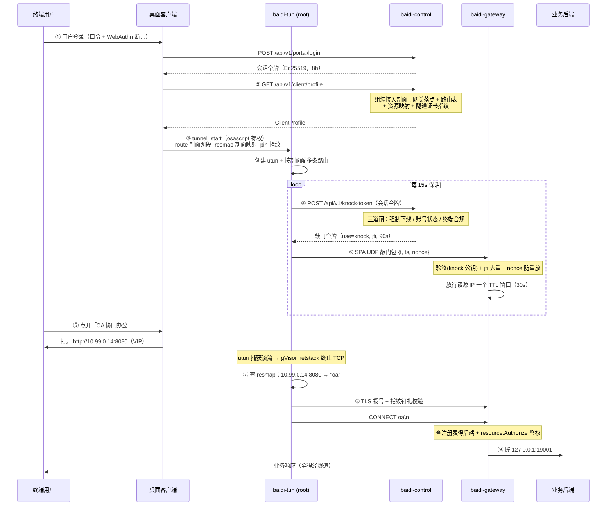
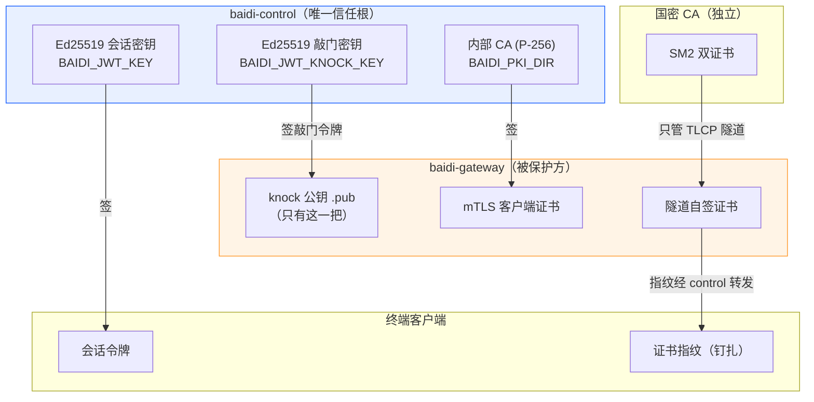
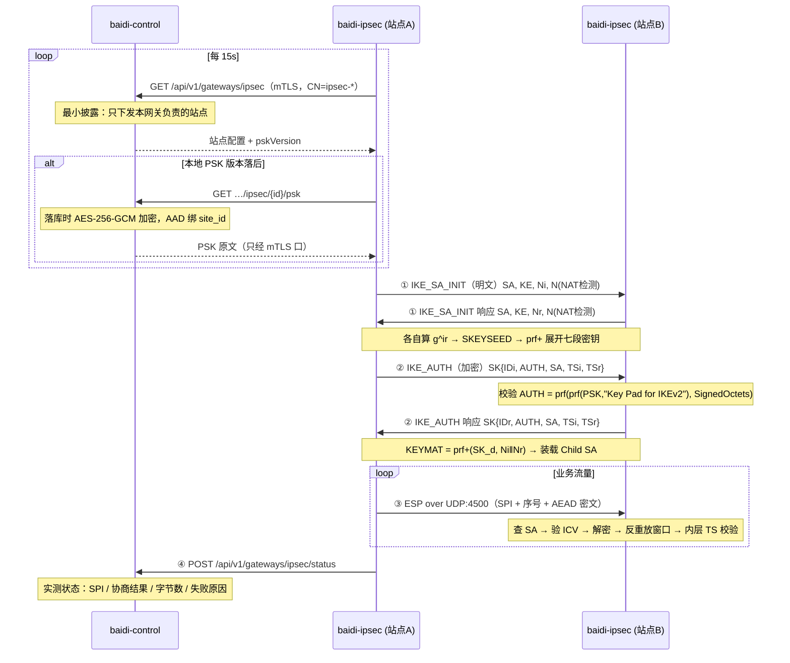

# 白帝 · 架构与技术方案解析

> 面向代码审查：每节都给出可点击的源码位置。读完这篇应当能回答「一个包从终端出发，经过哪些判定，最终怎么到达业务」，以及「哪一段是真链路，哪一段是演示数据」。
>
> 配套自检（各一条命令、自带起栈、无需 root/Docker）：
> - `cd gateway && ./e2e.sh` —— 南北向：登录 → 剖面 → 敲门 → 钉扎 → 多资源路由 → 越权拒绝
> - `cd gateway && ./ipsec-e2e.sh` —— 东西向：真 IKEv2 协商 → 真 ESP 加密 → 跨隧道业务流量 → 反例

---

## 一、一句话架构

**控制面判定，数据面执行，两者之间只有单向的信任流。**

控制面（`control/`）持有全部判定权：谁是谁、能访问什么、此刻是否合规。数据面（`gateway/`）不做任何策略推导，只执行控制面下发的结论。终端（`clients/`）连策略都不推导，连"哪些地址该进隧道"都由控制面告诉它。

这条原则决定了后面所有的设计取舍——凡是让数据面或终端获得判定权/签发能力的方案，都被刻意排除了。

---

## 二、进程全景

| 进程 | 位置 | 职责 | 端口 |
|---|---|---|---|
| `baidi-control` | [control/cmd/baidi-control](../control/cmd/baidi-control/main.go) | 控制面：身份、策略、审计、令牌签发、接入剖面下发 | 8090（管理）/ 8092（网关 mTLS） |
| `baidi-gateway` | [gateway/cmd/baidi-gateway](../gateway/cmd/baidi-gateway/main.go) | 数据面：SPA 门控 + 隧道代理 + 资源路由 | 18201/udp（敲门）、18443/tcp（隧道） |
| `baidi-tun` | [gateway/cmd/baidi-tun](../gateway/cmd/baidi-tun/main.go) | 终端数据面：utun 接管流量 → 逐流入隧道（需 root） | — |
| `baidi-knock` | [gateway/cmd/baidi-knock](../gateway/cmd/baidi-knock/main.go) | 轻量敲门器（桌面端 sidecar） | — |
| `baidi-knock-agent` | [gateway/cmd/baidi-knock-agent](../gateway/cmd/baidi-knock-agent/main.go) | 浏览器 dev 联调用的敲门代理 | 8091 |
| `baidi-gmca` | [gateway/cmd/baidi-gmca](../gateway/cmd/baidi-gmca/main.go) | 国密 SM2 双证书签发（只服务 TLCP 隧道） | — |
| `baidi-tlcp-probe` | [gateway/cmd/baidi-tlcp-probe](../gateway/cmd/baidi-tlcp-probe/main.go) | 国密隧道探针（curl 不支持 TLCP） | — |
| `baidi-e2e` | [gateway/cmd/baidi-e2e](../gateway/cmd/baidi-e2e/main.go) | **全链路自检**：8 步真实断言 | — |
| `baidi-ipsec` | [gateway/cmd/baidi-ipsec](../gateway/cmd/baidi-ipsec/) | **站点组网**：自研 IKEv2 + ESP（需 CAP_NET_ADMIN） | 500/udp（IKE）、4500/udp（NAT-T + ESP 封装） |
| `baidi-ipsec-e2e` | [gateway/cmd/baidi-ipsec-e2e](../gateway/cmd/baidi-ipsec-e2e/) | IPSec 全链路自检（无 root） | — |
| console | [console/](../console/) | 管理台 SPA + 门户 + 大屏 + 诊断 | 5193（dev） |
| desktop | [clients/desktop/](../clients/desktop/) | Tauri 2 + Vue3 桌面客户端 | 5294（dev） |

---

## 三、核心链路：一次接入的完整时序

这是理解整个系统的主干。**注意 ②③ 两步是本轮补上的关键环节** —— 在此之前客户端不知道该接管哪些网段，隧道建起来了也没有流量进去。



### 为什么第 ②③ 步是关键

修复前，客户端的接管网段是**设置页里手填的** `10.99.0.0/24`，而业务真实地址是 `10.20.1.10:8080`。两者毫无关系，于是：

- 隧道成功建立、UI 显示"已接入"、日志一切正常；
- 但用户点开应用，流量走系统默认路由直连内网，**根本不进隧道**；
- 而 `-resmap` 从来没有被任何人填过，即使流量进了隧道也只会落到网关的单一默认后端。

这就是"最基础的客户端连接没跑通"的真实成因——不是某处报错，而是**整条映射链缺了控制面这一环**。修复方式是让控制面下发接入剖面（[clientprofile.go](../control/internal/api/clientprofile.go)），因为只有它同时知道：网关在哪、业务在哪、当前用户有权访问哪些资源。

---

## 四、信任模型：三套互不污染的密钥体系

这是全系统最需要小心的部分。三套 PKI 各管一段，**刻意不复用**：



### 关键不变量

| 不变量 | 实现位置 | 为什么 |
|---|---|---|
| **网关只装 knock 公钥** | [main.go `-jwt-pubkey`](../gateway/cmd/baidi-gateway/main.go) | 会话令牌用另一把密钥签，其 kid 在网关侧查不到 → **从密码学上就敲不开门**。`spa.checkKnock` 的 `use` 语义闸退化为纵深，而非唯一防线 |
| **数据面没有 Sign 函数** | [gateway/internal/auth](../gateway/internal/auth/) | 阶段 4 主动删除。要加签发就是给被保护方发钥匙——不加 |
| **公钥走部署期文件分发，不做 JWKS 端点** | 部署脚本 | 在线端点若自身即信任根，会构成循环论证 |
| **配了 `-control` 就必须配 mTLS 证书** | [main.go](../gateway/cmd/baidi-gateway/main.go) | 机器身份只有一条路，没有回退 |
| **证书指纹白名单是即刻吊销的执行点** | [mtls.go `VerifyPeerCertificate`](../control/internal/api/mtls.go) | mTLS 只证明证书由我们签过，不代表此刻仍被信任 |
| **国密 CA 只管 TLCP 隧道** | [gmcert](../gateway/internal/gmcert/gmcert.go) | 与身份体系完全隔离，两套 PKI 互不污染 |

### 隧道证书钉扎（本轮新增）

网关的隧道证书是**启动期自签**的，没有公共 CA 可校验。修复前客户端写死 `InsecureSkipVerify: true` —— 隧道加密但**不认证**，任何抢到 TCP 连接的中间人都能冒充网关，把明文业务流量原样读走。

修复思路不是"去搞一个公共证书"，而是**把信任根落到控制面**：

1. 网关启动时算出自己隧道证书的 SHA-256 指纹，随 mTLS 注册心跳上报（[main.go `certFingerprint`](../gateway/cmd/baidi-gateway/main.go)）；
2. 控制面存下并经接入剖面转发给客户端（[clientprofile.go `ProfileGateway.TunnelPin`](../control/internal/api/clientprofile.go)）；
3. 客户端在 `VerifyPeerCertificate` 里比对指纹（[dataplane.go `tlsClientConfig`](../gateway/internal/dataplane/dataplane.go)）。

> 代码里仍然有 `InsecureSkipVerify: true`，但含义完全不同：它关掉的是**链**校验（自签证书必然过不了），安全性改由指纹钉扎承担。钉扎比链校验**更严**——只认那一张证书，连同一个 CA 签的其他证书都不认。回归覆盖见 [pin_test.go](../gateway/internal/dataplane/pin_test.go)。

---

## 五、五道门：一个访问请求会被拦几次

理解白帝的核心在于：**同一个访问会被独立地拦截五次，任何一次拒绝都终止访问**。

| # | 门 | 位置 | 拦什么 |
|---|---|---|---|
| 1 | **敲门令牌签发闸** | [api.go `handleKnockToken`](../control/internal/api/api.go) | 强制下线名单 / 账号禁用锁定 / 终端合规（posture）三项任一不过就不发令牌 |
| 2 | **SPA 单包授权** | [spa.go `checkKnock`](../gateway/internal/spa/spa.go) | 令牌签名、`use=knock`、jti 去重、TTL 上界、nonce 防重放；未通过 → 网关对该 IP 保持隐身 |
| 3 | **放行窗口** | [spa.go `Allowlist`](../gateway/internal/spa/spa.go) | 源 IP 不在 30s 放行窗口内 → 隧道端口直接断连 |
| 4 | **隧道证书钉扎** | [dataplane.go](../gateway/internal/dataplane/dataplane.go) | 对端不是那台网关 → 握手失败（防中间人） |
| 5 | **资源鉴权** | [registry.go `Authorize`](../gateway/internal/resource/registry.go) | 资源 id 的 AllowRoles/AllowUsers 不命中 → 断连 |

关键：**接入剖面不是授权凭据**。它只是"路由提示"，告诉客户端哪些地址该进隧道。即使剖面被完整泄露，攻击者也拿不到任何访问权 —— 第 5 道门在网关侧独立重新鉴权（自检第 ⑧ 步专门验证这一点）。

### fail-closed 的代价与补偿

严格敲门（默认开）意味着**所有敲门客户端必须能访问控制面**。副作用是：控制面不可达超过网关 TTL（30s）时，窗口自然关闭、访问中断。

这是刻意的选择——零信任下失去策略源就该收窗，而不是拿长效令牌硬撑。补偿手段是 reknock 频度（15s）显著小于 TTL（30s），单次抖动不至于关窗（[dataplane.go `knock`](../gateway/internal/dataplane/dataplane.go)）。

---

## 六、代码地图

### 控制面 `control/`

```
cmd/baidi-control/       启动、密钥自举、双监听（明文 8090 + mTLS 8092）
internal/api/
  api.go                 主路由表 + 门户/管理端点（1000+ 行，从这里开始读）
  clientprofile.go       ★接入剖面：网关落点 + 路由表 + 资源映射 + 证书指纹
  mtls.go                网关 mTLS 服务端配置 + 证书指纹白名单校验
  jit.go                 JIT 申请 → 审批 → 时限授予
  webauthn.go            passkey 注册/断言两回合
  posture.go             终端环境上报
  diag.go                自诊断
internal/auth/           Ed25519 双密钥、JWT 自实现、中间件
internal/pki/            内部 CA（签网关 mTLS 客户端证书）
internal/risk/           按安全基线评估 posture → allow/observe/block
internal/store/          领域文件 + 同名 _sqlite.go 成对；Memory 是种子/降级
internal/webauthnx/      WebAuthn 依赖方实现
```

### 数据面 `gateway/`

```
internal/spa/            ★SPA 单包授权：放行表、封禁、敲门校验
internal/proxy/          受 SPA 门控的隧道代理；CONNECT 前导多资源路由
internal/resource/       资源注册表（防 SSRF：后端地址只来自注册表）
internal/dataplane/      ★客户端数据面引擎（桌面/移动共享）
                         TUN → gVisor netstack → 逐流隧道 + 证书钉扎
internal/knock/          敲门包封装、nonce 缓存、向控制面换令牌
internal/cplane/         网关侧控制面客户端（mTLS）
internal/darkfw/         内核态隐身（pf / nft）
internal/auth/           令牌验证（★刻意没有 Sign）
internal/gmcert/         国密 SM2 双证书
internal/ipsec/          ★站点组网：自研 IKEv2 + ESP（约 2 万行含测试）
                         依赖是一条单向链，任何一环都不许反向 import：
                         ipsec（契约） ← ike ← esp ← site ← cmd/baidi-ipsec
  types.go               契约层：SiteConfig / SiteState / Protector / Datapath / Transport
  config.go              装载期拒绝规则的**唯一集中地**（不支持的配置一律显式拒绝，绝不静默降级）
  transport_udp.go       500/4500 双监听 + non-ESP marker + IKE/ESP/keepalive 三分流
  transport_mem.go       进程内假 UDP 网 —— 让「真协商」能被无 root 的 go test 验证
  datapath_{tun,pair,netstack}.go  生产 TUN / 内存对拨 / gVisor netstack 三种数据面
  ike/                   IKEv2：wire 报文层、payload_* 载荷、crypto+dh 算法、keys 派生、
                         auth PSK 认证、suite 套件映射、initiator/responder/engine 状态机、
                         rekey / nat / cookie / retransmit
  esp/                   ESP：packet 线格式、sa SPI 与生存期、replay 反重放窗口、spd 选路
  site/                  编排：site 生命周期、backend 声明式对账、pump 双向泵、status 状态聚合
mobile/baidimobile/      gomobile 绑定（iOS/Android）
```

### 客户端 `clients/desktop/`

```
src-tauri/src/main.rs    Tauri 壳：osascript 提权拉起 root baidi-tun、
                         终端环境采集、托盘常驻、open_app_url 白名单
src/lib/api.ts           HTTP 封装 + 接入剖面类型
src/lib/store.ts         会话 / 配置 / ★接入剖面（profile）
src/lib/tunnel.ts        ★resolveTunOpts：剖面优先、config 兜底
src/lib/knock.ts         敲门抽象（Tauri sidecar / dev 代理两条路径）
src/views/Connect.vue    接入状态机（从 baidi-tun 真实日志解析状态）
src/views/Apps.vue       ★应用中心：真实打开 VIP 地址
```

---

## 六·五、站点组网：自研 IKEv2 + ESP

远程接入（南北向：用户 → 业务）与站点组网（东西向：站点 ↔ 站点）是**两条完全独立的链路**，只共享 mTLS 客户端证书与控制面地址。理解这一点很重要——它解释了为什么 IPSec 是独立进程而不是并进网关。

### 为什么是独立进程

| 理由 | 说明 |
|---|---|
| **权限边界（决定性）** | `baidi-gateway` 是**非 root、`NoNewPrivileges=true`** 的进程——这不是偶然：SPA 敲门 + 隧道代理只需两个高位端口。IPSec 需要 `CAP_NET_BIND_SERVICE`（绑 500）+ `CAP_NET_ADMIN`（建 TUN、配路由）。并进去等于给**直接暴露在公网、逐包解析未认证 UDP 敲门包**的进程授予建网络接口的能力，账算不过来 |
| **失效域隔离** | 网关挂 = 远程接入中断；IPSec 挂 = 站点组网中断。合进一个进程意味着 IKE 解析器的一个 panic 会顺带打掉所有远程接入 |
| **部署可选性** | `WITH_IPSEC=0` 默认关。很多部署只要远程接入不要站点组网，不该被迫背上一个需要特权的组件 |

### 一条隧道的建立时序



### 三个关键设计决定

**① ESP 只走 UDP 4500 封装，不做裸 ESP。** 裸 ESP（IP 协议号 50）需要 raw socket + root，本机无法验证——做了就等于再造一个不可验证的声明。UDP 封装还顺带让 IKE 与 ESP 共用一条 socket（NAT 映射按五元组建立，ESP 另开端口在 NAT 后必然收不到）。

**② 期望态与观测态彻底分家。** `ipsec_sites.enabled` 是管理意图（toggle 只改这个），`ipsec_sa_state` 是网关实测回报。旧实现里 `status` 一列同时承担两者，于是「点了启用」和「真的连上了」在界面上长得一模一样——真做 IKE 后必然出现「点了启用但协商失败」，混在一起就是又一个静默失效。

**③ 算法参数化从第一行做起。** IKEv2 的报文编解码、状态机、SPI 管理、rekey、NAT-T、ESP 封装占了 90% 的工作量，而这些**全部与具体算法无关**。把算法藏在 `EncrAlg`/`PRF`/`IntegAlg`/`DHGroup` 接口后面，增加国密套件的成本就退化为「注册表加一行 + 几十行 gmsm 胶水」。反过来先硬编码 AES 再回头抽象，代价是重写整条链路。

> 国密套件能以极低成本存在，但**能实现不等于能声称合规**——它走 IANA 私有码点，只白帝↔白帝互通，与 GM/T 0022 无关。边界见第七节。

---

## 七、真实性清单（诚实版）

这是本文档最该被认真读的一节。

### ✅ 真链路（可用 `./e2e.sh` 复现验证）

| 能力 | 证据 |
|---|---|
| SPA 单包授权 + 服务隐身 | 自检 ③：敲门前直连必被拒 |
| 短时效一次性敲门令牌（三道闸） | 自检 ④；[api.go `handleKnockToken`](../control/internal/api/api.go) |
| 敲门重放防护（ts + nonce + jti） | [knock.go](../gateway/internal/knock/knock.go)、[spa_test.go](../gateway/internal/spa/spa_test.go) |
| TLS / 国密 TLCP 隧道 | 自检 ⑤；国密路径用 `baidi-tlcp-probe` 验证 |
| **隧道证书钉扎（防中间人）** | 自检 ⑤⑥；[pin_test.go](../gateway/internal/dataplane/pin_test.go) |
| **多资源路由到不同后端** | 自检 ⑦：两个资源落到两个可区分的后端 |
| **资源级鉴权（越权拒绝）** | 自检 ⑧ |
| utun 真流量接管 + gVisor netstack | [dataplane.go](../gateway/internal/dataplane/dataplane.go)（需 root，自检不覆盖建卡） |
| 网关 mTLS 机器身份 + 即刻吊销 | [mtls.go](../control/internal/api/mtls.go)、[gwidentity_test.go](../control/internal/api/gwidentity_test.go) |
| 强制下线（撤窗 + 断隧道 + 封禁敲门） | [linkage_test.go](../control/internal/api/linkage_test.go) |
| 终端合规（posture）→ 拒发令牌 | [posture_test.go](../control/internal/api/posture_test.go)、[risk_test.go](../control/internal/risk/risk_test.go) |
| **风险分档四档都有执行方（gray 观察 / degrade 降权 / block 全断）** | [degrade_test.go](../control/internal/api/degrade_test.go)、[registry_test.go](../gateway/internal/resource/registry_test.go) |
| JIT 申请 → 审批 → 时限授予 → 网关放行 | [jit_sqlite_test.go](../control/internal/store/jit_sqlite_test.go)、`TestBuildProfile_ActiveGrantUnlocksRouting` |
| WebAuthn / passkey 二次认证 | [ceremony_test.go](../control/internal/webauthnx/ceremony_test.go)（需可注册域名，裸 IP 不可用） |
| 真实在线用户 / 网关活性 | 网关 mTLS 注册上报，[monitor_objects.go](../control/internal/api/monitor_objects.go) |
| 审计落库 | [audit_sqlite.go](../control/internal/store/audit_sqlite.go) |
| 组织树 / 用户组落库（含环形父子拒绝、删除守卫、种子部门回填） | [orgs_sqlite.go](../control/internal/store/orgs_sqlite.go)、[orgs_sqlite_test.go](../control/internal/store/orgs_sqlite_test.go)、[orgs_test.go](../control/internal/api/orgs_test.go) |
| **按组织 / 用户组授权（含子树继承、移出即失效、两处判定同构）** | [subjects.go](../control/internal/store/subjects.go)、[subjects_sqlite_test.go](../control/internal/store/subjects_sqlite_test.go)、[subjects_test.go](../control/internal/api/subjects_test.go) |
| **认证策略驱动二次认证（自适应认证真接进登录链路）** | [authpolicy.go](../control/internal/authpolicy/authpolicy.go)、[authpolicy_test.go](../control/internal/authpolicy/authpolicy_test.go)、[api/authpolicy_test.go](../control/internal/api/authpolicy_test.go) |
| **管理员分级分权 / 三权分立（有真执行方 + 防自锁）** | [admins_sqlite.go](../control/internal/store/admins_sqlite.go)、[api/admins.go](../control/internal/api/admins.go)、[adminrbac_test.go](../control/internal/api/adminrbac_test.go)、[admins_sqlite_test.go](../control/internal/store/admins_sqlite_test.go) |
| **消息通道 SMTP / Webhook（真发；STARTTLS 不降级；安全事件真通知）** | [internal/notify/](../control/internal/notify/)、[smtp_test.go](../control/internal/notify/smtp_test.go)（进程内 SMTP 服务端跑真协议）、[api/notify_test.go](../control/internal/api/notify_test.go)。★`kind=sms` 就是 webhook，不是短信网关实现 |

**按组织 / 用户组授权（真，判定权全在控制面）**：资源授权从「角色 + 账号」两维扩到四维，新增 `resources.allow_groups / allow_orgs`（补列 + 回填 `[]`，既有行语义不变）。组织**含子树**——授权给某组织即涵盖其全部后代组织的用户。

- **子树展开只有一处实现**：`store.SubjectIndex`（[subjects.go](../control/internal/store/subjects.go) 纯逻辑 + [subjects_sqlite.go](../control/internal/store/subjects_sqlite.go) 取数）。它靠 `org_units.path` 这条冗余物化路径一次性展平祖先链，不递归查库。
- **数据面一字未改**：网关的 `resource.Resource` 仍只有角色/账号两维，`registry.Authorize` 原样不动。组织与组在控制面 `expandForGateway` 里展开成账号并进 `AllowUsers` 后才下发——与「数据面不做策略推导」的既有原则一致，也避免网关按 30s 周期缓存一棵可能已经过时的组织树。
- **控制面两个判定点同构**：`handleGatewayPolicy → expandForGateway`（权威闸）与 `buildProfile → authorizeRes`（剖面路由提示）都只调 `SubjectIndex` 的方法。同构测试见 [subjects_test.go](../control/internal/api/subjects_test.go)：构造「用户仅因所属组织被授权」的场景，同时断言剖面排出了 resmap+route 且网关下发的 `allowUsers` 覆盖该账号，两者同真同假；把人移出组织后两者同时翻假。
- **展开每次现算、不缓存**：撤权与生效之间不留窗口，把人移出组织下一轮网关轮询即失效。
- **空展开下发哨兵**（`store.DenyAllSubject`）：只按组织授权、而该组织成员为零时，展开结果为空；若原样下发，网关会因「AllowUsers 与 AllowRoles 皆空 = 不限」退化成**对所有人开放**，而控制面判定的是「对所有人关闭」——方向相反且两侧日志都正常。哨兵是一个含 NUL 字节、任何真实账号都不可能等于的值。
- 用户组成员按 **account** 存（而非 user id），正是为了在这一步能与令牌主体对齐。

控制台「资源策略」页的编辑器直接吃组织树与用户组真实数据，并显示**展开后的生效账号数**——那份数字与下发网关的展开出自同一次计算，管理员看得见子树语义的实际影响。

### ⚠️ 内存种子（结构真实、数据是演示值，无落库/无真实采集）

`SQLiteStore` **内嵌** `*Memory`（[sqlite.go](../control/internal/store/sqlite.go)），漏写一个方法不是编译错误而是**静默落回种子**——这是「页面看起来是真的」的机制性原因。当前恰好 3 个 Store 方法仍走种子（其余全部已被 SQLite 覆盖，清单由 [coverage_guard_test.go](../control/internal/store/coverage_guard_test.go) 双向钉住）：

| 页面 | store 方法 | 说明 |
|---|---|---|
| 网关与隐身 · 区域拓扑 | `Memory.Gateway` | "华东/华南出口"是硬编码拓扑；**真实网关清单**在 `GET /api/v1/gateways`（mTLS 注册来源） |
| 认证源接入 · 顶部卡片 | `Memory.AuthSrc` | 卡片上的源列表与「1160 用户」等数字是种子。**注意：LDAP/OIDC 接入本身已是真实现**（见下文认证源一节），真实配置走 `GET /api/v1/authsrc/sources`——同一页两个数据源，别混。同页「自适应认证规则」tab 是**交互沙盘**（改动不落库、不参与登录判定，页面已如实标注），真正在登录链路生效的是「认证策略」tab |
| 在线用户 · 无网关回退 | `Memory.OnlineSessions` | 有网关 mTLS 上报时走真实会话（`source=live`），无网关时回退种子（`source=demo`，页面有标注） |
| 大屏 `/screen` | 前端 `MOCK_*` 常量 | 纯展示 |

**管理员分级分权 / 三权分立（真，PRD ch15.1）**：此前系统管理页整页是 `Memory.System` 种子——五张编造的管理组卡片、八个不存在的管理员账号、三个假集群节点，而权限模型实际只有 `admin|user` 两级：任何管理员都能改用户、改策略、读全量审计。这是全项目最容易被误读成「已实现」的一页。

- **角色落库**：`admin_roles("key", name, power, builtin, scope_json)` + `users.admin_role`（补列 + 回填，见下）。内置四角色 root / system / security / audit 每次启动按 `PowerPerms` 重算 `scope_json` 覆盖，新增权限键时内置角色自动跟上。
- **执行方是 `api.requirePerm`**，不是页面文案：`scope_json` 里的权限键（`system` / `security` / `audit` / `admins` / `*`）逐端点比对。审计管理员读得到 `/api/v1/audit`（含链校验与导出）却改不了用户与策略；安全管理员管认证源 / 认证策略 / 资源应用 / 用户组织 / 审批，但**读不到全量审计**；系统管理员管网关证书 / 组网 / 对象库 / 锁定阈值 / `/diag`。权限矩阵有双向用例（能做的 2xx、不能做的 403）。
- **角色现算不进令牌**：写进 8h 会话令牌的话一次降权要等到令牌过期才生效。读不出角色（库抖动 / 角色悬空 / 从未分派）一律 **fail-closed 403**，越权尝试落审计（category=security、verdict=deny）。
- **补列回填是「不被自己锁在门外」的唯一保证**：既有 `role='admin'` 的账号一次性回填成 root（`admin.role.backfill.v1` 标记）。不回填的话升级后所有管理员立即什么都干不了，而"给自己分配角色"本身也要管理员权限——死锁。做成**一次性**则是另一面：每次启动都补的话，任何造出「是管理员但没角色」的路径都变成「重启即提权到超管」。
- **防自锁三条路都堵上**：最后一名可登录的超管不可降权（`SetAdminRole`）、不可撤销（`RemoveAdmin`）、不可禁用/锁定（`SetUserStatus`），三处判定在同一个事务内做计数，回 409 + 原因。**已被禁用的 root 不计入剩余超管**——留着一个登不进来的 root 当"还有人管"，等于闸没生效。
- **自定义角色只能在三权内收缩**：`*` 与 `admins` 保存时拒绝。拿得到它们的自定义角色等价于一个不叫 root 的超管，而防自锁的计数只认 `power=root`。
- **`POST /api/v1/users` 收口成只建普通用户**：`DirUser.Role` 是能从请求体解出来的字段，放任它带 `admin` 就意味着持 security 权的人一次请求给自己造个管理员。建管理员的唯一入口是 `POST /api/v1/admins`（需 `admins` 权限）。
- **集群区块如实回「未部署」**：`ClusterInfo.Deployed` 恒 false、节点列表恒空，与 `/diag` 的 `checkCluster`（skip「集群未部署」）同口径。白帝没有节点发现 / 选主 / 主备同步，此前那三个 healthy 节点是在给不存在的能力背书。

### ✅ IPSec 站点组网（真，但边界很硬）

纯 Go 自实现 **IKEv2（RFC 7296 子集）+ ESP（RFC 4303）**，用户态数据面，独立进程 `baidi-ipsec`（`gateway/internal/ipsec/`，约 2 万行含测试）。真实完成 IKE_SA_INIT / IKE_AUTH（PSK）/ CREATE_CHILD_SA（含 PFS）/ INFORMATIONAL（DPD、Delete），真实做 DH 密钥交换、prf+ 派生、AES-GCM 与 AES-CBC+HMAC 的 ESP 加解密、64 位滑窗反重放。站点状态、SPI、协商结果、流量字节数**全部来自 IKE 状态机与 ESP 计数器的实测值**，经 mTLS 回报控制面。

**能声称**：两台白帝网关之间能建立真实 IPSec 隧道并承载真实业务流量。协商与加解密可在**无 root、无 Docker** 的本机由 `gateway/ipsec-e2e.sh` 端到端验证。关键证据（都是「只有真协商才可能成立」的性质）：

- 两端**独立导出**的 KEYMAT 逐字节相等，且这些密钥字节**从未出现在任何一条抓到的报文里**；
- SPI **交叉相等**（`InSPI(A) == OutSPI(B)`）—— 单端伪造不出来；
- IKE_AUTH 报文的明文里**看不到身份**（被 SK 加密），而 IKE_SA_INIT **能被明文解析出 SA/KE/Nonce** —— 正面证明这是 RFC 7296 的报文，不是自造协议；
- ESP 载荷与 `crypto/cipher` **独立**按 RFC 4106 算出的结果逐字节相同（KAT，排除「自己 Seal 自己 Open 所以通过」）；
- 反例断言同样常驻：PSK 不一致 → `AUTHENTICATION_FAILED`、套件不相交 → `NO_PROPOSAL_CHOSEN`、TS 不匹配 → `TS_UNACCEPTABLE`、密文翻转任一 bit → 丢弃、重放 → 丢弃并计数、越权目的地址 → 不进隧道。

**不能声称**：

- **未与 strongSwan / libreswan 做过实机互通验证**。设计按 RFC 7296/4303 逐字段对齐并刻意避开私有行为，但**「按标准写」与「实测互通」是两回事**。`interop_test.go` 默认 skip，不作为互通依据。已知风险点：AEAD 提案我们显式发 `INTEG=NONE(0)`，strongSwan 是省略该变换（收侧已双向宽容，发侧未验证）。
- **ESP 只走 UDP 4500 封装（RFC 3948），不实现裸 ESP（IP 协议号 50）**。裸 ESP 需要 raw socket + root，本机无法验证 —— 不做，而不是做了不验证。与 strongSwan 对接需对端 `forceencap=yes`。
- **两端的 UDP 封装端口必须一致（生产恒为 4500）**，否则须在站点上显式配 `peerNatPort`。IKEv2 **没有**通告对端封装端口的机制，RFC 3948 直接把它定死为 4500，实现只能按对称假设推算。配错的症状极具迷惑性：**IKE 协商全绿、隧道显示 up、协商结果正常，但字节数恒为 0 且没有任何报错**。
- **认证方式只有 PSK**。证书认证（RFC 7427 数字签名 AUTH、CERT/CERTREQ）本轮不实现；控制台的 `cert`/`sm2cert` 在装载期被**显式拒绝并回报原因**，不会静默降级成 PSK。
- **国密套件（`suite=gm`：SM4-GCM/SM4-CBC、HMAC-SM3、sm2p256v1）走 IANA 私有使用段码点（1024+），只承诺白帝↔白帝互通，与 GM/T 0022 无关**。GM/T 0022 是 IKEv1 血统 + 数字信封的另一套协议栈，与 RFC 7296 结构性不兼容；且 IANA 从未为 SM 系列分配 IKEv2 码点。**因此绝不可对外称「国密 IPSec」或宣称 GM/T 合规。** 纯软件实现也不具备商用密码产品认证的资格（GM/T 0028 要求密码运算在硬件密码模块内完成）。
- **不实现**：EAP、IKEv1、MOBIKE、IKE 分片、配置载荷 CP/虚拟 IP 下发、ESN、传输模式、AH、IPComp、TFC padding、多 TS 对与 narrowing、窗口 >1、后量子混合（`pqHybrid` 字段保留但无效，装载期告警）。
- **不做 PMTUD**：内层包超过隧道 MTU 直接丢弃并计数（可见），不静默截断。
- **自实现的密码学协议，未经安全审计**。与项目整体定位一致（README 已声明研究/演示用途）。

### ✅ 分离式 DNS（split-DNS，真，但系统解析器那一段未实机验证）

企业业务几乎都靠域名访问。此前客户端**只按 IP 路由**，域名形式的后端被静默跳过（流量直连内网、无任何提示）。现在：控制面剖面下发 `dns` 段（解析器 VIP + 分流域 + `FQDN→VIP` 记录表），客户端在 netstack 里跑一个隧道内解析器，并把这些域交给它解析。

**能声称**：DNS 报文的编解码与作答逻辑是真的，有单元测试 + fuzz + 一条端到端用例（手工拼校验和的 IPv4/UDP 包灌进真协议栈，断言回包源地址/端口/事务 ID/RDATA）。UDP 与 TCP 两条查询路径都实现并有回归覆盖。

几个刻意的取舍：

- **不做递归转发**：未知域名一律 `REFUSED`。转发会把内网查询泄露给外部解析器，也会让我们变成开放解析器；而系统已按域分流，不属于我们的域名根本不会来问。
- **AAAA 命中名字返回 `NOERROR + 0 应答`（NODATA）而非 `NXDOMAIN`**。NXDOMAIN 意为「这个名字不存在」，客户端收到后连 A 都不再查——症状是「明明配了 A 记录却解析失败」，且**只在开了 IPv6 的机器上出现**。
- **按域分流，不全局接管**：全局接管会让所有 DNS 走隧道，隧道一断整机解析全挂。
- **UDP 只服务 DNS**：隧道协议只承载 TCP 语义，其余 UDP 目的地不接管。不接管的包**交回协议栈回 ICMP 端口不可达**而非黑洞丢弃——黑洞会让 QUIC(UDP/443) 卡满重试超时才降级 TCP，表现为「接入后网页奇慢」，比直接失败难查。

**不能声称**：**系统解析器配置那一段未实机验证**（macOS `/etc/resolver`、Linux `resolvectl`/`resolv.conf`、Windows NRPT）——它需要 root 且会真改系统配置，本机与 CI 都不跑。三个平台实现的文件头都标了「未实机验证，请按未验证代码对待」。清理覆盖了 defer / 信号 / 数据面异常退出三条路径，但 SIGKILL 拦不住的残留只能靠下次启动扫描回收。

**运维约束**：业务后端应使用**专用内网域**。分流域是从域名后端推导的父域（`oa.corp.internal` → `corp.internal`），若有人配了 `shop.example.com`，`example.com` 会成为分流域，其兄弟名字在隧道期间会因「不转发」而解析不了。公共后缀（`com`/`co.uk` 这类）已被显式挡住，但可公开注册的二级域挡不住。

### ✅ 认证源接入 LDAP/AD + OIDC（真，但未与真实目录/IdP 实机互通）

此前「认证源接入」页是**一整页内存种子**：6 条硬编码认证源，连「总部 AD 域 1160 用户」这个数字都是凭空写的，「接入认证源 / 同步」按钮背后没有任何东西；登录只查本地 SQLite + bcrypt。

现在：认证源配置真落库、凭据加密存储（AES-256-GCM，AAD 绑认证源 id，**只写不读**）、「测试连接」真的去连、登录链路真的按「本地 → 外部源」问下去。

**能声称**：协议实现是真的，且**验证方式不是 mock 接口**——
- LDAP/AD 用 `gldap` 起**进程内 LDAP 服务端**做真实 BER 协议往返（含 LDAPS 与 StartTLS 握手），覆盖率 93.6%；
- OIDC 用 `httptest` 起 mock IdP（发现文档 + JWKS + 令牌端点，真 RSA-2048/P-256 私钥签 ID Token），30 个用例。

守住的**认证绕过**（每条都有对应测试）：LDAP 注入（RFC 4515 转义，带"未转义会被骗到"的漏洞对照组）、**空口令 bind**（LDAP 经典绕过：有 DN + 空口令会被许多目录当成匿名 bind 并返回成功）、空 DN 条目、命中多条即拒、StartTLS 失败不得降级明文、OIDC 的 `alg=none` 与 HS256（且算法由**我们的白名单**决定而非令牌自称）、iss/aud/azp/exp/nonce 全验、伪造 kid 不会打成 JWKS 拉取风暴。

账号映射的两条硬约束（`login_authsrc.go` 与 `authsrc_sqlite.go` 里都写了症状）：
- **绑定以 `Subject`（OIDC 的 `sub` / LDAP 的 `entryDN`）为键，不是用户名**。按用户名绑的话，谁能在 AD 里新建一个叫 `admin` 的账号谁就是本地管理员，而审计日志里是一次完全正常的「admin 登录成功」。撞名时给外部账号加来源后缀，绝不复用本地账号；外部账号 `role` 恒为 `user`。
- **外部账号的 `pass_hash` 恒为空**。不置空的话，认证源被停用/删除后那个账号会退回成「用某个本地口令也能登录」，而那个口令是谁设的没人说得清。

**认证源故障 ≠ 密码错误**：目录不可用时回「认证服务暂时不可用」而非「用户名或密码错误」，也不计入账号锁定——不区分的症状是「AD 挂了，所有人看到的都是密码错误」，运维被误导去查用户而不是查目录。

**不能声称**：
- **未与真实 Active Directory / OpenLDAP / Keycloak / Azure AD 实机互通验证过**。所有往返都是对自写的进程内服务端/mock IdP。协议编解码是真的，但 AD 的具体行为（`data 533` 诊断串格式、referral 回法）与真实 IdP 的实现差异（form 编码、字符串型 `exp`、单值 `groups`）是**按文档模拟**的，不是抓包抄的。这条边界和 IPSec 那条一样硬。
- **LDAP 不支持 referral 追踪**（AD 多域林会表现为「某些域的人登不上」）、**不支持 SASL/GSSAPI/Kerberos**（只做 simple bind）、**嵌套组不展开**（按组授权时嵌套组成员会被判成不在组里）。
- **`Subject = entryDN` 有代价**：用户改名或跨 OU 移动时 DN 会变，绑定需要重建。AD 的 `objectGUID` 才是真正不变的标识，但它是 AD 专有。
- **OIDC 没有登出通道**（RP-initiated / back-channel logout 都没做）：**IdP 上禁用了账号，白帝这边 8h 会话照用**。这是目前最需要补的一个洞。
- **RADIUS / 短信网关 / 商密证书三种类型没有实现**，`Kind.Supported()` 会在保存时明确拒绝，控制台上置灰——不再是「能选但静默不生效」。

### ✅ 认证策略 → 二次认证（真接进登录链路，判不了的两条已冻结）

此前 `auth_policies` 是全项目最典型的 **config-only**：有表、有落库、安全中心可编辑，但全库对 `store.AuthPolicies()` 的唯一调用是"读出来给页面看"。真正决定要不要二次认证的，是 `webauthn.go` 里一行字符串启发式——`账号名以 ext 开头或含「外包」`。于是管理员关掉「弱密码增强」登录行为毫无变化，而一个叫 `external.zhang` 的正式员工被强制 MFA，谁也说不清是哪条规则干的。

现在判定在 [`internal/authpolicy`](../control/internal/authpolicy/authpolicy.go)（纯函数、无 IO，与 `internal/risk` 同套路），取数在 [`api/authpolicy.go`](../control/internal/api/authpolicy.go)，消费点是 `api.secondFactor`。

**能声称**（每条都有命中/未命中两向用例）：

| 规则 | 判据 | 数据从哪来 |
|---|---|---|
| 增强 · 范围内一律二次认证 | 策略适用范围（组织含子树 / 用户组）覆盖该账号 | `store.SubjectIndex`（与资源授权同一处子树展开） |
| 增强 · 弱密码 | `users.pw_strength = weak` | **改密/建号那一刻**按明文判定（`auth.PasswordStrength`）；登录时只有 bcrypt 哈希，判不了 |
| 增强 · 非工作时段 | 服务器时间不在策略的工作日 + 工作时段内（支持跨零点排班） | 策略配置 |
| 豁免 · 授信终端 | 登录请求带的设备指纹曾以本账号上报过 posture，且该设备最新判定为 allow | `posture_reports`；指纹由桌面客户端登录时上报 |
| 豁免 · 可信网络 | 真实源 IP 落在策略网段内 | `api.clientIP`（已过 `BAIDI_TRUSTED_PROXIES` 信任边界） |

- **策略只能加强，不能削弱**：「已注册 passkey → 强制断言」排在策略求值**之前**，任何豁免都碰不到它。反过来（先算策略、命中豁免就放行）会让 passkey 变成"有时候要、有时候不要"，且在日志里看不出来。这条顺序有专门用例钉住。
- **判定材料读不到 → fail-closed 拒登录**：把"查不到该不该要二次认证"当成"不需要"，等于库一抖动就静默降级成单因素。
- **决策一律写审计**（category=auth），包括「命中 X 但因 Y 豁免」——否则"这次为什么没要二次认证"无从回答。

**不能声称 / 刻意不做**：

- **异地登录（GeoAnomaly）判不了**：没有接入任何 IP 地理库。该开关被**冻结**——保存接口拒绝开启、控制台按后端下发的 `capabilities` 置灰并写明原因、迁移回填清掉存量为 true 的行。选择"置灰+注明"而不是从模型删掉，与 RADIUS/短信/证书三类认证源的处理一致：删掉会让人以为"白帝不支持"，置灰才说清是"本版本判不了"。
- **Windows 域环境（WinDomain）判不了**：posture 六个基线键里没有域信息，也不校验机器票据。同样冻结。
- **一键上线（OneClick）已从模型与 UI 删除**：它需要一整套设备绑定的长效免认证票据（签发/存储/吊销/与强制下线联动），本轮不做。`auth_policies.one_click` 列冻结（不读不写，旧库可直接启动）。
- **授信终端豁免建立在客户端自报的指纹上，指纹不是秘密**。因此它只用来降低二次认证要求，**绝不放宽任何授权**——授权闸始终在网关侧 `resource.Authorize`。
- **`users.pw_strength` 的存量行只能是 `unknown`**：库里只有 bcrypt 哈希，明文不可得。回填成 `strong` 会让「弱密码」规则对全部存量账号静默失效，回填成 `weak` 会把所有人无端抬进二次认证——两种错法都看不出来。`unknown` 不命中该规则，用户改一次口令即自动补齐。

### ✅ 风险分档 → 四档都有真实执行方（degrade / gray 不再只是显示）

此前 `internal/risk` 定义了 allow / degrade / gray / block 四档，但全库唯一的消费点是
`PostureBlockedUsers`（只 `SELECT verdict='block'`）——**degrade 与 gray 落库了、审计了、页面显示了，就是不生效**。
于是白帝只有"全断"和"放行"两态，与 PRD 1.5「风险动态收缩优先于全断，优先降权而非终止会话」正相反。

现在四档的可执行语义写在 [store/posture.go](../control/internal/store/posture.go) 的常量注释里，逐档如下：

| 档 | 执行内容 | 执行方 |
|---|---|---|
| `allow` | 不做任何收缩 | — |
| `gray` | **访问权一字不改**，控制面每轮策略下发为该账号记一条 `observing` 审计 | `api.auditGrayObserved` |
| `degrade` | **降权不断连**：高敏资源（`Resource.Sensitivity=high`）从网关允许集合与客户端剖面里**同时**摘除；普通/低敏资源与隧道本身照常 | `expandForGateway`（网关侧 `DenyUsers`）+ `accessibleFor`（剖面侧） |
| `block` | 全断：拒发敲门令牌 + 并入撤销名单撤放行窗 + 断隧道（**行为未改**，有回归用例） | `PostureBlockedUsers` → `handleGatewayPolicy` |

几个关键决定：

- **敏感度从应用挪到资源**。改造前"高敏"的唯一来源是 `apps.Category == "finance"` 这一行硬编码（门户磁贴与剖面各写一遍）。它挂在**应用**上而授权与路由的单位是**资源**，且只认财务一个分类——管理员新建的任何高敏资源都被静默当成普通资源。现在 `resources.sensitivity`（low/normal/high）是一等字段，补列 + 两步回填（既有行补 `normal`，原 `category=finance` 应用关联的资源抬成 `high`），第二步带一次性标记，否则管理员重新评估后"重启就变回去"。
- **网关新增一维 `DenyUsers`（否决名单），且先于一切允许来源判定**。为什么不能只收窄 `AllowUsers`：绝大多数资源根本没设 ACL（两维皆空 = 不限），删无可删；用允许名单表达"除了这几个人"要枚举全体账号，漏一个就是静默放行。为什么必须先判：控制面会把有效期内的 JIT 授予并进 `AllowUsers`，先判允许的话**一张审批单就能绕过降权**——而终端已经不合规了，临时授权更不该开高敏的门。网关仍然不做任何推导（它不知道"高敏"是什么），只机械比对控制面算好的名单，与组织展开成账号是同一条纪律。
- **两处判定同构，有测试同时断言两侧**（[degrade_test.go](../control/internal/api/degrade_test.go)）：降权后高敏资源在网关侧被拒**且**剖面里没有 VIP/路由；同一时刻普通资源两侧都照常放行（这条断言才是"降权而非全断"的证据）；恢复合规后下一轮下发即回到全量；降权压过有效 JIT 授予。
- **降权必须让用户知道为什么**。剖面 `warnings` 的**第一条**是「因终端合规降级：xx 等高敏资源已暂停访问（普通资源不受影响，隧道未断开），原因：<risk reason>」，桌面「接入」页原样渲染，且判定档位一变就重拉剖面（不等到下次点接入）。磁贴另带 `degraded` 标记，把"没授权"与"被降权"分开——两者的下一步动作完全不同，混在一起用户会反复提交必然无效的访问申请。
- **`gray` 的 observing 审计按 5 分钟节流**。策略下发是 30s 轮询 × 可能多台网关，不节流的话一个灰度账号一天产出近 3000 条相同审计，真正的处置事件会被冲刷掉——那与"提高审计粒度"正好相反。
- **处置严厉度排序改成 `allow < gray < degrade < block`**（原先 gray 排在 degrade 之上）。四档都有执行方之后这个顺序有了后果：一台同时命中 gray 与 degrade 基线的终端若被判成 gray，降权就静默失效了。排序表现在只在 `store.DisposalRank` 定义一份，`risk`、`PostureVerdict`、用户状态页都从它取。
- **用户状态页与四档统一口径**。原来那套 `risk-high / risk-low / idle` 与处置档没有映射关系（同一个"被降权的用户"两处两个名字），现在分桶就是 `block / degrade / gray` + 目录状态 `locked / disabled`；`idle` 从来没有真实来源，一并删除。处置为 `allow` 的账号不再进"受关注用户"清单——既然没有任何收缩在执行，评分本身不构成受关注（明细仍在安全中心「终端合规」页可查）。

**不能声称**：

- **降权的判据只有终端 posture 一种**。PRD 里的"风险"还包括异地登录、访问频次偏离基线等行为维度，白帝没有这些数据源（无 IP 地理库、无行为基线），所以不会有别的东西把用户推进 degrade 档。
- **`degrade` 名单读失败时按「无人被降权」处理**（记 Error 日志），不是 fail-closed。这是刻意取舍：降权是动态收缩不是最后防线，一次数据库抖动就把全体用户的高敏资源关掉，用户侧只会看到"明明有权限却打不开"。真正的 fail-closed 底线由 `block` 与敲门令牌闸承担。
- **敏感度是管理员标注的，白帝不自动识别**。没有数据分类分级能力，标错就是标错。

### ⚠️ 终端 posture 采集器（三平台都真写了，但只有 macOS 分支是实机验证）

`clients/desktop/src-tauri/src/posture.rs` 分平台采集 6 个基线键（disk_encrypted / sys_integrity / firewall_on / os_version / edr_online / client_version），三态上报：`ok` 之外还有 `unknown`（探不到）。

**能声称**：

- 三平台的采集与解析逻辑**都被编译、都被单测覆盖**。做法是把「跑命令 / 读文件」抽到 `Env` trait 后面，只有「挑哪个平台函数 + 用哪个真实探测源」受 `#[cfg]` 门控——只活在 cfg 里的分支在 mac 上连语法都验不到，那正是此前 Windows/Linux 上报**假数据**的同类问题。14 条单测覆盖三平台键对齐、探不到必须是 unknown、注册表/netsh/lsblk/SELinux 各条解析、指纹稳定性。
- 三态在控制面有真实消费方：`risk.Evaluate(..., Options{StrictUnknown})` —— observe 下不可判定不计分不抬处置（只进 `Verdict.Unknowns` 回传展示），strict 下与「缺报即拒」同口径视为不合规；两条都有 Go 测试。桌面「接入」页与管理台「终端合规」页都按三态渲染（灰=无法判定）。
- Windows / Linux 一律走**不需要管理员/root**的读法优先（注册表值、`/sys` 文件、`lsblk`、`firewall-cmd`），拿不到就落 unknown。

**不能声称**：

- **Windows / Linux 分支从未在真机上跑过**。本机只装了 apple 目标（无 clippy、无交叉目标），验证方式是：解析逻辑在 macOS 上 `cargo test` 全绿，两条平台分发臂用临时改写 cfg 谓词的方式各做过一次 `cargo check`。命令输出样本是**按文档构造**的，不是抓来的真实输出。
- **桌面客户端整体目前还不能在 Windows 上构建**：`main.rs` 的 `tunnel_start` 是 macOS 专属（`osascript` 提权 + `std::os::unix::fs::PermissionsExt`）。Linux 能编但拉不起数据面（同样是 osascript）。采集器分平台是**为后续补这两个平台的数据面做好准备**，不等于这两个平台现在可用。
- 判据里有取舍：Windows 的 `sys_integrity` 是 Secure Boot（次选 Defender 篡改防护），Linux 的 `sys_integrity` 是 SELinux/AppArmor enforcing、`os_version` 比的是**内核** ≥ 5.10（发行版号各家规则不同，拿来比大小只会误判）。这些都不是行业统一定义，换环境需要重新校准。

### ✅ 消息通道 SMTP / Webhook（真，但「短信」就是 webhook，别当短信网关用）

`control/internal/notify/` + `notify_channels` 表 + 系统管理页「消息通道」区块。PRD ch15.2 此前是**整章空的**（grep smtp/sms/webhook 零命中），而第 5 章的「告警邮件通知」压在它上面。

**能声称**：

- **SMTP 是真实现**：标准库 `net/smtp` + `crypto/tls`，支持 STARTTLS 与 implicit TLS(465)、匿名 / PLAIN / LOGIN 三种认证（LOGIN 标准库没有，本项目自己实现，Exchange 与部分国产网关只认它）。中文主题按 RFC 2047 编码、正文 base64 传输编码。测试用**进程内最小 SMTP 服务端**跑真协议往返（[testsmtpd_test.go](../control/internal/notify/testsmtpd_test.go)），与 ldapsrc 用 gldap 起真目录同一思路。
- **STARTTLS 失败绝不降级明文**，与 [ldapsrc 那条纪律](../control/internal/authsrc/ldapsrc/ldapsrc.go)同款：服务端没通告 STARTTLS 就直接报错。对照测试断言服务端**一条 AUTH/MAIL/DATA 都没收到**——降级不只是让告警被看见，SMTP 账号口令会跟着明文出门。明文传输 + 配置认证在**构造期**就被拒。
- **Webhook 是真实现**：POST JSON、自定义头放凭据、超时有界、非 2xx 视为失败并把对端状态码与响应片段如实带回。
- **凭据只写不读**：`notify_channel_secrets` 独立表，AES-256-GCM，**AAD 绑 channel id**（与 `auth_source_secrets` / `ipsec_secrets` 同款；不绑的话"能写库"就等于"能完成一次凭据转移"）。界面只回显指纹前 8 位。测试钉住"换 id 解不开"。
- **有真实消费方，不是 config-only**：账号被爆破锁定（`api.noteLoginFailure`）与终端判定**转入** block（`api.handlePostureReport`）时各发一条通知。派发走**有界异步队列**（`notify.Dispatcher`，满则丢新保旧并计数）——消费方都在主流程上，一台连不上的 SMTP 服务器不得把登录接口拖成 15 秒一次，那比爆破本身更省事的拒绝服务面。发送成功与失败**都落审计**（行为人记 `system`，不借用某个管理员的名义）。
- **「测试连接」真发**，成功/失败都是真实结果；结果与安全事件的发送结果一起写进 `last_status/last_detail/last_event/last_at` 四列，而那四列**只由真正发出那一次写入**——保存配置、翻转开关都不碰它，否则通道页会在邮件根本发不出去时长期显示绿色。

**不能声称**：

- **「短信」不是短信**。`kind=sms` 的实现就是一次 webhook 调用（载荷 `{mobiles, text}`），需要用户自己搭一跳转成运营商/云厂商的请求。白帝**没有**接入任何短信网关的协议（各家签名算法/模板参数/错误码都不同，且都要真实账号才能验证）。API 下发的 `smsNote` 与控制台上的标注都照这句话写——塞一个"看起来像在发短信"的假实现，配完之后一切正常、真出事那天一条都收不到，且没有任何报错。
- **没有推送（App Push）通道**。PRD ch15.2 里的第三条通道未实现，也没有在界面上留一个能选的空壳。
- **未与任何真实企业邮件网关实机互通验证过**。验证全部来自进程内 SMTP 服务端与 `httptest`。
- **对 webhook URL 不做出网限制**。系统管理员可以把它指向内网任意 http(s) 地址（一个 SSRF 面）。这是接受的边界：该端点归 `PermSystem` 一权，而持有该权的人本来就能改网关证书与组网配置；真要收紧应当在部署侧用出网策略做，而不是在这里维护一张永远不全的黑名单。
- **通知投递没有重试**。发失败就是失败（落审计 + last_*），不排队重发——重发在对端长时间不可用时会把队列变成放大器，而"这条没发出去"本身已经有据可查。

### ⚠️ 声明式但未实现的能力

- **console 各页的 `MOCK_*` 常量**：这些是**后端不可达时的降级演示数据**（设计如此，见 CLAUDE.md）。后端在跑时走真实 API。判断方法：页面右上角的「已连控制中心 / 未连」标签。

### 📌 已知配置缺口（会被剖面显式告警，不再静默）

- 应用 `a4 数据库运维 (SSH)` 未关联受控资源 → 无法经隧道访问。剖面会返回 `warnings`，客户端显著提示。这类缺口此前是静默的：管理台里应用好端端的，客户端就是连不上，且没有任何线索。

---

## 八、本轮做了什么（收口清单）

| # | 问题 | 修复 |
|---|---|---|
| 1 | **客户端不知道该接管哪些网段**，隧道通了但流量不进去 | 控制面新增 `GET /api/v1/client/profile` 下发路由表（[clientprofile.go](../control/internal/api/clientprofile.go)） |
| 2 | `-resmap` 从未被填过，所有流量落到单一默认后端 | 剖面下发资源映射，Tauri 落盘后传 `-resmap`（[main.rs](../clients/desktop/src-tauri/src/main.rs)） |
| 3 | `baidi-tun` 只支持单网段 | `-route` 支持逗号分隔多段，三平台 `ifup` 同步（[ifup_*.go](../gateway/cmd/baidi-tun/)） |
| 4 | 隧道 `InsecureSkipVerify` 写死，加密但不认证 | 网关上报证书指纹 → 控制面转发 → 客户端钉扎（[dataplane.go](../gateway/internal/dataplane/dataplane.go)） |
| 5 | `Apps.vue:openApp()` 只弹 toast，什么都不做 | 真实打开 VIP 地址（web）/ 复制接入地址（SSH 等） |
| 6 | `knock.ts` 硬编码 `127.0.0.1:18201`，设置项被忽略 | 改为剖面优先、配置兜底 |
| 7 | **`apps.resource_id` 补列迁移只加列不回填** | 既有库的应用↔资源桥接永久为空，静默拖垮 JIT 与客户端路由 → 加回填（[sqlite.go `backfillAppResourceID`](../control/internal/store/sqlite.go)） |
| 8 | 网关地址靠用户手填 | 剖面从 mTLS 注册信息取真实落点，离线时明确告警 |
| 9 | 无法验证"到底通没通" | 新增 [baidi-e2e](../gateway/cmd/baidi-e2e/main.go) + [e2e.sh](../gateway/e2e.sh)：8 步真实断言 |

### IPSec 站点组网：从"只有配置面"到真实实现

| # | 问题 | 修复 |
|---|---|---|
| 10 | **`toggle` 全部实现就是两条 SQL**（把 `status` 改成 `'up'`），没有任何进程被通知、没有任何网络动作 | 自研 IKEv2 + ESP（[internal/ipsec/](../gateway/internal/ipsec/)），独立进程 [baidi-ipsec](../gateway/cmd/baidi-ipsec/) |
| 11 | **审计谎报**：toggle 写「建立 IPSec 隧道 X · ok」——断言了一个从未发生的事实 | 改为记录「下发启用意图」，真正的 up/down 由网关实测回报另记一条 |
| 12 | `rx_bytes` 全库**没有任何 UPDATE 语句**，种子里 184MB 的常量永久不变（UI 上最有欺骗性的一格） | 新表 `ipsec_sa_state`，字节数只来自 ESP 计数器；旧四列废弃 |
| 13 | `status` 一列同时表达「管理员想让它开」和「它真的开着」 | 拆成 `enabled`（意图）+ `state`（实测五态）。不拆的话「点了启用但协商失败」在界面上和「已连上」长得一样 |
| 14 | **`GET /api/v1/ipsec` 漏了 `requireAdmin`** —— 任何登录用户（含门户普通员工）都能读走全部对端公网地址 + 内网网段拓扑 | 补上。这是往模型里加 PSK 之前的硬前置 |
| 15 | 模型里没有 PSK 字段，UI 却允许选 `auth=psk` | 独立加密表 `ipsec_secrets`（AES-256-GCM，**AAD 绑 site_id**，否则剪贴密文行即可完成密钥转移），只写不读 |
| 16 | 种子站点配的是 `sm2cert`/`group24`/`PqHybrid`，本轮全不支持 → 落地即永久标红 | 改成真能连的配置。**留一条永远红的站点比改种子更不诚实** |
| 17 | 一张网关证书可读全部策略 | mTLS **CN 前缀分权**：`ipsec-*` 只能调 ipsec 端点，读不到资源授权策略 |
| 18 | IKE 是网关上第一个「非暗」的对外端口，逐包解析未认证输入，但引擎无 panic 兜底 | 收包与定时器两条路径加顶层 `recover`：把「一个畸形包打掉整个进程」降级成「丢一个包 + 一条响亮日志」（[panicguard_test.go](../gateway/internal/ipsec/ike/panicguard_test.go) 守着不被重构掉） |
| 19 | **控制面没下发 `ikeVersion`**，网关侧那道「非 IKEv2 一律拒绝」的闸永远不会响 | 补进下发 DTO。管理员选了 IKEv1 现在会被当面拒绝，而不是被当成 IKEv2 静默处理 |
| 20 | **无 NAT 时 ESP 被发往对端 IKE 端口**（`applyNAT` 只在检测到 NAT 时才切封装口），而 500 口按设计只跑 IKE → 静默丢弃 | ESP 落点与 IKE 落点分开算（[nat.go `espEndpoints`](../gateway/internal/ipsec/ike/nat.go)）。**这个缺陷只在「两端都有公网 IP、中间无 NAT」的数据中心互联场景出现，有 NAT 的测试环境永远复现不了**，而症状正是隧道 up、零流量、无报错 |
| 21 | 两端封装端口不一致时无从表达，同样静默失效 | 新增 `peerNatPort` 站点配置，端到端贯通（store→DTO→网关）。旧库补列后为 NULL，读侧 `COALESCE` 到 0 即「按对称假设」，与既有部署行为一致，故**不需要回填** |
| 22 | netstack 数据面只有**同网段**往返测试，而 IPSec 场景恒为跨网段 | 补 [跨网段往返测试](../gateway/internal/ipsec/datapath_netstack_crossnet_test.go)：少了它，数据面的跨网段缺陷会一路潜伏到 e2e 才炸，那时怀疑对象是十几个环节 |

### 分离式 DNS：让域名形式的业务也真正走隧道

| # | 问题 | 修复 |
|---|---|---|
| 23 | **客户端数据面完全没有 UDP**，DNS 无法穿隧道 | netstack 注册 UDP 协议与转发器，**只**服务隧道内 DNS；其余 UDP 交回协议栈回 ICMP 端口不可达（[dataplane.go](../gateway/internal/dataplane/dataplane.go)） |
| 24 | **域名形式的后端被静默跳过**（`clientprofile.go` 原注释：「域名后端交给系统 DNS + 默认出口」）——配了却不走隧道，无任何提示 | 域名后端同样分配 VIP、进 resmap、并登记进 `DNS.Records`；父域推导为分流域（[clientprofile.go](../control/internal/api/clientprofile.go)） |
| 25 | 解析器 VIP 会与资源 VIP **撞号**：资源从 `.11` 连续递增，第 43 个正好落在 `.53` | `vipHostFor` 把 53 从分配区间挖掉，且**无条件**挖除——否则新增一个域名应用会让几十个资源 VIP 集体后移，用户书签/SSH 配置全部失效 |
| 26 | **TCP/53 会掉进隧道转发路径**：解析器 VIP 随 routes 被接管，发往它 53 端口的 TCP 连接会去 CONNECT 一个不存在的资源 id | TCP 转发器对解析器 VIP 短路并真正实现 DNS-over-TCP（RFC 1035 §4.2.2 长度前缀）。症状本来是「`dig +tcp` 挂住而 UDP 正常」，只有特定查询方式才暴露 |

---

## 九、下一步建议（按价值排序）

1. **DNS 劫持**：目前只按 IP 路由，域名形式的业务（`oa.corp.internal`）需要在 netstack 里接管 DNS 并返回 VIP。这是从"能用"到"好用"的最大一步。
2. **IPSec 与 strongSwan 实机互通验证**：协议按 RFC 写完了，但没跟第三方实现对过字节。搭一台 strongSwan（`authby=secret` + `forceencap=yes`）跑通 `interop_test.go`，才能把「未验证互通」这条从边界里划掉。第一个该查的地方是 AEAD 提案的 `INTEG=NONE` 发送形式。
3. **IPSec 证书认证**：目前只有 PSK。内部 CA（`control/internal/pki`）已能签客户端证书，接 RFC 7427 数字签名 AUTH 即可复用同一套白名单/吊销机制，把 PSK 降级为兼容路径。
4. **认证源接入**：LDAP/OIDC 是企业落地的硬门槛，目前完全是界面。
5. **剖面缓存与增量**：现在每次接入全量拉取；资源多了之后应加 ETag + 变更推送。
6. **网关多活**：剖面目前只选心跳最新鲜的一台，没有故障转移与就近选择。
